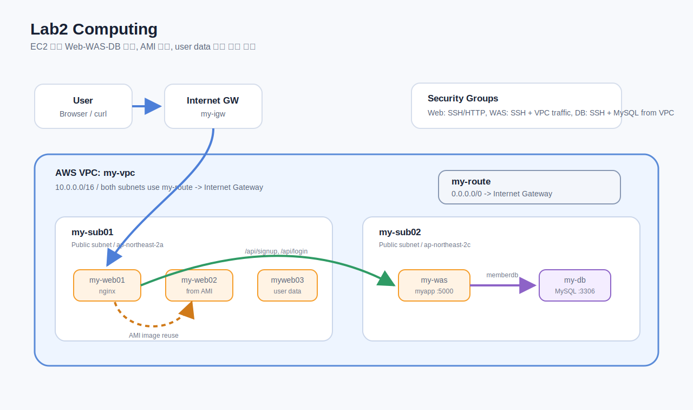
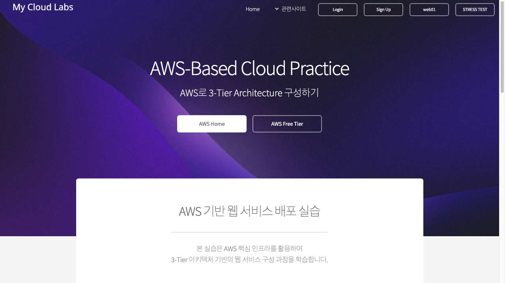
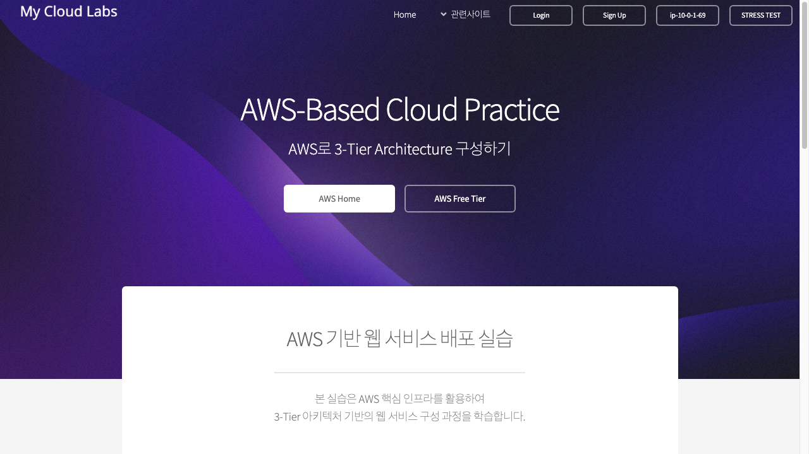
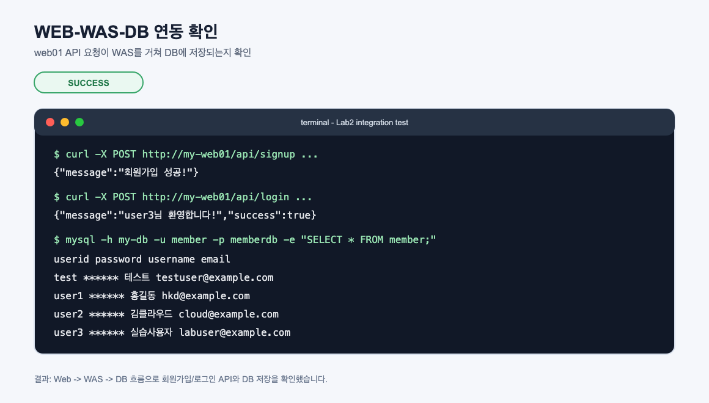
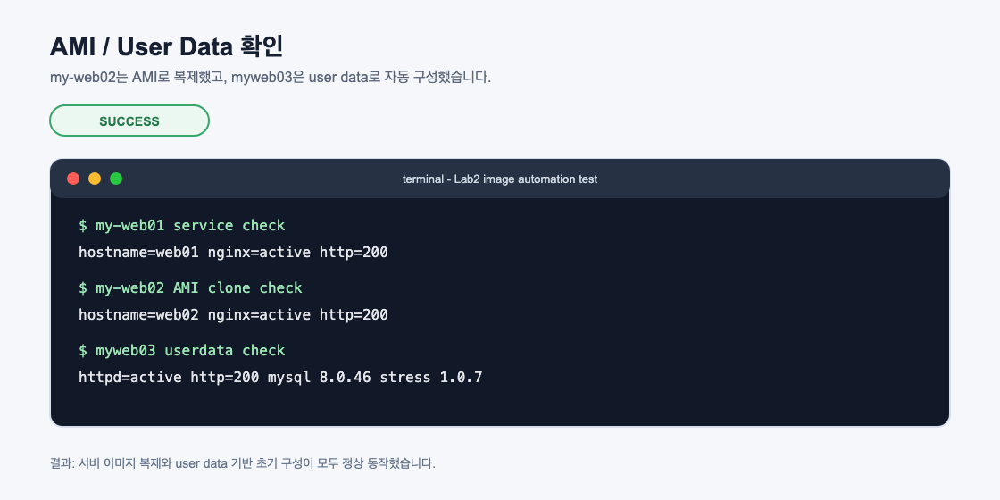

# Lab2 Computing

EC2 기반 컴퓨팅 실습 기록입니다. Web-WAS-DB 구조를 만들고, AMI와 user data를 활용해 서버 이미지를 재사용하는 흐름까지 확인했습니다.

## 아키텍처



## 실습 목표

- Ubuntu EC2에 nginx 기반 웹 서버 구성
- MySQL DB 서버 구성과 원격 접속 계정 생성
- WAS 서버에서 DB 접속 및 애플리케이션 실행
- Web-WAS-DB 회원가입/로그인 흐름 확인
- `my-web01`로 AMI 생성 후 `my-web02` 복제
- Amazon Linux 2023 user data로 `myweb03` 자동 구성

## 리소스 구성

| 리소스 | 역할 | 서브넷 | 주요 확인 |
| --- | --- | --- | --- |
| `my-web01` | nginx 웹 서버 | `my-sub01` | HTTP 200, `myweb.service` 실행 |
| `my-db` | MySQL DB 서버 | `my-sub02` | `memberdb.member` 테이블 생성 |
| `my-was` | WAS 서버 | `my-sub02` | `myapp.service` 실행, DB 조회 성공 |
| `my-web02` | AMI 기반 웹 서버 복제 | `my-sub01` | nginx active, HTTP 200 |
| `myweb03` | user data 기반 Apache 서버 | `my-sub01` | httpd active, MySQL client/stress 설치 |

## 실습 결과 요약

| 테스트 | 결과 | 확인한 내용 |
| --- | --- | --- |
| `my-web01` HTTP 접속 | 성공 | nginx 웹 페이지 응답 |
| `my-was -> my-db` MySQL 접속 | 성공 | `memberdb.member` 조회 |
| `my-web01 -> my-was -> my-db` 회원가입/로그인 | 성공 | API 201/200 응답, DB 데이터 저장 |
| `my-web01` AMI 생성 후 `my-web02` 시작 | 성공 | 복제 서버 HTTP 200 |
| `myweb03` user data 실행 | 성공 | Apache, MySQL client, stress 설치 |

## 웹 화면 캡처

### my-web01



### my-web02



### myweb03


## WEB-WAS-DB 연동 확인



## AMI와 User Data 확인



## 핵심 개념

### Amazon EC2

EC2는 AWS에서 제공하는 가상 서버입니다. AMI, 인스턴스 유형, 네트워크, 보안 그룹, 키 페어, 스토리지, user data 등을 지정해 서버를 생성합니다.

### AMI

AMI는 EC2 인스턴스를 만들기 위한 이미지입니다. 이미 구성된 서버를 AMI로 저장하면 같은 환경의 새 인스턴스를 빠르게 만들 수 있습니다.

이번 실습에서는 `my-web01`을 이미지로 만든 뒤 `my-web02`를 생성했습니다.

### User Data

User data는 EC2가 처음 시작될 때 실행되는 초기화 스크립트입니다. 패키지 설치, 서비스 시작, 기본 웹 페이지 생성 같은 작업을 자동화할 수 있습니다.

이번 실습에서는 `myweb03` 생성 시 Apache, MySQL client, stress를 자동 설치했습니다.

### Web-WAS-DB

3-tier 구조는 웹 서버, 애플리케이션 서버, 데이터베이스 서버를 역할별로 분리하는 방식입니다.

```text
User -> Web -> WAS -> DB
```

이번 실습에서는 `my-web01`이 웹 요청을 받고, `my-was`가 회원가입/로그인 API를 처리하며, `my-db`가 회원 데이터를 저장합니다.

## 명령어

실습 중 사용한 주요 명령어는 [commands.md](commands.md)에 정리했습니다.

## 정리 주의

실습 후에는 EC2 인스턴스, AMI, 스냅샷, 사용하지 않는 Elastic IP/NAT Gateway를 정리해야 과금을 줄일 수 있습니다.
