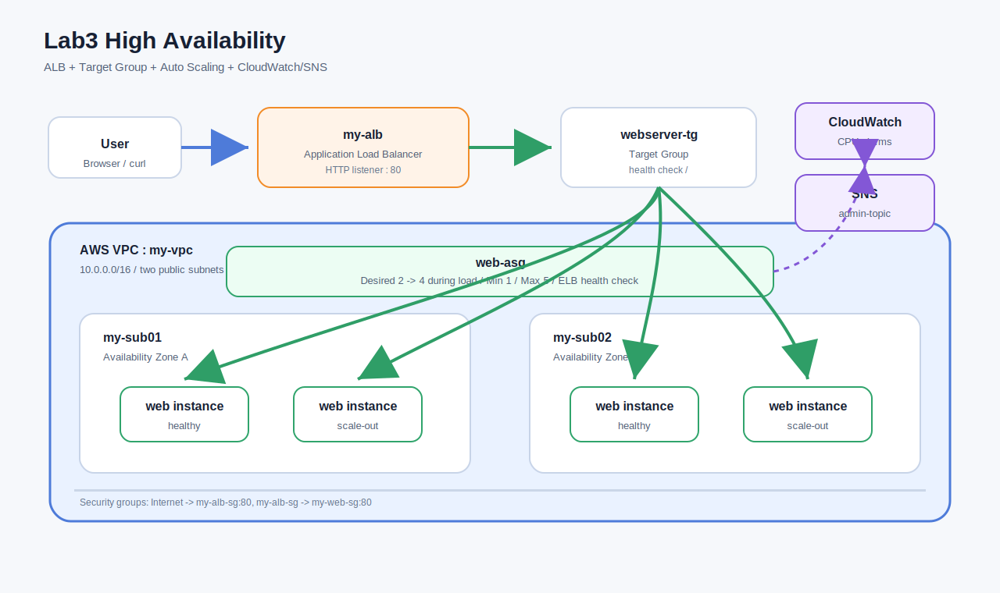
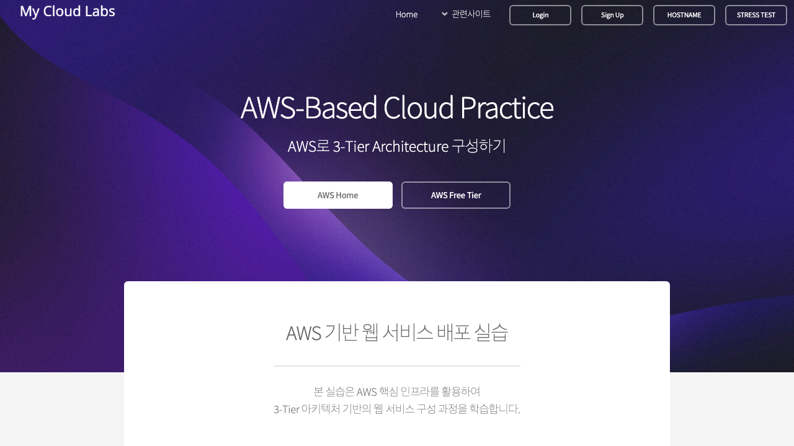
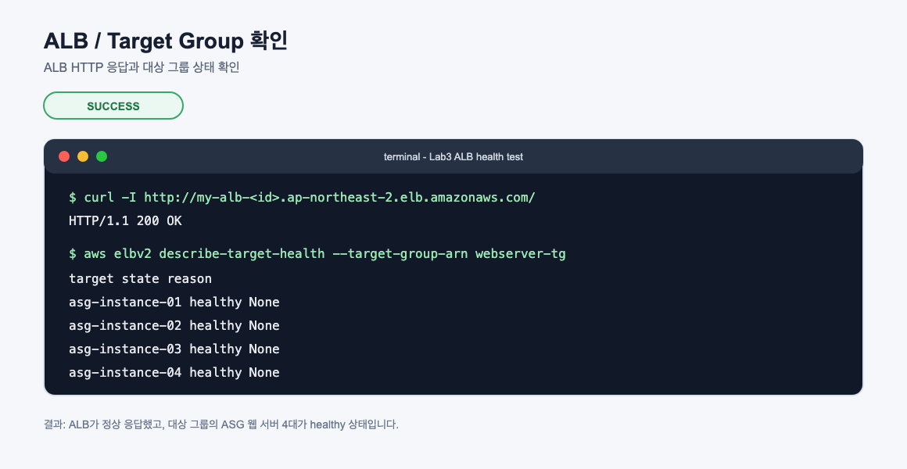
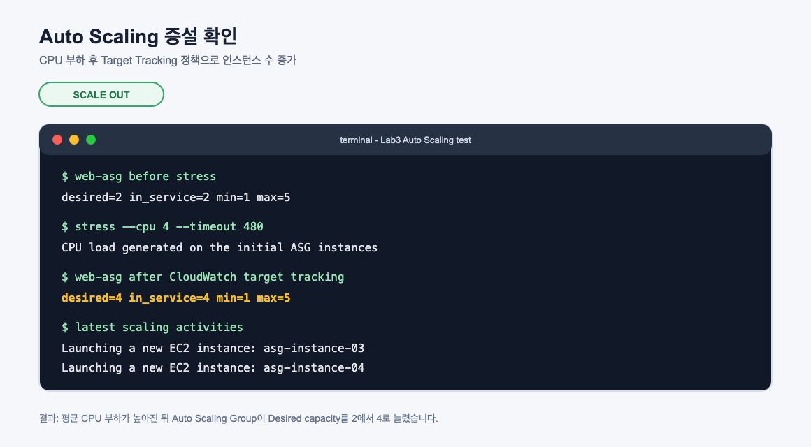

# Lab3 High Availability

고가용성 아키텍처 실습 기록입니다. Lab2에서 만든 웹 서버 이미지를 기반으로 Application Load Balancer, Target Group, CloudWatch, SNS, Auto Scaling Group을 구성하고, 부하 발생 시 EC2 인스턴스가 자동으로 늘어나는 흐름을 확인했습니다.

## 아키텍처



## 실습 목표

- `my-vpc`의 서로 다른 두 가용 영역 서브넷에 웹 서버 배치
- `my-alb` Application Load Balancer 생성
- `webserver-tg` 대상 그룹에 웹 서버 연결
- 웹 서버 보안 그룹을 ALB에서 들어오는 HTTP만 허용하도록 조정
- CloudWatch CPU 경보와 SNS 알림 주제 구성
- `webserver-template` 시작 템플릿 생성
- `web-asg` Auto Scaling Group 생성
- Target Tracking Scaling으로 CPU 부하 시 scale-out 확인

## 리소스 구성

| 리소스 | 역할 | 설정 |
| --- | --- | --- |
| `my-alb` | 외부 HTTP 요청을 받는 Application Load Balancer | internet-facing, HTTP:80 |
| `webserver-tg` | ALB가 트래픽을 전달할 대상 그룹 | instance target, HTTP:80, health check `/` |
| `my-alb-sg` | ALB 보안 그룹 | HTTP 80 from Internet |
| `my-web-sg` | 웹 서버 보안 그룹 | HTTP 80 from `my-alb-sg`, SSH는 실습용 |
| `admin-topic` | CloudWatch/Auto Scaling 알림용 SNS Topic | 이메일 구독은 메일 확인 필요 |
| `my-web01-cpu-high` | EC2 CPU 경보 | CPUUtilization 50% 초과 시 알림 |
| `webserver-template` | Auto Scaling 시작 템플릿 | Lab2 웹 서버 AMI, `t3.micro`, `my-web-sg` |
| `web-asg` | Auto Scaling Group | Desired 2, Min 1, Max 5, ELB health check |

## 실습 결과 요약

| 테스트 | 결과 | 확인한 내용 |
| --- | --- | --- |
| ALB 웹 접속 | 성공 | ALB DNS로 접속 시 HTTP 200 응답 |
| Target Group 상태 확인 | 성공 | ASG 웹 서버 4대가 `healthy` |
| Auto Scaling 초기 구성 | 성공 | Desired 2, Min 1, Max 5 구성 |
| CPU 부하 테스트 | 성공 | `stress` 실행 후 Desired 2 -> 4 scale-out 확인 |
| SNS 구독 | 생성됨 | 이메일에서 Confirm subscription을 눌러야 알림 수신 가능 |

## 웹 화면 캡처

### ALB 접속 화면



## CLI 결과 캡처

### ALB와 대상 그룹 확인



### Auto Scaling 증설 확인



## 핵심 개념

### 고가용성

고가용성은 일부 구성 요소에 장애가 생겨도 서비스 전체는 계속 사용할 수 있도록 만드는 설계입니다. 단일 EC2 인스턴스 하나에만 서비스를 올리면 그 인스턴스가 중지되거나 해당 가용 영역에 문제가 생겼을 때 서비스가 바로 멈춥니다.

AWS에서는 보통 다음 방식으로 고가용성을 높입니다.

- 여러 가용 영역에 리소스를 분산합니다.
- 로드 밸런서가 정상 대상에만 트래픽을 전달하게 합니다.
- 비정상 인스턴스는 자동으로 교체되게 합니다.
- 수요가 증가하면 인스턴스 수를 늘리고, 수요가 줄면 줄입니다.

이번 실습의 핵심은 `사용자 -> ALB -> Target Group -> Auto Scaling Group EC2` 흐름입니다. 사용자는 개별 EC2의 주소를 알 필요 없이 ALB DNS로 접속하고, ALB가 정상 인스턴스를 골라 요청을 분산합니다.

### 가용 영역과 Multi-AZ

가용 영역은 하나의 리전 안에 있는 물리적으로 분리된 데이터센터 묶음입니다. 서로 다른 가용 영역에 인스턴스를 배치하면 한 가용 영역에 문제가 생겨도 다른 가용 영역의 인스턴스로 서비스를 이어갈 수 있습니다.

이번 실습에서는 다음처럼 두 서브넷을 사용했습니다.

| 서브넷 | 역할 | 가용 영역 |
| --- | --- | --- |
| `my-sub01` | 웹 서버 배치 | ap-northeast-2a |
| `my-sub02` | 웹 서버 배치 | ap-northeast-2c |

Auto Scaling Group은 두 서브넷을 모두 사용하도록 구성했습니다. 따라서 인스턴스가 한쪽 서브넷에만 몰리지 않고, 가능한 한 여러 가용 영역에 나뉘어 배치됩니다.

### Elastic Load Balancing

Elastic Load Balancing은 여러 대상에 트래픽을 나누어 보내는 AWS 관리형 서비스입니다. 로드 밸런서를 직접 설치하고 운영하지 않아도 AWS가 확장, 상태 확인, 장애 감지 같은 기본 운영을 대신 처리합니다.

로드 밸런서가 중요한 이유는 다음과 같습니다.

- 사용자는 서버 여러 대의 주소를 몰라도 됩니다.
- 서버 한 대가 비정상이 되면 그 서버로 트래픽을 보내지 않습니다.
- 서버 수가 늘거나 줄어도 동일한 접속 지점을 유지할 수 있습니다.
- Auto Scaling Group과 연결하면 새로 생성된 인스턴스가 자동으로 대상 그룹에 등록됩니다.

### Application Load Balancer

Application Load Balancer는 HTTP/HTTPS 같은 애플리케이션 계층 트래픽을 처리하는 로드 밸런서입니다. URL 경로나 호스트 기반 라우팅이 가능해서 웹 서비스, API 서버, 컨테이너 서비스와 잘 맞습니다.

이번 실습에서는 가장 기본적인 HTTP 리스너를 사용했습니다.

```text
Client HTTP:80 -> my-alb listener HTTP:80 -> webserver-tg -> EC2 web servers
```

ALB는 퍼블릭 서브넷에 연결되어 인터넷 요청을 받고, 대상 그룹에 등록된 EC2 인스턴스의 상태를 확인한 뒤 정상 대상으로만 요청을 전달합니다.

### Listener, Rule, Target Group

ALB를 이해할 때는 Listener, Rule, Target Group을 나누어 보는 것이 좋습니다.

| 구성 요소 | 의미 |
| --- | --- |
| Listener | ALB가 어떤 프로토콜과 포트로 요청을 받을지 정합니다. 이번 실습은 HTTP 80입니다. |
| Rule | 들어온 요청을 어떤 조건에 따라 어디로 보낼지 정합니다. 이번 실습은 모든 요청을 하나의 대상 그룹으로 전달합니다. |
| Target Group | 실제 요청을 받을 EC2 인스턴스 묶음입니다. Auto Scaling Group과 연결됩니다. |

즉 Listener가 문을 열고, Rule이 목적지를 판단하며, Target Group이 실제 서버 목록을 관리한다고 볼 수 있습니다.

### Health Check

상태 확인은 로드 밸런서가 대상 서버가 정상인지 판단하는 기준입니다. 대상 그룹은 정해진 경로로 주기적으로 요청을 보내고, 기대한 HTTP 상태 코드가 돌아오면 healthy로 판단합니다.

이번 실습의 상태 확인은 HTTP `/` 경로입니다. 웹 서버가 HTTP 200 응답을 반환하면 정상 대상으로 유지되고, 응답하지 않거나 오류 상태가 계속되면 unhealthy가 됩니다.

상태 확인이 중요한 이유는 단순합니다. 서버가 실행 중이어도 애플리케이션이 죽어 있으면 사용자 요청을 처리할 수 없습니다. Health check는 이런 서버를 트래픽 대상에서 빼는 안전장치입니다.

### 보안 그룹 설계

Lab2에서는 웹 서버가 인터넷에서 직접 HTTP를 받을 수 있었습니다. Lab3에서는 구조가 바뀌므로 웹 서버 보안 그룹도 바꾸는 것이 좋습니다.

권장 흐름은 다음과 같습니다.

```text
Internet -> my-alb-sg -> my-web-sg -> EC2
```

`my-alb-sg`는 인터넷에서 HTTP 80을 받습니다. `my-web-sg`는 HTTP 80을 모든 인터넷이 아니라 `my-alb-sg`에서만 받습니다. 이렇게 하면 사용자는 ALB를 통해서만 웹 서버에 접근하게 되고, 개별 EC2 인스턴스가 직접 노출되는 면을 줄일 수 있습니다.

### CloudWatch

CloudWatch는 AWS 리소스와 애플리케이션 상태를 관찰하는 서비스입니다. EC2 CPU 사용률, 네트워크 입출력, ALB 요청 수, Target Group 정상/비정상 호스트 수 같은 지표를 수집합니다.

CloudWatch에서 자주 보는 단위는 다음과 같습니다.

| 용어 | 의미 |
| --- | --- |
| Metric | CPUUtilization처럼 시간에 따라 기록되는 성능 데이터 |
| Datapoint | 특정 시점의 지표 값 |
| Alarm | 지표가 조건을 만족할 때 상태가 바뀌는 경보 |
| Action | 경보 상태 변화 시 실행할 작업. SNS 알림, Auto Scaling 정책 등이 될 수 있습니다. |

이번 실습에서는 CPU 사용률이 50%를 넘는 상황을 감지하기 위해 CloudWatch 경보를 만들었습니다.

### SNS 알림

SNS는 메시지를 여러 구독자에게 전달하는 Pub/Sub 서비스입니다. CloudWatch 경보나 Auto Scaling 이벤트가 발생했을 때 이메일로 알림을 받을 수 있습니다.

이번 실습에서는 `admin-topic`을 만들고 이메일 구독을 추가했습니다. 단, 이메일 구독은 수신자가 확인 메일의 Confirm subscription을 눌러야 실제 알림이 도착합니다. 확인 전에는 `PendingConfirmation` 상태입니다.

### Launch Template

시작 템플릿은 Auto Scaling Group이 새 EC2 인스턴스를 만들 때 사용할 기준입니다. AMI, 인스턴스 타입, 키 페어, 보안 그룹 같은 값을 담습니다.

이번 실습에서는 Lab2의 웹 서버 AMI를 사용해 `webserver-template`을 만들었습니다. Auto Scaling이 새 서버를 만들 때 이 템플릿을 기준으로 동일한 웹 서버를 생성합니다.

### Auto Scaling Group

Auto Scaling Group은 EC2 인스턴스 수를 원하는 상태로 유지하는 논리적 그룹입니다.

| 값 | 의미 |
| --- | --- |
| Desired capacity | 현재 유지하고 싶은 인스턴스 수 |
| Minimum capacity | 줄어들 수 있는 최소 인스턴스 수 |
| Maximum capacity | 늘어날 수 있는 최대 인스턴스 수 |

이번 실습에서는 Desired 2, Min 1, Max 5로 구성했습니다. 기본적으로 2대를 유지하고, 부하가 커지면 최대 5대까지 늘어날 수 있습니다.

### Target Tracking Scaling

Target Tracking Scaling은 특정 지표가 목표값 근처에 머물도록 인스턴스 수를 자동 조정하는 방식입니다. 예를 들어 평균 CPU 사용률 목표를 50%로 설정하면, 평균 CPU가 계속 높을 때 인스턴스를 늘려 평균을 낮추고, 평균 CPU가 낮을 때는 인스턴스를 줄입니다.

이번 실습에서는 ASG 평균 CPU 사용률 목표를 50%로 설정했습니다. `stress`로 CPU 부하를 발생시킨 뒤 ASG가 Desired 2에서 Desired 4로 증가하는 것을 확인했습니다.

### Scale-Out과 Scale-In

Scale-out은 인스턴스를 더 추가하는 동작입니다. 트래픽이나 CPU 부하가 증가할 때 수행됩니다.

Scale-in은 인스턴스를 줄이는 동작입니다. 부하가 줄어들어 적은 인스턴스로도 충분할 때 수행됩니다.

Scale-in은 일반적으로 scale-out보다 천천히 일어납니다. 너무 빨리 줄이면 잠깐의 트래픽 감소 때문에 인스턴스가 종료되고, 곧바로 다시 늘어나는 불안정한 상태가 생길 수 있기 때문입니다. 그래서 cooldown, warmup, health check grace period 같은 완충 시간이 중요합니다.

## 이번 실습에서 확인한 흐름

```text
1. ALB 생성
2. Target Group 생성
3. 기존 웹 서버를 대상 그룹에 연결해 HTTP 200 확인
4. 웹 서버 보안 그룹을 ALB 전용 HTTP 접근으로 조정
5. Launch Template 생성
6. Auto Scaling Group 생성
7. ASG 인스턴스 2대가 Target Group에 healthy로 등록
8. CPU 부하 발생
9. Target Tracking 정책이 Desired capacity를 2에서 4로 증가
10. 새 인스턴스 2대가 Target Group에 healthy로 등록
```

## 명령어

실습 중 사용한 주요 명령어는 [commands.md](commands.md)에 정리했습니다.

## 정리 주의

실습 후에는 ALB, Target Group, Auto Scaling Group, Launch Template, SNS Topic, CloudWatch Alarm, EC2 인스턴스, AMI, 스냅샷, NAT Gateway, Elastic IP 등 과금 가능 리소스를 정리해야 합니다.
