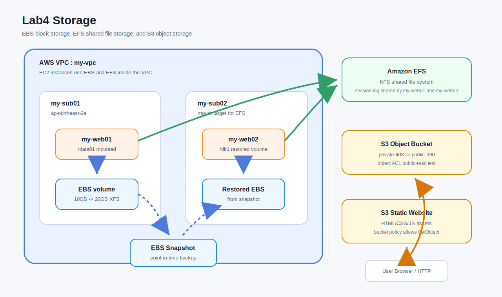
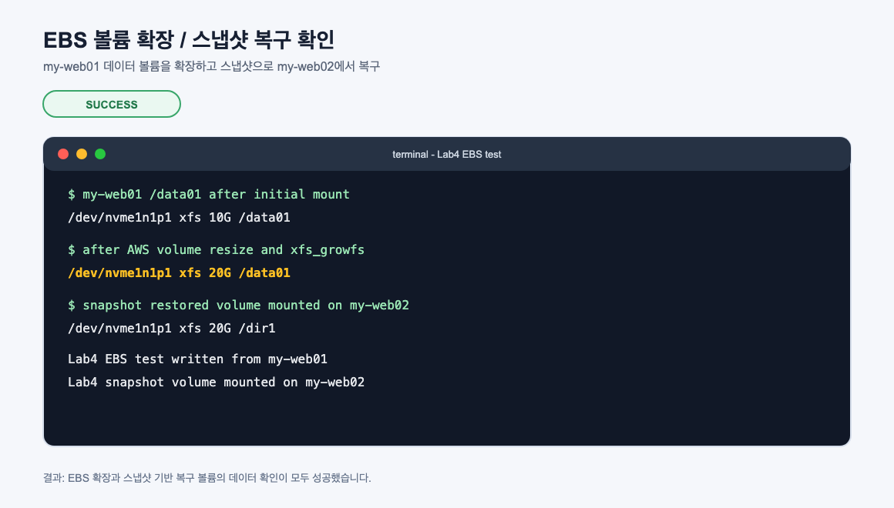
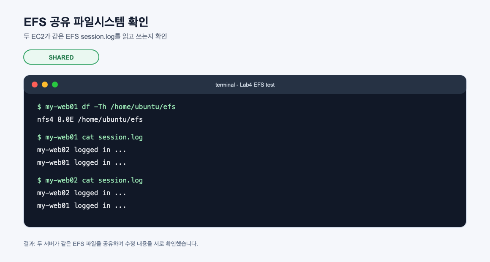
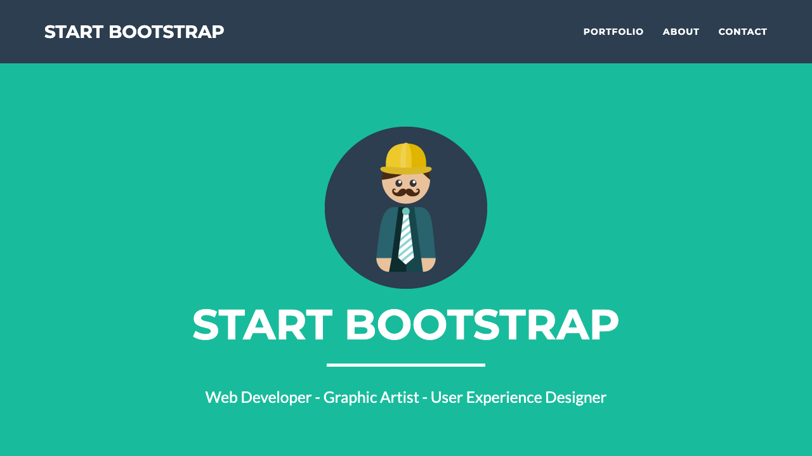
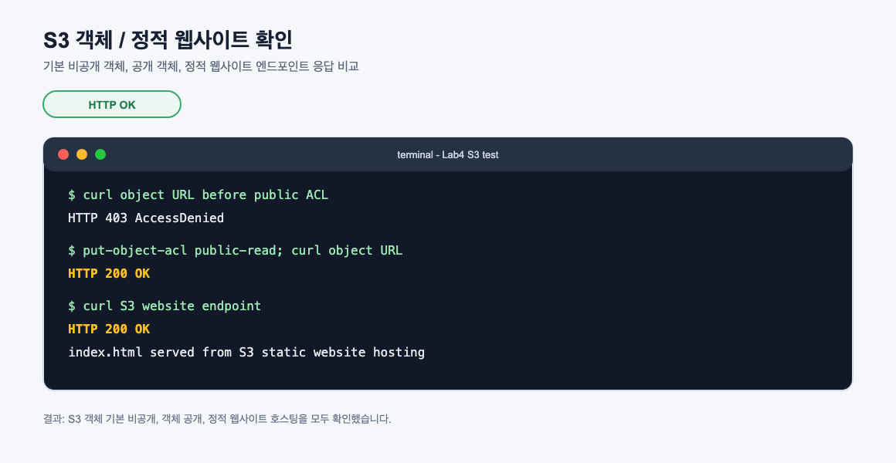

# Lab4 Storage

AWS 스토리지 개념과 실습 기록입니다. 이번 실습에서는 EC2에 붙이는 EBS 블록 스토리지, 여러 EC2가 함께 쓰는 EFS 파일 스토리지, 인터넷 기반 객체 저장소인 S3를 순서대로 확인했습니다.

## 아키텍처



## 실습 목표

- `my-web01`에 10GB EBS 데이터 볼륨 추가
- XFS 파일시스템 생성 후 `/data01`에 마운트
- EBS 볼륨을 10GB에서 20GB로 확장하고 파일시스템도 확장
- EBS 스냅샷 생성 후 새 볼륨으로 복원
- 복원 볼륨을 `my-web02`에 연결하고 `/dir1`에 마운트
- EFS 파일시스템 생성 후 `my-web01`, `my-web02`에서 공유 마운트
- S3 객체 업로드 후 기본 비공개 상태와 공개 전환 확인
- S3 정적 웹사이트 호스팅 구성 및 웹 페이지 접속 확인

## 실습 결과 요약

| 영역 | 테스트 | 결과 |
| --- | --- | --- |
| EBS | 10GB 볼륨 생성, XFS 포맷, `/data01` 마운트 | 성공 |
| EBS | 20GB로 볼륨 확장 후 `xfs_growfs` 실행 | 성공 |
| EBS Snapshot | 스냅샷에서 새 볼륨 생성 후 `my-web02`에 마운트 | 성공 |
| EFS | 두 EC2에서 같은 `session.log` 확인 | 성공 |
| S3 Object | 공개 전 403, 공개 후 200 응답 | 성공 |
| S3 Website | 정적 웹사이트 엔드포인트 HTTP 200 응답 | 성공 |

## 실습 캡처

### EBS 볼륨 확장과 스냅샷 복구



### EFS 공유 파일시스템



### S3 객체 접근 테스트


### S3 정적 웹사이트



### S3 응답 확인



## 핵심 개념

### 클라우드 스토리지

클라우드 스토리지는 데이터를 직접 구매한 물리 장비가 아니라 클라우드 사업자가 제공하는 저장소에 보관하고 네트워크로 접근하는 방식입니다. 사용자는 디스크 장비의 구매, 교체, 복제, 장애 대응을 직접 처리하지 않고 필요한 용량과 성능을 서비스 형태로 사용합니다.

중요한 특징은 다음과 같습니다.

- 확장성: 필요한 만큼 저장 공간을 늘리거나 줄일 수 있습니다.
- 고가용성: 서비스에 따라 여러 장비, 여러 가용 영역, 여러 시설에 데이터를 복제합니다.
- 내구성: 디스크나 장비 장애가 발생해도 데이터가 사라지지 않도록 설계합니다.
- 비용 효율성: 미리 큰 장비를 사지 않고 사용량 기반으로 비용을 냅니다.
- 접근 방식 다양성: EC2 내부 디스크처럼 쓰거나, 여러 서버가 공유하거나, HTTP API로 접근할 수 있습니다.

### 블록, 파일, 객체 스토리지

AWS 스토리지는 접근 방식에 따라 블록, 파일, 객체 스토리지로 나누어 이해하면 쉽습니다.

| 구분 | AWS 서비스 | 접근 방식 | 대표 사용 |
| --- | --- | --- | --- |
| 블록 스토리지 | Amazon EBS | EC2에 디스크처럼 연결 | OS 볼륨, 데이터베이스, 애플리케이션 데이터 |
| 파일 스토리지 | Amazon EFS | NFS로 여러 서버에 마운트 | 공유 디렉터리, 웹 콘텐츠 공유, 로그 공유 |
| 객체 스토리지 | Amazon S3 | HTTP API와 객체 URL | 이미지, 백업, 정적 웹사이트, 데이터 레이크 |

블록 스토리지는 운영체제가 디스크처럼 보고 파일시스템을 직접 올립니다. 파일 스토리지는 이미 파일시스템 형태로 제공되어 여러 서버가 동시에 같은 경로를 볼 수 있습니다. 객체 스토리지는 디렉터리처럼 보이지만 실제로는 key-value 구조의 객체 저장소이며, 파일 일부를 수정하기보다는 객체 단위로 저장하고 읽는 방식에 가깝습니다.

### Amazon EBS

Amazon EBS는 EC2 인스턴스에 연결하는 블록 수준 스토리지입니다. EC2 입장에서는 추가 디스크가 생기는 것과 비슷합니다. 그래서 EBS를 사용하려면 보통 다음 흐름이 필요합니다.

```text
EBS 볼륨 생성 -> EC2에 연결 -> 파티션 생성 -> 파일시스템 생성 -> 마운트
```

이번 실습에서는 10GB `gp3` 볼륨을 `my-web01`에 연결하고 XFS 파일시스템을 만들어 `/data01`에 마운트했습니다.

### EBS와 가용 영역

EBS 볼륨은 특정 가용 영역에 속합니다. 그래서 EC2 인스턴스와 EBS 볼륨이 같은 가용 영역에 있어야 연결할 수 있습니다.

예를 들어 `my-web01`이 `ap-northeast-2a`에 있다면, 이 인스턴스에 붙일 EBS 볼륨도 `ap-northeast-2a`에 있어야 합니다. 다른 가용 영역의 EBS 볼륨은 직접 attach할 수 없습니다.

스냅샷은 리전 단위 백업이므로, 스냅샷에서 새 볼륨을 만들 때 원하는 가용 영역을 선택할 수 있습니다. 이 특성 때문에 스냅샷은 백업뿐 아니라 가용 영역 간 데이터 이동에도 사용할 수 있습니다.

### 파일시스템과 마운트

EBS 볼륨은 빈 블록 장치이므로 바로 파일을 저장할 수 없습니다. 운영체제가 사용할 수 있도록 파일시스템을 만들어야 합니다.

이번 실습에서 사용한 흐름은 다음과 같습니다.

```text
/dev/nvme1n1 -> /dev/nvme1n1p1 파티션 생성 -> XFS 포맷 -> /data01 마운트
```

마운트는 특정 디스크나 파일시스템을 리눅스 디렉터리 트리에 연결하는 작업입니다. `/data01`에 마운트하면 사용자는 `/data01/file.txt`처럼 일반 디렉터리처럼 접근하지만, 실제 데이터는 추가 EBS 볼륨에 저장됩니다.

### `/etc/fstab`

리눅스에서 수동으로 `mount`한 내용은 재부팅하면 사라질 수 있습니다. 재부팅 후에도 자동으로 마운트하려면 `/etc/fstab`에 마운트 정보를 적습니다.

디바이스 이름은 재부팅이나 attach 순서에 따라 달라질 수 있으므로, 운영 환경에서는 `/dev/nvme1n1p1` 같은 이름보다 UUID를 사용하는 편이 안전합니다. 이번 실습도 UUID 기반으로 `/etc/fstab`에 기록했습니다.

### EBS 볼륨 확장

AWS 콘솔이나 CLI에서 EBS 크기를 10GB에서 20GB로 늘려도, 리눅스 파일시스템이 자동으로 커지는 것은 아닙니다.

확장에는 두 단계가 있습니다.

1. AWS에서 EBS 볼륨 크기 수정
2. EC2 내부에서 파티션과 파일시스템 확장

이번 실습에서는 `growpart`로 파티션을 확장하고, XFS 파일시스템은 `xfs_growfs`로 확장했습니다.

```text
EBS volume: 10GB -> 20GB
XFS filesystem: 10GB -> 20GB
```

### EBS 스냅샷

EBS 스냅샷은 특정 시점의 EBS 볼륨 백업입니다. 스냅샷은 증분 방식으로 저장되며, 스냅샷에서 언제든 새 EBS 볼륨을 만들 수 있습니다.

이번 실습에서는 `my-web01`의 `/data01`에 테스트 파일을 저장한 뒤 스냅샷을 생성했습니다. 이후 스냅샷에서 새 볼륨을 만들고 `my-web02`에 연결해 `/dir1`에 마운트했습니다. `my-web02`에서 `my-web01`이 작성한 파일을 확인했으므로, 스냅샷 복구가 정상 동작한 것입니다.

### Amazon EFS

Amazon EFS는 Linux 워크로드를 위한 관리형 파일 스토리지입니다. 여러 EC2 인스턴스가 같은 파일시스템을 동시에 마운트할 수 있습니다.

EBS와 EFS의 차이는 매우 중요합니다.

| 항목 | EBS | EFS |
| --- | --- | --- |
| 접근 단위 | 블록 장치 | 파일시스템 |
| 연결 대상 | 보통 단일 EC2 | 여러 EC2 동시 마운트 |
| 범위 | 가용 영역 단위 볼륨 | VPC 안의 여러 AZ에서 접근 |
| 프로토콜 | OS 블록 장치 | NFS |
| 대표 사용 | DB 디스크, OS 디스크 | 공유 콘텐츠, 공용 로그, 홈 디렉터리 |

이번 실습에서는 `my-web01`과 `my-web02`가 같은 EFS를 마운트하고 `session.log` 파일을 함께 수정했습니다. 한 서버가 쓴 내용이 다른 서버에서도 보였으므로 공유 파일시스템의 특징을 확인한 것입니다.

### EFS Mount Target

EFS를 VPC 안에서 사용하려면 mount target이 필요합니다. Mount target은 각 서브넷에 생성되는 네트워크 엔드포인트입니다. EC2는 이 mount target을 통해 EFS에 NFS로 접근합니다.

운영에서는 EC2가 있는 각 가용 영역마다 mount target을 두는 것이 좋습니다. 그래야 EC2가 같은 가용 영역의 mount target으로 접근해 지연 시간과 가용성을 개선할 수 있습니다.

이번 실습에서는 `my-sub01`, `my-sub02`에 mount target을 생성했습니다.

### EFS 보안 그룹

EFS는 NFS TCP 2049 포트를 사용합니다. PDF 실습에서는 NFS를 `0.0.0.0/0`에서 허용하는 흐름이 나오지만, 실제 운영에서는 너무 넓습니다.

이번 실습에서는 더 안전하게 웹 서버 보안 그룹 내부에서만 NFS를 허용했습니다.

```text
source: my-web-sg
port: TCP 2049
target: EFS mount target
```

이렇게 하면 같은 실습 웹 서버 그룹에 속한 EC2만 EFS에 접근할 수 있습니다.

### Amazon S3

Amazon S3는 객체 스토리지입니다. 파일은 버킷 안의 객체로 저장되며, 각 객체는 key, value, metadata, version 같은 정보를 가집니다.

S3는 EC2에 붙는 디스크가 아닙니다. 운영체제에 `/data01`처럼 마운트해서 쓰는 방식이 아니라, AWS CLI, SDK, HTTP API, 콘솔 등을 통해 객체를 업로드하고 다운로드합니다.

S3의 핵심 특징은 다음과 같습니다.

- 버킷 이름은 전 세계에서 고유해야 합니다.
- 저장 용량은 사실상 무제한에 가깝게 확장됩니다.
- S3 Standard는 99.999999999% 내구성을 목표로 설계됩니다.
- 객체는 기본적으로 비공개입니다.
- 버킷 정책, IAM 정책, ACL, pre-signed URL 등으로 접근을 제어합니다.

### S3 퍼블릭 액세스

S3에 객체를 업로드하면 기본적으로 외부 사용자는 접근할 수 없습니다. 이번 실습에서도 객체 공개 전에는 HTTP 403 응답이 나왔습니다.

객체를 공개하려면 다음 설정 중 하나가 필요합니다.

- 퍼블릭 액세스 차단 설정 조정
- 객체 ACL public-read
- 버킷 정책에서 `s3:GetObject` 허용

이번 실습에서는 객체 단위 공개 확인을 위해 ACL public-read를 사용했고, 정적 웹사이트 호스팅에는 버킷 정책으로 읽기 권한만 허용했습니다.

주의할 점은 `s3:PutObject`를 공개 Principal에 허용하면 누구나 버킷에 파일을 업로드할 수 있게 됩니다. 실습 PDF에는 정책 생성 과정에서 PutObject도 보이지만, 공개 웹사이트 목적이라면 일반적으로 `s3:GetObject`만 허용하는 것이 안전합니다.

### S3 정적 웹사이트 호스팅

S3 정적 웹사이트 호스팅은 HTML, CSS, JavaScript, 이미지처럼 서버 실행이 필요 없는 파일을 버킷에서 바로 서비스하는 기능입니다.

정적 웹사이트는 다음과 같은 특징이 있습니다.

- 서버 운영이 필요 없습니다.
- PHP, Node.js 같은 서버 사이드 코드는 실행되지 않습니다.
- 공개 읽기 권한이 필요합니다.
- 웹사이트 엔드포인트는 일반 S3 객체 URL과 다릅니다.

이번 실습에서는 zip에 포함된 `s3_mysite` 폴더를 S3 버킷에 업로드하고, 정적 웹사이트 엔드포인트에서 페이지가 열리는 것을 확인했습니다.

### S3 보안 관점

S3는 쉽게 공개할 수 있지만, 그래서 더 조심해야 합니다. 정적 웹사이트처럼 의도적으로 공개하는 경우가 아니라면 기본 비공개 상태를 유지하는 것이 좋습니다.

권장 기준은 다음과 같습니다.

- 공개가 필요 없는 버킷은 Block Public Access를 유지합니다.
- 공개 웹사이트 버킷도 `s3:GetObject`만 허용합니다.
- 업로드 권한은 IAM 사용자/역할에만 부여합니다.
- 중요한 데이터는 서버 측 암호화와 버전 관리를 고려합니다.
- 임시 공유는 public-read보다 pre-signed URL이 더 안전한 경우가 많습니다.

## 이번 실습에서 확인한 흐름

```text
1. EBS 10GB 볼륨 생성
2. my-web01에 attach
3. XFS 파일시스템 생성 후 /data01 마운트
4. EBS 크기를 20GB로 수정
5. growpart와 xfs_growfs로 파일시스템 확장
6. 스냅샷 생성
7. 스냅샷에서 새 볼륨 생성
8. my-web02에 attach 후 /dir1 마운트
9. EFS 생성 및 mount target 구성
10. my-web01, my-web02에서 같은 session.log 확인
11. S3 객체 업로드와 공개 접근 확인
12. S3 정적 웹사이트 호스팅 확인
```

## 명령어

실습 중 사용한 주요 명령어는 [commands.md](commands.md)에 정리했습니다.

## 정리 주의

실습 후에는 EBS 볼륨, EBS 스냅샷, EFS 파일시스템과 mount target, S3 버킷 객체, 공개 버킷 정책, EC2, NAT Gateway, ALB 같은 과금 가능 리소스를 정리해야 합니다.
