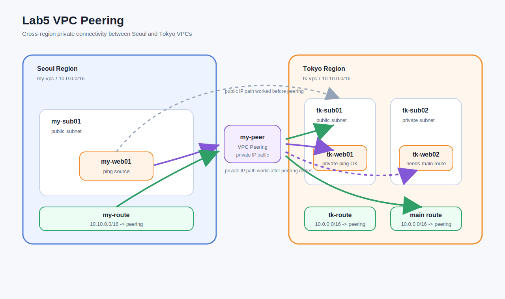
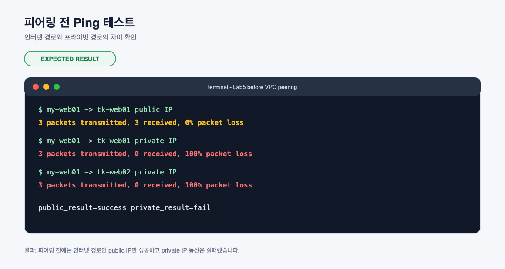
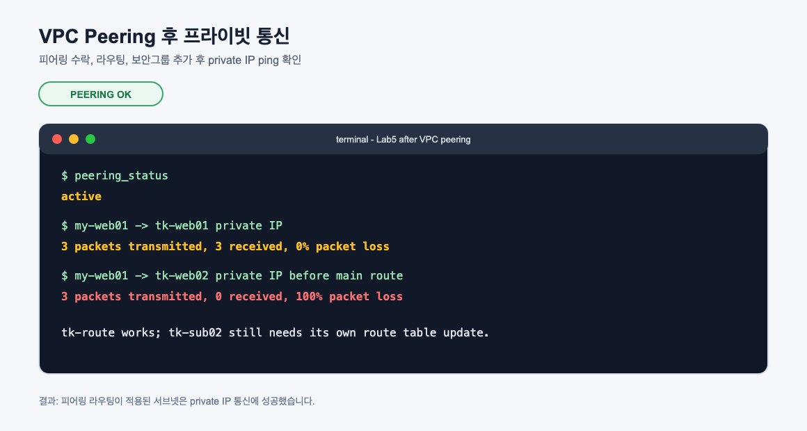
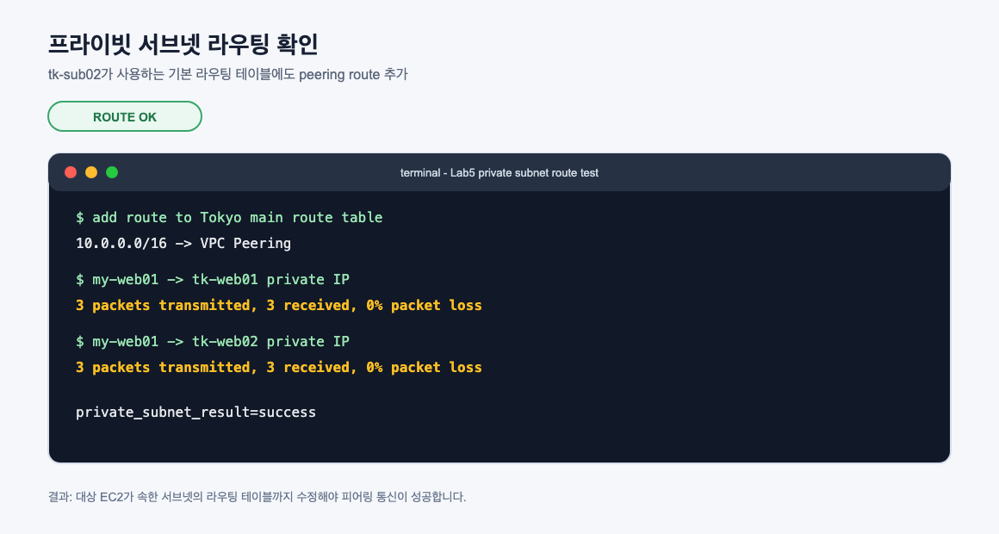

# Lab5 VPC Peering

AWS 고급 네트워킹 중 VPC Peering 실습 기록입니다. 서울 리전의 기존 `my-vpc`와 도쿄 리전에 새로 만든 `tk-vpc`를 피어링으로 연결하고, 퍼블릭 IP 통신과 프라이빗 IP 통신의 차이를 확인했습니다.

## 아키텍처



## 실습 목표

- 도쿄 리전에 `tk-vpc` 생성
- `tk-sub01` 퍼블릭 서브넷과 `tk-sub02` 프라이빗 서브넷 구성
- `tk-route`, `tk-igw`, `tk-web-sg` 생성
- `tk-web01` 퍼블릭 인스턴스와 `tk-web02` 프라이빗 인스턴스 생성
- 피어링 전에는 퍼블릭 IP ping만 성공하고 프라이빗 IP ping은 실패하는 것 확인
- 서울 `my-vpc`와 도쿄 `tk-vpc` 간 VPC Peering 생성 및 수락
- 양쪽 라우팅 테이블에 피어링 경로 추가
- 보안 그룹에 상대 VPC CIDR 허용
- 프라이빗 IP 기반 리전 간 통신 성공 확인
- 프라이빗 서브넷은 해당 서브넷 라우팅 테이블도 수정되어야 통신되는 것 확인

## 리소스 구성

| 리소스 | 리전 | 역할 |
| --- | --- | --- |
| `my-vpc` | Seoul | 기존 실습 VPC, CIDR `10.0.0.0/16` |
| `my-web01` | Seoul | ping 테스트를 실행한 기준 EC2 |
| `tk-vpc` | Tokyo | Lab5용 신규 VPC, CIDR `10.10.0.0/16` |
| `tk-sub01` | Tokyo | 퍼블릭 서브넷, `tk-route` 연결 |
| `tk-sub02` | Tokyo | 프라이빗 서브넷, 기본 라우팅 테이블 사용 |
| `tk-web01` | Tokyo | 퍼블릭 서브넷 테스트 EC2 |
| `tk-web02` | Tokyo | 프라이빗 서브넷 테스트 EC2 |
| `my-peer` | Seoul/Tokyo | Cross-region VPC Peering |

## 실습 결과 요약

| 단계 | 테스트 | 결과 | 의미 |
| --- | --- | --- | --- |
| 피어링 전 | `my-web01 -> tk-web01 public IP` | 성공 | 인터넷 경로로 통신 |
| 피어링 전 | `my-web01 -> tk-web01 private IP` | 실패 | 프라이빗 CIDR 경로 없음 |
| 피어링 후 | `my-web01 -> tk-web01 private IP` | 성공 | 양쪽 public subnet route table에 peering route 존재 |
| 프라이빗 서브넷 고려 전 | `my-web01 -> tk-web02 private IP` | 실패 | `tk-sub02`가 쓰는 route table에 peering route 없음 |
| 프라이빗 서브넷 route 추가 후 | `my-web01 -> tk-web02 private IP` | 성공 | 대상 서브넷의 route table까지 수정되어 통신 가능 |

## 실습 캡처

### 피어링 전 Ping 테스트



### VPC Peering 후 프라이빗 통신



### 프라이빗 서브넷 라우팅 고려사항



## 핵심 개념

### VPC Peering

VPC Peering은 두 VPC를 프라이빗 네트워크처럼 연결하는 기능입니다. 피어링이 연결되면 두 VPC의 EC2 인스턴스는 퍼블릭 IP가 아니라 프라이빗 IP로 통신할 수 있습니다.

VPC Peering은 다음 상황에서 사용합니다.

- 같은 계정의 VPC끼리 연결
- 다른 계정의 VPC와 연결
- 같은 리전의 VPC 연결
- 다른 리전의 VPC 연결

이번 실습은 서울 리전 `my-vpc`와 도쿄 리전 `tk-vpc`를 연결한 cross-region VPC Peering입니다.

### 퍼블릭 IP 통신과 프라이빗 IP 통신

피어링 전에도 도쿄 EC2의 퍼블릭 IP로 ping이 성공할 수 있습니다. 이 경우 트래픽은 인터넷 경로를 사용합니다.

하지만 프라이빗 IP는 인터넷에서 라우팅되지 않습니다. `10.10.1.0/24` 같은 사설 IP 대역은 해당 VPC 내부에서만 의미가 있습니다. 서울 VPC가 도쿄 VPC의 프라이빗 IP 대역을 어디로 보내야 하는지 모르면 통신할 수 없습니다.

이번 실습에서 피어링 전 결과는 다음과 같았습니다.

```text
my-web01 -> tk-web01 public IP  : success
my-web01 -> tk-web01 private IP : fail
```

### Peering은 연결만으로 끝나지 않는다

VPC Peering 리소스를 만들고 수락해도 통신이 바로 되는 것은 아닙니다. 반드시 양쪽 라우팅 테이블에 상대 VPC CIDR로 가는 경로를 추가해야 합니다.

```text
my-vpc route table
10.10.0.0/16 -> pcx

tk-vpc route table
10.0.0.0/16 -> pcx
```

라우팅은 항상 양방향으로 생각해야 합니다. 요청이 가는 경로만 있고 응답이 돌아오는 경로가 없으면 통신은 실패합니다.

### 보안 그룹도 양쪽에서 고려해야 한다

라우팅 테이블이 맞아도 보안 그룹에서 막히면 통신은 실패합니다. VPC Peering은 네트워크 경로를 제공할 뿐, 보안 그룹을 자동으로 열어주지는 않습니다.

이번 실습에서는 다음 원칙으로 보안 그룹을 조정했습니다.

- 도쿄 `tk-web-sg`: 서울 VPC CIDR `10.0.0.0/16` 허용
- 서울 `my-web-sg`: 도쿄 VPC CIDR `10.10.0.0/16` 허용

실습에서는 ping 확인을 위해 ICMP와 내부 통신을 허용했습니다. 운영 환경에서는 필요한 포트만 최소 권한으로 허용하는 것이 좋습니다.

### CIDR 중복 제한

VPC Peering을 만들려면 두 VPC의 CIDR이 겹치면 안 됩니다. 예를 들어 두 VPC가 모두 `10.0.0.0/16`이면 AWS는 어떤 VPC로 트래픽을 보내야 하는지 결정할 수 없습니다.

이번 실습에서는 다음처럼 CIDR을 분리했습니다.

| VPC | CIDR |
| --- | --- |
| `my-vpc` | `10.0.0.0/16` |
| `tk-vpc` | `10.10.0.0/16` |

이처럼 처음 VPC를 설계할 때 나중에 연결될 가능성이 있는 네트워크와 CIDR이 겹치지 않게 계획하는 것이 중요합니다.

### 전이적 라우팅 미지원

VPC Peering은 전이적 라우팅을 지원하지 않습니다. 즉 A-B, B-C가 피어링되어 있어도 A가 B를 거쳐 C와 통신할 수 없습니다.

```text
VPC A <-> VPC B <-> VPC C

VPC A can talk to VPC B
VPC B can talk to VPC C
VPC A cannot talk to VPC C through VPC B
```

여러 VPC를 허브처럼 연결해야 한다면 VPC Peering을 많이 만드는 것보다 Transit Gateway를 검토하는 편이 좋습니다.

### 라우팅 테이블은 서브넷 단위로 적용된다

VPC 하나에 라우팅 테이블이 하나만 있는 것은 아닙니다. 서브넷마다 다른 라우팅 테이블을 연결할 수 있습니다.

이번 실습에서 중요한 지점은 `tk-sub01`과 `tk-sub02`입니다.

- `tk-sub01`: `tk-route`에 명시적으로 연결
- `tk-sub02`: VPC의 기본 라우팅 테이블 사용

처음에는 `tk-route`에만 서울 VPC로 가는 피어링 경로를 추가했습니다. 그래서 `tk-sub01`의 `tk-web01`은 통신에 성공했지만, 기본 라우팅 테이블을 쓰는 `tk-sub02`의 `tk-web02`는 실패했습니다.

그 후 기본 라우팅 테이블에도 `10.0.0.0/16 -> pcx` 경로를 추가하자 `tk-web02`도 통신에 성공했습니다.

이것이 실습의 핵심입니다.

```text
피어링 연결 + 해당 서브넷 라우팅 테이블 + 보안 그룹
= 프라이빗 통신 성공
```

### Cross-region VPC Peering

서로 다른 리전 간에도 VPC Peering을 만들 수 있습니다. 이 경우 리전 간 AWS 백본 네트워크를 통해 프라이빗 IP 통신이 가능합니다.

Cross-region peering에서 기억할 점은 다음과 같습니다.

- 요청 리전과 수락 리전이 다를 수 있습니다.
- 요청자는 한 리전에서 만들고, 수락자는 상대 리전에서 수락합니다.
- 각 리전의 라우팅 테이블을 따로 수정해야 합니다.
- 리전 간 데이터 전송 비용이 발생할 수 있습니다.

### VPC Endpoint

VPC Endpoint는 VPC 안의 리소스가 인터넷을 거치지 않고 AWS 서비스에 프라이빗하게 접근하도록 만드는 기능입니다.

대표 유형은 두 가지입니다.

| 유형 | 예시 | 특징 |
| --- | --- | --- |
| Gateway Endpoint | S3, DynamoDB | 라우팅 테이블에 endpoint 경로를 추가 |
| Interface Endpoint | EC2 API, ECR, Kinesis 등 | ENI와 PrivateLink 기반 접근 |

Lab5 PDF의 추가 고려사항에서는 프라이빗 서브넷 EC2에 접속할 때 EC2 Instance Connect Endpoint가 필요할 수 있다고 설명합니다. 이 endpoint는 프라이빗 서브넷 EC2에 퍼블릭 IP 없이 연결하기 위한 접근 경로입니다.

이번 실습에서는 서울 `my-web01`에서 피어링 경로를 통해 도쿄 프라이빗 인스턴스의 ICMP 통신을 검증했습니다. 콘솔 기반 SSH 접속 자체를 검증하려면 EC2 Instance Connect Endpoint를 추가로 구성해야 합니다.

### Site-to-Site VPN

Site-to-Site VPN은 온프레미스 네트워크와 AWS VPC를 인터넷 기반 IPSec 터널로 연결하는 방식입니다.

VPC Peering이 VPC-VPC 연결이라면, Site-to-Site VPN은 회사 네트워크와 AWS 사이의 하이브리드 연결입니다.

특징은 다음과 같습니다.

- 인터넷 위에 암호화된 VPN 터널 생성
- 보통 두 개의 터널로 고가용성 구성
- 전용 회선보다 빠르게 구성 가능
- 인터넷 품질의 영향을 받을 수 있음

### Direct Connect

Direct Connect는 온프레미스와 AWS를 전용 네트워크 회선으로 연결하는 서비스입니다. 인터넷 VPN보다 예측 가능한 지연 시간과 대역폭이 필요할 때 사용합니다.

주요 사용 사례는 다음과 같습니다.

- 대용량 데이터 전송
- 안정적인 네트워크 지연 시간이 필요한 워크로드
- 보안/규정상 퍼블릭 인터넷 경유를 줄여야 하는 환경
- 온프레미스 데이터센터와 AWS 간 장기 연결

### Transit Gateway

Transit Gateway는 여러 VPC와 온프레미스 네트워크를 중앙 허브로 연결하는 서비스입니다.

VPC Peering을 여러 개 만들면 VPC 수가 늘어날수록 연결 수가 급격히 늘어납니다. 예를 들어 VPC 5개를 모두 서로 연결하려면 피어링 연결이 많이 필요하고 라우팅 관리도 복잡해집니다.

Transit Gateway를 사용하면 각 VPC는 Transit Gateway에만 연결하고, Transit Gateway가 중앙 라우터 역할을 합니다.

| 구분 | VPC Peering | Transit Gateway |
| --- | --- | --- |
| 구조 | VPC 간 1:1 연결 | 중앙 허브 연결 |
| 전이 라우팅 | 지원 안 함 | 지원 |
| 규모 | 소수 VPC에 적합 | 다수 VPC/온프레미스에 적합 |
| 관리 | 연결 수가 늘면 복잡 | 중앙 라우팅 관리 |

### Route 53

Route 53은 AWS의 DNS 서비스입니다. VPC Peering 자체가 DNS 서비스를 대체하지는 않습니다. 프라이빗 IP 통신이 되더라도 이름 해석을 어떻게 할지는 별도로 설계해야 합니다.

Route 53은 다음과 같은 상황에서 사용합니다.

- 도메인 이름을 ALB, CloudFront, EC2, S3 웹사이트 등에 연결
- 장애 조치 라우팅 구성
- 지연 시간 기반 라우팅 구성
- 프라이빗 호스티드 존으로 VPC 내부 DNS 구성

VPC 간 이름 해석까지 자연스럽게 하고 싶다면 Private Hosted Zone 연결, VPC DNS 옵션, Peering DNS resolution 옵션을 함께 검토해야 합니다.

## 이번 실습에서 확인한 흐름

```text
1. 도쿄 리전에 tk-vpc 생성
2. tk-sub01, tk-sub02 생성
3. tk-route와 tk-igw로 tk-sub01을 퍼블릭 서브넷으로 구성
4. tk-web01, tk-web02 생성
5. 피어링 전 public IP ping 성공, private IP ping 실패 확인
6. 서울 my-vpc에서 VPC Peering 요청 생성
7. 도쿄 tk-vpc에서 Peering 요청 수락
8. 서울 my-route에 10.10.0.0/16 -> pcx 추가
9. 도쿄 tk-route에 10.0.0.0/16 -> pcx 추가
10. tk-web01 private IP ping 성공 확인
11. tk-web02 private IP ping 실패 확인
12. 도쿄 기본 route table에도 10.0.0.0/16 -> pcx 추가
13. tk-web02 private IP ping 성공 확인
```

## 명령어

실습 중 사용한 주요 명령어는 [commands.md](commands.md)에 정리했습니다.

## 정리 주의

실습 후에는 도쿄 EC2, VPC Peering, Tokyo VPC 구성 리소스, 서울 라우팅/보안그룹에 추가한 피어링 규칙을 정리해야 합니다. 기존 Lab1-Lab4 리소스까지 함께 남아 있으면 과금이 계속 발생합니다.
