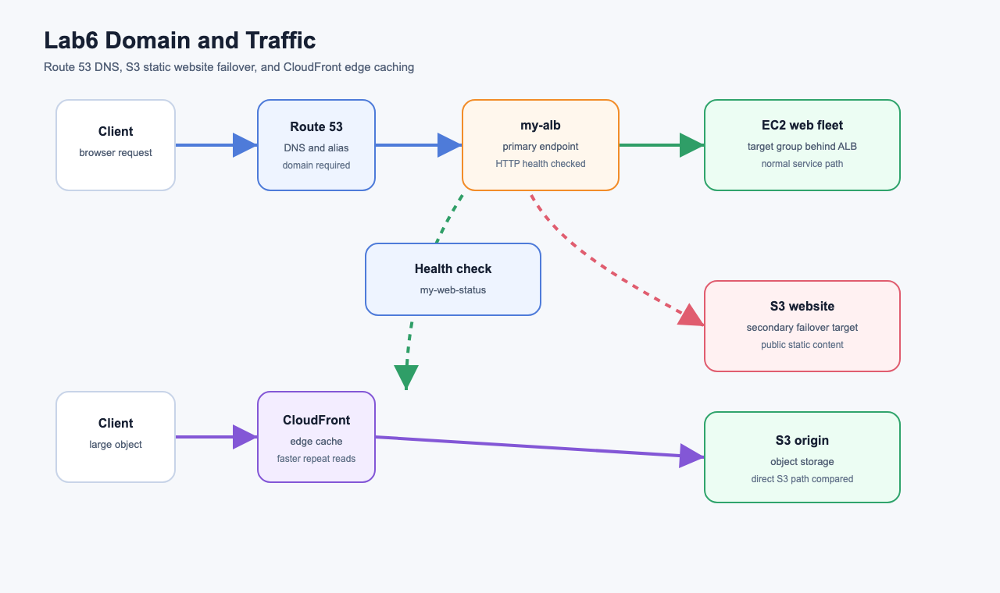
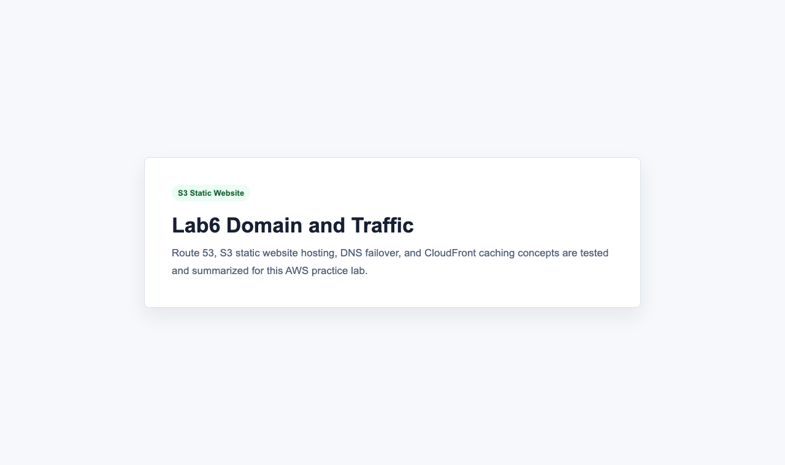
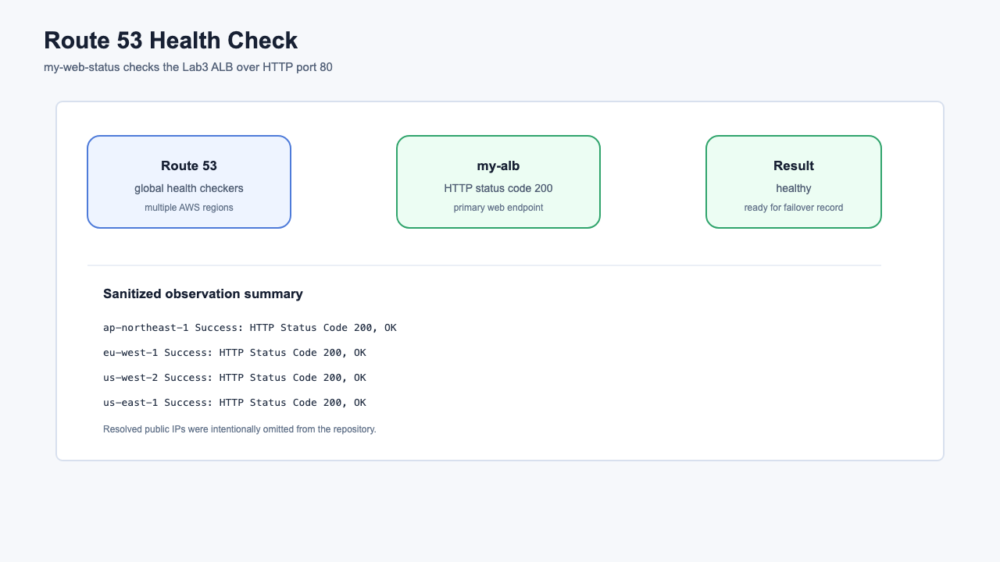
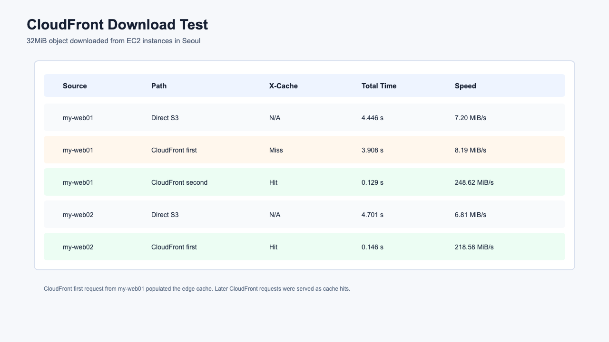

# Lab6 Domain and Traffic

AWS 도메인, 트래픽 관리, 콘텐츠 캐싱 개념과 실습 기록입니다. 이번 실습에서는 Route 53, S3 정적 웹사이트, DNS 장애조치, CloudFront CDN 캐싱을 다룹니다.

## 아키텍처



원본 SVG는 [architecture.svg](architecture.svg)에 함께 보관했습니다.

## 실습 목표

- Route 53 퍼블릭 호스팅 영역과 NS 위임 흐름 이해
- ALB를 가리키는 Route 53 Alias A 레코드 구조 이해
- Route 53 헬스 체크로 ALB 상태 확인
- S3 정적 웹사이트 호스팅 구성
- DNS 장애조치에서 기본 레코드와 보조 레코드의 역할 이해
- 미국 동부 리전에 S3 오리진 버킷 생성
- CloudFront 배포 생성 후 S3 객체 다운로드 경로 비교
- CloudFront 캐싱, TTL, 캐시 히트/미스 개념 정리

## 실습 결과 요약

| 구간 | 수행 결과 | 설명 |
| --- | --- | --- |
| Route 53 Hosted Zone | 문서화 | 실제 소유 도메인이 필요해서 생성하지 않음 |
| Route 53 Health Check | 성공 | `my-alb` HTTP 200 상태 확인 |
| S3 Static Website | 성공 | 정적 웹사이트 엔드포인트 HTTP 200 |
| CloudFront Distribution | 성공 | S3 오리진 기반 배포 `Deployed` |
| Download Test | 성공 | `my-web01`, `my-web02`에서 직접 S3와 CloudFront 다운로드 비교 |

## 리소스 구성

| 리소스 | 리전 | 역할 |
| --- | --- | --- |
| `my-alb` | Seoul | Route 53 기본 레코드가 바라볼 ALB |
| `my-web-status` | Global | ALB HTTP 상태를 확인하는 Route 53 health check |
| `wildyoung-lab6-site-20260703021919` | Seoul | S3 정적 웹사이트 호스팅 버킷 |
| `wildyoung-lab6-direct-20260703021919` | N. Virginia | 직접 S3 다운로드 비교용 버킷 |
| `wildyoung-lab6-cf-origin-20260703021919` | N. Virginia | CloudFront 오리진 버킷 |
| `drytce7emp5dc.cloudfront.net` | Global | CloudFront 배포 도메인 |

## 실습 캡처

### S3 정적 웹사이트



### Route 53 Health Check



### CloudFront 다운로드 테스트



## 다운로드 테스트 결과

테스트 객체는 32MiB입니다. 수업 자료는 1GB 이상의 ISO 파일을 사용하지만, 비용과 시간을 줄이기 위해 더 작은 객체로 캐시 동작을 확인했습니다.

| Source | Path | X-Cache | Total Time | Speed |
| --- | --- | --- | --- | --- |
| `my-web01` | Direct S3 | N/A | 4.446s | 7.20 MiB/s |
| `my-web01` | CloudFront first | Miss | 3.908s | 8.19 MiB/s |
| `my-web01` | CloudFront second | Hit | 0.129s | 248.62 MiB/s |
| `my-web02` | Direct S3 | N/A | 4.701s | 6.81 MiB/s |
| `my-web02` | CloudFront first | Hit | 0.146s | 218.58 MiB/s |

`my-web01`의 첫 CloudFront 요청은 `Miss from cloudfront`였습니다. 이 요청이 엣지 캐시를 채운 뒤 두 번째 요청과 `my-web02`의 요청은 `Hit from cloudfront`로 응답했고, 다운로드 시간이 크게 줄었습니다.

## Route 53 개념

### DNS와 Route 53

DNS는 사람이 읽기 쉬운 도메인 이름을 실제 접속 대상 주소로 바꾸는 시스템입니다. 예를 들어 `www.example.com`을 입력하면 DNS 질의를 통해 해당 이름이 어떤 서버, 로드 밸런서, CloudFront 배포, S3 웹사이트로 연결되는지 찾습니다.

Route 53은 AWS의 관리형 DNS 서비스입니다. 도메인 등록, DNS 레코드 관리, 헬스 체크, 장애조치 라우팅, 지연 시간 기반 라우팅 등을 제공합니다.

### Hosted Zone

Hosted Zone은 특정 도메인의 DNS 레코드를 담는 관리 단위입니다. 예를 들어 `example.com`의 퍼블릭 호스팅 영역을 만들면, 그 안에 `example.com`, `www.example.com`, `api.example.com` 같은 레코드를 만들 수 있습니다.

퍼블릭 호스팅 영역이 실제 인터넷 DNS로 동작하려면 도메인 등록기관의 네임서버를 Route 53이 제공하는 NS 값 4개로 바꿔야 합니다. 이 과정을 NS 위임이라고 합니다.

이번 실습 자료의 Route 53 단계가 실제 구매 도메인을 요구하는 이유가 여기에 있습니다. AWS 안에서 호스팅 영역만 만들어도, 외부 등록기관에서 NS 위임을 하지 않으면 인터넷 사용자는 그 Route 53 영역을 찾지 못합니다.

### A, CNAME, Alias 레코드

| 레코드 | 의미 | 주의점 |
| --- | --- | --- |
| A | 이름을 IPv4 주소로 연결 | 전통적인 DNS 기본 레코드 |
| CNAME | 이름을 다른 DNS 이름으로 연결 | 루트 도메인에는 보통 사용 불가 |
| Alias A | AWS 리소스를 A 레코드처럼 연결 | ALB, CloudFront, S3 website 등에 적합 |

ALB는 고정 IP 하나가 아니라 AWS가 관리하는 DNS 이름을 제공합니다. 그래서 Route 53에서는 ALB를 직접 IP로 적기보다 Alias A 레코드로 연결합니다.

### 라우팅 정책

Route 53 레코드는 단순히 이름을 주소로 바꾸는 것 이상을 할 수 있습니다.

| 정책 | 용도 |
| --- | --- |
| Simple | 하나의 대상에 단순 연결 |
| Weighted | 여러 대상에 비율을 나눠 트래픽 분산 |
| Latency | 사용자에게 지연 시간이 낮은 리전으로 응답 |
| Failover | 기본 대상 장애 시 보조 대상으로 응답 |
| Geolocation | 사용자 위치 기반 응답 |
| Multivalue Answer | 여러 정상 엔드포인트를 DNS 응답에 포함 |

이번 Lab6의 핵심은 Failover 라우팅입니다. 기본 레코드는 ALB를 바라보고, 보조 레코드는 S3 정적 웹사이트를 바라봅니다. Route 53 health check가 기본 대상 장애를 감지하면 보조 레코드로 응답하게 됩니다.

### DNS 장애조치

DNS 장애조치는 애플리케이션 앞단에서 도메인 응답을 바꿔 장애 상황을 우회하는 방식입니다.

이번 실습 구조는 다음과 같습니다.

```text
normal state
domain -> Route 53 primary alias -> ALB -> EC2 web servers

failure state
domain -> Route 53 secondary alias -> S3 static website
```

이 방식은 단순한 정적 안내 페이지나 임시 점검 페이지로 넘길 때 유용합니다. 다만 DNS 캐시 때문에 전환이 즉시 보이지 않을 수 있습니다. 브라우저, 운영체제, ISP DNS 캐시가 TTL 동안 이전 응답을 유지할 수 있기 때문입니다.

## S3 정적 웹사이트 개념

S3 정적 웹사이트 호스팅은 HTML, CSS, JavaScript, 이미지처럼 서버 실행이 필요 없는 파일을 S3에서 바로 제공하는 기능입니다.

일반 S3 객체 URL과 웹사이트 엔드포인트는 다릅니다.

```text
S3 object endpoint
https://bucket-name.s3.amazonaws.com/index.html

S3 website endpoint
http://bucket-name.s3-website.ap-northeast-2.amazonaws.com
```

웹사이트 엔드포인트는 `index.html`, `error.html` 같은 웹사이트 문서 설정을 이해합니다. 대신 HTTPS를 직접 제공하지 않습니다. HTTPS가 필요하면 보통 CloudFront를 앞에 둡니다.

S3 정적 웹사이트를 공개하려면 퍼블릭 액세스 차단 설정과 버킷 정책을 의도적으로 열어야 합니다. 운영 환경에서는 실수로 민감 데이터가 공개되지 않도록 정적 웹사이트 전용 버킷을 분리하는 것이 좋습니다.

## CloudFront 개념

### CDN과 Edge Location

CloudFront는 AWS의 CDN입니다. CDN은 원본 서버 또는 S3 오리진에 있는 콘텐츠를 사용자와 가까운 엣지 로케이션에 캐싱해서 더 빠르게 전달합니다.

처음 요청은 오리진까지 가야 하므로 느릴 수 있습니다. 이후 같은 객체가 캐시에 있으면 CloudFront 엣지에서 바로 응답하므로 지연 시간과 오리진 부하가 줄어듭니다.

```text
first request
client -> CloudFront edge -> S3 origin -> CloudFront edge -> client

cached request
client -> CloudFront edge -> client
```

### Cache Hit과 Cache Miss

CloudFront 응답 헤더의 `X-Cache`를 보면 캐시 상태를 확인할 수 있습니다.

| 값 | 의미 |
| --- | --- |
| `Miss from cloudfront` | 엣지에 객체가 없어 오리진에서 가져옴 |
| `Hit from cloudfront` | 엣지 캐시에서 바로 제공 |

### TTL

TTL은 객체가 CloudFront 캐시에 유지되는 시간입니다. TTL이 길면 캐시 히트 가능성이 올라가고 오리진 부하가 줄어듭니다. 대신 원본 파일을 바꿔도 사용자가 이전 캐시를 더 오래 볼 수 있습니다.

운영에서는 다음 두 방식을 많이 사용합니다.

- 파일 이름에 버전 포함: `app-v2.js`, `header-v3.png`
- 꼭 필요할 때만 invalidation 실행

Invalidation은 CloudFront 캐시에서 특정 객체를 지우는 기능입니다. 편리하지만 비용과 시간이 들 수 있으므로 자주 쓰기보다 버전이 포함된 파일명을 사용하는 편이 좋습니다.

### CloudFront와 S3 보안

이번 실습은 수업 흐름에 맞춰 S3 객체를 공개하고 CloudFront에서 읽는 방식으로 구성했습니다. 운영 환경에서는 S3를 직접 공개하지 않고 CloudFront Origin Access Control(OAC)을 사용해 CloudFront만 S3 오리진에 접근하도록 구성하는 것이 더 안전합니다.

## 이번 실습에서 확인한 흐름

```text
1. 기존 Lab3의 my-alb HTTP 200 상태 확인
2. Route 53 health check my-web-status 생성
3. S3 정적 웹사이트 버킷 생성
4. index.html, error.html 업로드
5. S3 website endpoint HTTP 200 확인
6. us-east-1에 직접 다운로드용 S3 버킷 생성
7. us-east-1에 CloudFront 오리진용 S3 버킷 생성
8. 테스트 객체 업로드
9. CloudFront 배포 생성
10. EC2에서 직접 S3 URL과 CloudFront URL 다운로드 시간 비교
```

## 도메인 실습 제한 사항

현재 계정에는 Route 53 hosted zone이 없고, 이 실습에 사용할 실제 소유 도메인도 제공되지 않았습니다. 그래서 다음 단계는 문서로 정리하고 실제 생성은 하지 않았습니다.

- 외부 등록기관에서 도메인 구매
- Route 53 퍼블릭 호스팅 영역 생성
- 등록기관 네임서버를 Route 53 NS 4개로 변경
- ALB Alias A 기본 레코드 생성
- S3 Website Alias A 보조 레코드 생성
- Failover 라우팅 정책으로 실제 도메인 장애조치 확인

도메인이 준비되면 [commands.md](commands.md)의 Route 53 레코드 예시를 그대로 이어서 실행할 수 있습니다.

## 명령어

실습 중 사용한 주요 명령어는 [commands.md](commands.md)에 정리했습니다.

## 정리 주의

CloudFront 배포, Route 53 health check, S3 버킷은 과금 가능 리소스입니다. 실습 확인 후 사용하지 않을 경우 CloudFront 배포 비활성화/삭제, health check 삭제, S3 버킷 비우기/삭제를 진행해야 합니다.
