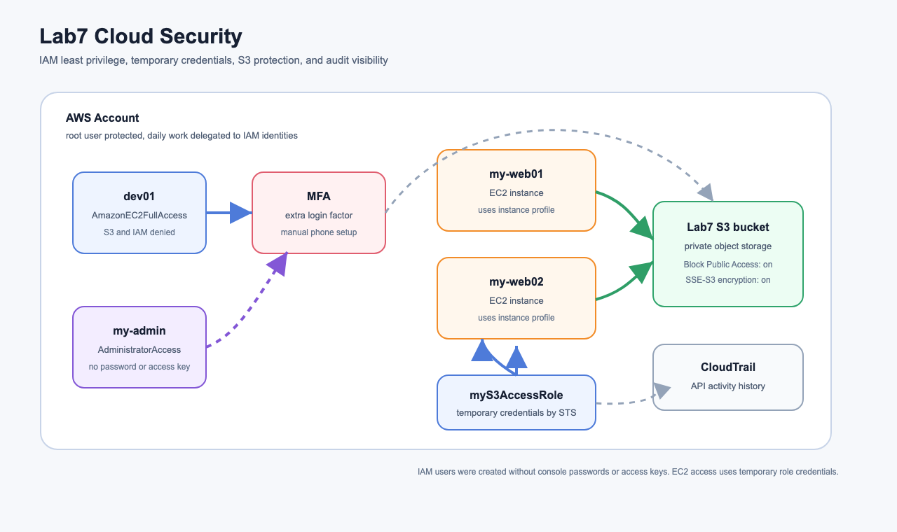
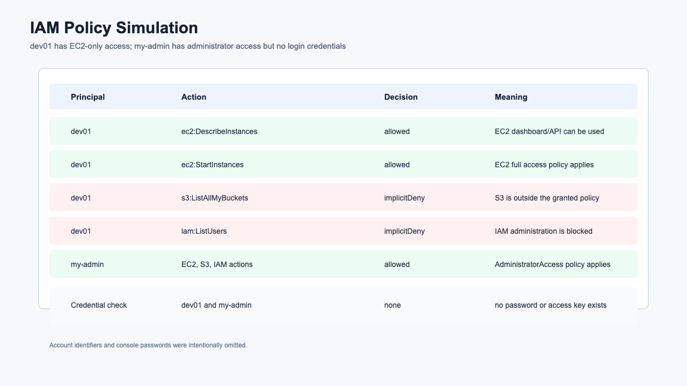
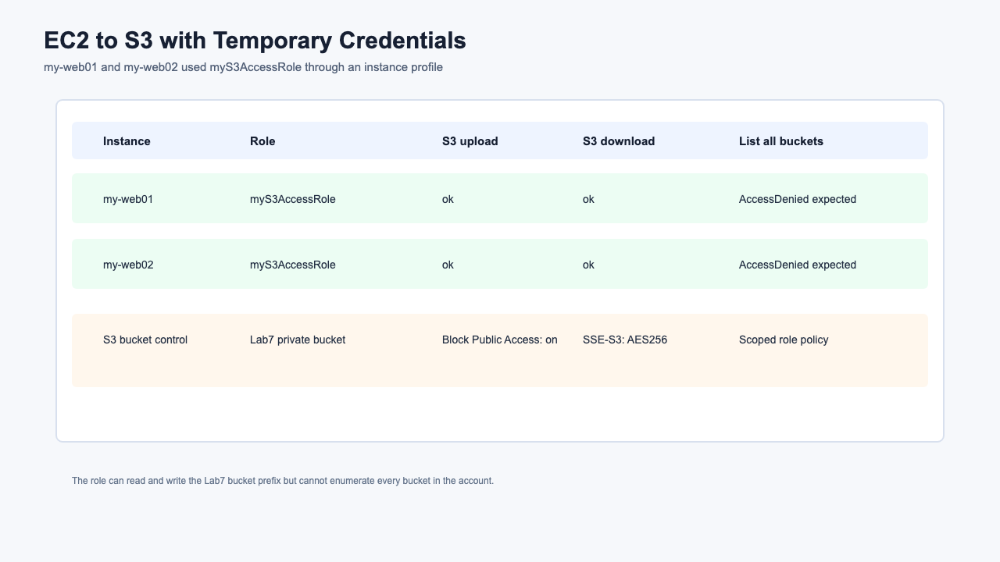

# Lab7 Cloud Security

AWS 클라우드 보안 개념과 실습 기록입니다. 이번 실습에서는 IAM 사용자와 정책, 관리자 계정 원칙, MFA, EC2 인스턴스 프로파일, S3 접근 권한, 계정 보안 서비스를 정리했습니다.

## 아키텍처



원본 SVG는 [architecture.svg](architecture.svg)에 함께 보관했습니다.

## 실습 목표

- IAM 사용자 `dev01` 생성과 EC2 전용 권한 확인
- IAM 관리자 사용자 `my-admin`의 관리자 정책 구조 이해
- MFA가 계정 보안에 필요한 이유 정리
- EC2에서 장기 액세스 키 없이 IAM 역할로 S3 접근
- S3 버킷의 퍼블릭 액세스 차단과 서버 측 암호화 확인
- IAM 권한 평가에서 허용, 암시적 거부, 명시적 거부의 차이 이해
- CloudTrail, KMS, Organizations, Config 등 보안 관련 서비스 개념 정리

## 실습 결과 요약

| 구간 | 수행 결과 | 설명 |
| --- | --- | --- |
| `dev01` IAM 사용자 | 성공 | `AmazonEC2FullAccess` 연결, S3/IAM은 암시적 거부 |
| `my-admin` IAM 사용자 | 성공 | `AdministratorAccess` 연결, 콘솔 비밀번호/액세스 키는 생성하지 않음 |
| MFA | 문서화 | 실제 OTP 앱과 휴대폰 인증이 필요해서 절차와 의미만 정리 |
| EC2 IAM Role | 성공 | `my-web01`, `my-web02`에 `myS3AccessRole` 인스턴스 프로파일 연결 |
| EC2에서 S3 접근 | 성공 | 두 EC2 모두 S3 업로드/다운로드 성공 |
| 최소 권한 확인 | 성공 | 역할로 Lab7 버킷 접근은 가능, 전체 버킷 목록 조회는 거부 |
| S3 보안 설정 | 성공 | Block Public Access 전체 활성화, SSE-S3 `AES256` 확인 |

## 리소스 구성

| 리소스 | 역할 |
| --- | --- |
| `dev01` | EC2 관리 권한만 가진 IAM 사용자 |
| `my-admin` | 루트 계정 대체 관리자 구조를 확인하기 위한 IAM 사용자 |
| `myS3AccessRole` | EC2가 S3에 접근하기 위해 사용하는 IAM 역할 |
| `Lab7S3BucketAccess-20260703023156` | Lab7 버킷에만 접근하도록 제한한 역할 인라인 정책 |
| `wildyoung-lab7-security-20260703023156` | EC2 역할 테스트용 비공개 S3 버킷 |
| `my-web01`, `my-web02` | IAM 역할을 연결하고 S3 접근을 테스트한 EC2 |

## 실습 캡처

### IAM 정책 시뮬레이션



### EC2에서 S3 접근



## 실제 확인한 결과

### IAM 정책 시뮬레이션

| Principal | Action | Decision | 의미 |
| --- | --- | --- | --- |
| `dev01` | `ec2:DescribeInstances` | `allowed` | EC2 조회 가능 |
| `dev01` | `ec2:StartInstances` | `allowed` | EC2 시작 가능 |
| `dev01` | `s3:ListAllMyBuckets` | `implicitDeny` | S3 권한 없음 |
| `dev01` | `iam:ListUsers` | `implicitDeny` | IAM 관리 권한 없음 |
| `my-admin` | EC2, S3, IAM 주요 작업 | `allowed` | 관리자 정책 적용 |

`dev01`과 `my-admin` 모두 콘솔 로그인 프로필과 액세스 키는 만들지 않았습니다. 비밀번호, 액세스 키, 계정 ID는 GitHub에 올리지 않았습니다.

### EC2 역할 기반 S3 테스트

| Instance | Role | Upload | Download | 전체 버킷 목록 |
| --- | --- | --- | --- | --- |
| `my-web01` | `myS3AccessRole` | 성공 | 성공 | 거부됨 |
| `my-web02` | `myS3AccessRole` | 성공 | 성공 | 거부됨 |

두 EC2는 인스턴스 프로파일을 통해 임시 자격증명을 받았습니다. 서버 안에 AWS Access Key를 저장하지 않았고, `aws s3 cp` 명령은 역할 권한으로 실행되었습니다.

## 핵심 개념

### AWS 공동 책임 모델

AWS 보안은 AWS와 고객이 나누어 책임집니다.

| 구분 | 책임 |
| --- | --- |
| AWS의 책임 | 데이터센터, 물리 보안, 하드웨어, 글로벌 인프라, 관리형 서비스 기반 |
| 고객의 책임 | IAM, 계정 관리, 데이터, 애플리케이션, 네트워크 구성, 보안 그룹, OS 패치 |

EC2처럼 사용자가 운영체제를 관리하는 서비스는 고객 책임이 큽니다. 반대로 S3, RDS, Lambda처럼 관리형 성격이 강한 서비스는 AWS가 인프라 관리를 더 많이 담당하지만, 데이터 접근 권한과 암호화 설정은 여전히 고객이 설계해야 합니다.

### IAM 사용자

IAM 사용자는 사람 또는 애플리케이션이 AWS에 인증하기 위한 자격 증명입니다.

IAM 사용자는 다음 방식으로 접근할 수 있습니다.

- Management Console 로그인: 사용자 이름, 비밀번호, MFA
- 프로그래밍 방식 접근: Access Key ID, Secret Access Key

이번 실습에서는 보안상 콘솔 비밀번호와 액세스 키를 만들지 않았습니다. 대신 정책 시뮬레이션으로 어떤 작업이 허용되는지 확인했습니다.

### IAM 그룹

IAM 그룹은 여러 IAM 사용자에게 같은 권한을 부여하기 위한 묶음입니다. 실제 운영에서는 사용자마다 직접 정책을 붙이기보다 `Developers`, `Admins`, `Auditors` 같은 그룹을 만들고 그룹에 정책을 연결하는 방식이 관리하기 좋습니다.

이번 수업 PDF는 사용자에게 직접 정책을 붙이는 흐름입니다. 실습 규모가 작을 때는 이해하기 쉽지만, 운영 환경에서는 그룹 또는 역할 기반 설계가 더 적합합니다.

### IAM 역할

IAM 역할은 특정 사람에게 고정되지 않는 권한 묶음입니다. 역할을 수임하면 AWS STS가 임시 보안 자격증명을 발급합니다.

역할은 다음 상황에서 많이 사용합니다.

- EC2가 S3, DynamoDB 등 AWS 서비스에 접근
- Lambda 함수가 다른 AWS 리소스를 호출
- 다른 계정에 접근 권한 위임
- 외부 IdP 또는 SSO 사용자가 AWS 역할 수임

이번 실습의 핵심은 `myS3AccessRole`입니다. EC2에 이 역할을 연결하면 인스턴스 안에서 별도 액세스 키 없이 AWS CLI가 자동으로 임시 자격증명을 가져옵니다.

### Instance Profile

EC2에 IAM 역할을 직접 붙이는 것처럼 보이지만, 실제로는 인스턴스 프로파일이라는 컨테이너가 EC2와 IAM 역할 사이에 존재합니다.

```text
EC2 instance -> instance profile -> IAM role -> IAM policy -> S3 bucket
```

EC2 내부의 AWS CLI나 SDK는 Instance Metadata Service를 통해 임시 자격증명을 받아 사용합니다. 이 방식은 서버 안에 장기 액세스 키를 저장하는 것보다 안전합니다.

### IAM 정책

IAM 정책은 JSON 문서로, 어떤 작업을 어떤 리소스에 허용하거나 거부할지 정의합니다.

정책의 기본 구성은 다음과 같습니다.

| 필드 | 의미 |
| --- | --- |
| `Effect` | `Allow` 또는 `Deny` |
| `Action` | 허용/거부할 API 작업 |
| `Resource` | 대상 리소스 ARN |
| `Condition` | 조건부 허용/거부 |

이번 실습에서 `dev01`은 AWS 관리형 정책 `AmazonEC2FullAccess`를 연결했습니다. 그래서 EC2 작업은 허용되지만 S3와 IAM 작업은 허용되지 않았습니다.

EC2 역할에는 수업 자료의 `AmazonS3FullAccess` 대신 Lab7 버킷에만 접근하는 인라인 정책을 사용했습니다. 클라우드 보안 실습인 만큼 최소 권한 원칙을 더 잘 보여주기 위해서입니다.

### 권한 평가 순서

IAM은 기본적으로 모든 요청을 거부합니다. 명시적 허용이 있어야 허용되고, 명시적 거부가 있으면 허용보다 우선합니다.

```text
1. 기본값은 암시적 거부
2. Allow 정책이 있으면 허용
3. Deny 정책이 있으면 Allow보다 우선하여 거부
```

이번 정책 시뮬레이션에서 `dev01`의 S3 작업은 명시적 거부가 아니라 `implicitDeny`였습니다. 즉, S3를 금지한다고 쓴 것이 아니라 S3를 허용한 정책이 없어서 거부된 것입니다.

### 자격 증명 기반 정책과 리소스 기반 정책

| 구분 | 연결 위치 | 예시 |
| --- | --- | --- |
| 자격 증명 기반 정책 | IAM 사용자, 그룹, 역할 | `dev01`에 `AmazonEC2FullAccess` 연결 |
| 리소스 기반 정책 | S3 버킷 같은 리소스 | S3 버킷 정책 |

자격 증명 기반 정책은 “이 사용자가 무엇을 할 수 있는가”를 정의합니다. 리소스 기반 정책은 “이 리소스에 누가 접근할 수 있는가”를 정의합니다.

S3는 IAM 정책과 버킷 정책을 모두 고려합니다. 그래서 S3 공개 설정을 설계할 때는 IAM 권한, 버킷 정책, Block Public Access를 함께 봐야 합니다.

### 루트 사용자와 관리자 사용자

루트 사용자는 계정의 모든 권한을 갖고 있으며 제한하기 어렵습니다. 그래서 평소에는 루트 사용자를 쓰지 않고, 관리자 IAM 사용자 또는 IAM Identity Center를 사용하는 것이 좋습니다.

루트 사용자로만 해야 하는 작업도 있습니다.

- 계정 이메일 변경
- 지원 플랜 변경
- 루트 사용자 MFA 설정
- 일부 계정/결제 설정

이번 실습에서는 `my-admin` 사용자를 만들고 `AdministratorAccess` 정책을 붙여 관리자 구조를 확인했습니다. 다만 콘솔 비밀번호나 액세스 키는 생성하지 않았습니다.

### MFA

MFA는 비밀번호 외에 일회용 인증 코드를 추가로 요구하는 방식입니다. 비밀번호가 유출되어도 MFA가 있으면 공격자가 바로 로그인하기 어렵습니다.

권장 대상은 다음과 같습니다.

- 루트 사용자
- 관리자 IAM 사용자
- 권한이 높은 운영자
- 민감한 데이터에 접근하는 사용자

MFA는 실제 휴대폰 OTP 앱 또는 보안 키 등록이 필요합니다. 그래서 이번 자동화 실습에서는 활성화하지 않고, 절차와 필요성만 문서화했습니다.

### S3 보안

S3 버킷과 객체는 기본적으로 비공개입니다. 외부 공개가 필요한 정적 웹사이트 같은 경우가 아니라면 공개하지 않는 것이 원칙입니다.

이번 Lab7 버킷은 다음 설정을 확인했습니다.

- Block Public Access 4개 항목 모두 활성화
- 서버 측 암호화 SSE-S3 `AES256`
- 역할 정책은 Lab7 버킷으로 제한
- 전체 버킷 목록 조회는 거부

이 구조는 “필요한 버킷에 필요한 작업만 허용”하는 최소 권한 설계입니다.

### CloudTrail

CloudTrail은 AWS 계정에서 발생한 API 호출을 기록합니다. 사용자가 어떤 리소스를 만들었는지, 어떤 역할이 어떤 API를 호출했는지 추적할 수 있습니다.

기본 Event history는 최근 90일 관리 이벤트를 볼 수 있습니다. 장기 보관, 전체 리전 추적, S3 저장, 알림 연동이 필요하면 별도의 Trail을 생성합니다.

이번 실습에서 IAM 사용자 생성, 역할 생성, 인스턴스 프로파일 연결 같은 작업은 CloudTrail 관리 이벤트로 추적할 수 있습니다.

### KMS

AWS KMS는 암호화 키를 생성하고 관리하는 서비스입니다. S3, EBS, EFS, RDS 같은 서비스의 서버 측 암호화에 사용할 수 있습니다.

S3에서는 크게 두 가지 암호화 방식을 자주 봅니다.

| 방식 | 설명 |
| --- | --- |
| SSE-S3 | AWS가 관리하는 S3 암호화 키 사용 |
| SSE-KMS | KMS 키를 사용하고 키 정책/감사를 더 세밀하게 관리 |

이번 실습은 비용과 단순성을 고려해 SSE-S3를 사용했습니다. 운영 환경에서 키 사용 감사와 접근 제어가 중요하면 SSE-KMS를 검토합니다.

### Organizations와 SCP

AWS Organizations는 여러 AWS 계정을 중앙에서 관리하는 서비스입니다. 조직 단위인 OU를 만들고, 서비스 제어 정책(SCP)으로 계정의 최대 권한을 제한할 수 있습니다.

IAM 정책은 권한을 허용할 수 있지만, SCP는 권한을 부여하지 않습니다. SCP는 “이 계정에서 최대 어디까지 할 수 있는가”를 제한합니다.

```text
실제 권한 = IAM에서 허용한 권한 ∩ SCP에서 허용한 최대 범위
```

예를 들어 IAM 관리자가 `AdministratorAccess`를 가지고 있어도, SCP가 특정 리전 사용을 막으면 그 리전 작업은 할 수 없습니다.

### Config, Artifact, GuardDuty, Inspector, Macie

| 서비스 | 목적 |
| --- | --- |
| AWS Config | 리소스 구성 변경 추적과 규정 준수 평가 |
| AWS Artifact | 보안/규정 준수 보고서와 계약 문서 확인 |
| Amazon GuardDuty | 계정과 워크로드 위협 탐지 |
| Amazon Inspector | EC2/ECR/Lambda 취약점 분석 |
| Amazon Macie | S3의 민감 데이터 탐지 |

이 서비스들은 직접 애플리케이션 트래픽을 처리하기보다는 보안 상태를 점검하고, 이상 징후를 찾고, 감사 자료를 확보하는 데 도움을 줍니다.

## 이번 실습에서 확인한 흐름

```text
1. dev01 IAM 사용자 생성
2. dev01에 AmazonEC2FullAccess 연결
3. dev01 정책 시뮬레이션으로 EC2 허용, S3/IAM 거부 확인
4. my-admin IAM 사용자 생성
5. my-admin에 AdministratorAccess 연결
6. 두 사용자 모두 콘솔 비밀번호와 액세스 키가 없는지 확인
7. Lab7 전용 S3 버킷 생성
8. S3 Block Public Access와 SSE-S3 설정
9. myS3AccessRole 생성
10. 역할에 Lab7 버킷 전용 S3 권한 연결
11. my-web01, my-web02에 인스턴스 프로파일 연결
12. 각 EC2에 AWS CLI 설치
13. EC2에서 S3 업로드/다운로드 성공 확인
14. 전체 버킷 목록 조회는 AccessDenied로 거부되는 것 확인
```

## 콘솔 실습 제한 사항

수업 PDF에는 IAM 사용자 콘솔 비밀번호 생성, 관리자 로그인, MFA 등록이 포함되어 있습니다. 하지만 GitHub 저장소에 비밀번호나 MFA 시드 값을 남길 수 없고, MFA는 실제 휴대폰 인증 앱이 필요합니다.

그래서 이번 자동화 실습에서는 다음을 생략했습니다.

- IAM 사용자 콘솔 비밀번호 생성
- IAM 사용자로 실제 콘솔 로그인
- MFA 가상 디바이스 등록
- 루트 사용자 MFA 등록

대신 IAM 정책 시뮬레이션과 EC2 역할 기반 S3 접근을 실제로 수행해 보안 원리를 확인했습니다.

## 명령어

실습 중 사용한 주요 명령어는 [commands.md](commands.md)에 정리했습니다.

## 정리 주의

현재 `dev01`, `my-admin`, `myS3AccessRole`, Lab7 S3 버킷, EC2 인스턴스 프로파일 연결이 남아 있습니다. 실습 후 사용하지 않을 경우 [commands.md](commands.md)의 정리 명령어로 삭제해야 합니다.
