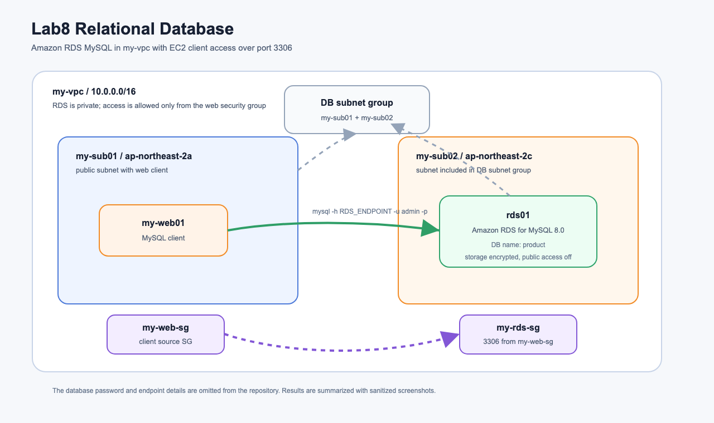
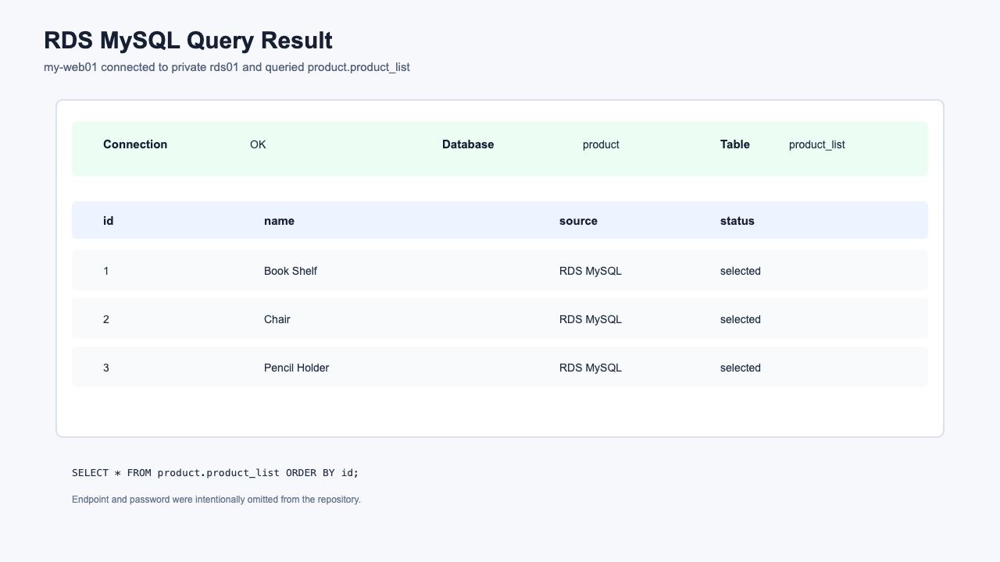
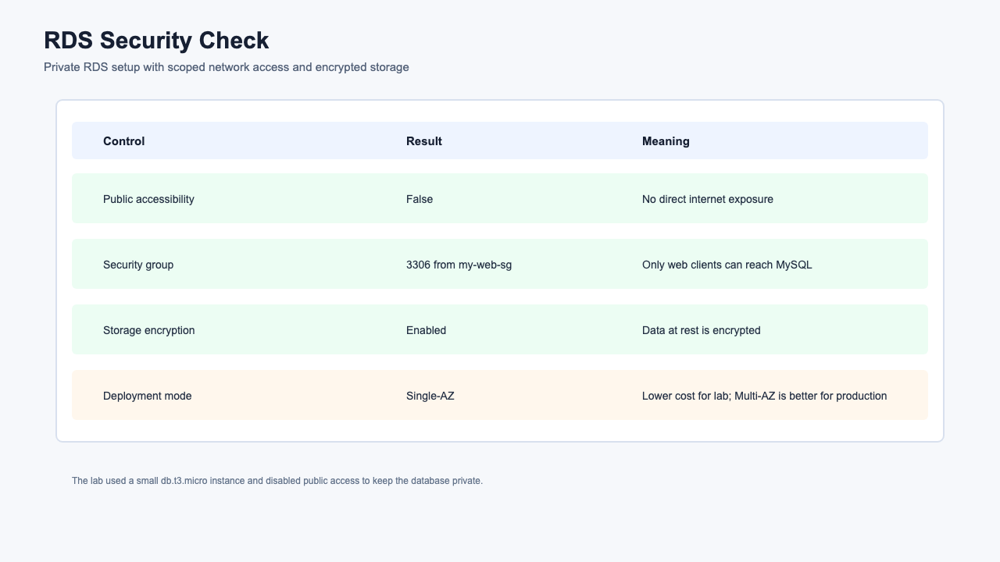

# Lab8 Relational Database

AWS 관계형 데이터베이스 개념과 실습 기록입니다. 이번 실습에서는 EC2에 직접 설치하는 MySQL 구조와 Amazon RDS MySQL 구조를 비교하고, 실제로는 RDS MySQL을 생성한 뒤 `my-web01`에서 접속해 테이블 생성과 조회까지 확인했습니다.

## 아키텍처



원본 SVG는 [architecture.svg](architecture.svg)에 함께 보관했습니다.

## 실습 목표

- 설치형 DB와 관리형 DB의 차이 이해
- Amazon RDS for MySQL 인스턴스 생성
- DB subnet group으로 두 개의 AZ 서브넷 연결
- RDS 보안 그룹에서 MySQL 3306 접근 범위 제한
- EC2 `my-web01`에서 RDS 엔드포인트로 MySQL 접속
- `product` 데이터베이스와 `product_list` 테이블 생성
- SQL insert/select로 데이터 저장과 조회 확인
- RDS, DynamoDB, Redshift, Aurora, DMS 개념 정리

## 실습 결과 요약

| 구간 | 수행 결과 | 설명 |
| --- | --- | --- |
| 설치형 DB | 문서화 | 기존 Lab2의 DB EC2 구성과 비교 중심으로 정리 |
| DB subnet group | 성공 | `my-sub01`, `my-sub02`를 포함한 `my-rds-subnet-group` 생성 |
| RDS Security Group | 성공 | `my-rds-sg`에서 `my-web-sg`의 MySQL 3306만 허용 |
| RDS MySQL | 성공 | `rds01`, MySQL 8.0, `db.t3.micro`, Single-AZ |
| Public Access | 차단 | RDS를 private DB로 구성 |
| Storage Encryption | 활성화 | RDS storage encryption enabled |
| MySQL 접속 | 성공 | `my-web01`에서 RDS 접속 |
| SQL 쿼리 | 성공 | `product.product_list`에 3개 행 insert/select |

## 리소스 구성

| 리소스 | 역할 |
| --- | --- |
| `rds01` | Amazon RDS for MySQL DB 인스턴스 |
| `product` | 실습용 데이터베이스 |
| `product_list` | 상품 목록 테스트 테이블 |
| `my-rds-subnet-group` | RDS가 사용할 두 AZ 서브넷 묶음 |
| `my-rds-sg` | RDS MySQL 접근 보안 그룹 |
| `my-web-sg` | MySQL client 역할의 EC2 보안 그룹 |
| `my-web01` | RDS 접속과 SQL 실행을 검증한 EC2 |

## 실습 캡처

### RDS Query Result



### RDS Security Check



## 실제 확인한 결과

### RDS 상태

| 항목 | 값 |
| --- | --- |
| DB identifier | `rds01` |
| Engine | MySQL |
| Engine version | 8.0.46 |
| Instance class | `db.t3.micro` |
| Deployment | Single-AZ |
| Publicly accessible | `False` |
| Storage encrypted | `True` |
| DB name | `product` |

### SQL 결과

```sql
CREATE TABLE product_list (
  id INT,
  name VARCHAR(20)
);

INSERT INTO product_list VALUES
  (1, 'Book Shelf'),
  (2, 'Chair'),
  (3, 'Pencil Holder');

SELECT * FROM product_list ORDER BY id;
```

| id | name |
| --- | --- |
| 1 | Book Shelf |
| 2 | Chair |
| 3 | Pencil Holder |

RDS 엔드포인트와 DB 비밀번호는 저장소에 남기지 않았습니다.

## 핵심 개념

### 데이터베이스 선택 시 고려사항

데이터베이스를 고를 때는 단순히 “SQL이냐 NoSQL이냐”보다 워크로드의 성격을 먼저 봐야 합니다.

| 고려사항 | 질문 |
| --- | --- |
| 확장성 | 데이터와 요청량이 늘 때 어떻게 확장할 것인가 |
| 저장 용량 | GB, TB, PB 중 어느 규모까지 커질 수 있는가 |
| 데이터 구조 | 고정 스키마가 필요한가, 유연한 문서 구조가 필요한가 |
| 내구성 | 장애 후 데이터 손실 허용 범위는 어느 정도인가 |
| 가용성 | 장애가 나도 서비스가 계속되어야 하는가 |
| 쿼리 패턴 | 조인과 트랜잭션이 중요한가, 단순 key-value 조회가 많은가 |

이번 실습은 정형 데이터와 SQL 쿼리가 중요한 관계형 데이터베이스 흐름입니다.

### 관계형 데이터베이스

관계형 데이터베이스는 데이터를 행과 열로 구성된 테이블에 저장합니다. SQL로 데이터를 조회하고, 테이블 간 관계를 조인할 수 있습니다.

관계형 DB가 잘 맞는 경우는 다음과 같습니다.

- 데이터 구조가 명확하고 스키마가 필요함
- 트랜잭션과 데이터 무결성이 중요함
- 주문, 결제, 고객, 재고처럼 관계가 있는 데이터를 다룸
- SQL 기반 분석과 조인이 필요함

관계형 DB는 ACID 특성을 중요하게 봅니다.

| 특성 | 의미 |
| --- | --- |
| Atomicity | 트랜잭션은 모두 성공하거나 모두 실패 |
| Consistency | 트랜잭션 후에도 데이터 규칙이 유지 |
| Isolation | 동시에 실행되는 트랜잭션이 서로 간섭하지 않음 |
| Durability | 커밋된 데이터는 장애 후에도 보존 |

### 설치형 DB와 관리형 DB

수업 PDF의 첫 번째 파트는 EC2에 MySQL을 직접 설치하는 방식입니다. 이 구조는 데이터베이스 서버를 직접 통제할 수 있지만 운영 부담이 큽니다.

| 구분 | EC2 설치형 MySQL | Amazon RDS |
| --- | --- | --- |
| OS 관리 | 사용자가 직접 | AWS 관리 |
| DB 설치/패치 | 사용자가 직접 | AWS 관리 |
| 백업 | 직접 구성 | 자동 백업 기능 제공 |
| 고가용성 | 직접 구성 | Multi-AZ 옵션 제공 |
| 모니터링 | 직접 구성 | CloudWatch/RDS 지표 제공 |
| 접속 방식 | EC2 private/public IP | RDS endpoint |
| 유연성 | 높음 | 관리형 제약 있음 |

이번 실습에서는 이미 기존 Lab2에 EC2 기반 DB가 있었기 때문에, 새 EC2 DB를 중복 생성하지 않고 RDS 중심으로 진행했습니다.

### Amazon RDS

Amazon RDS는 관계형 데이터베이스를 쉽게 생성하고 운영할 수 있는 관리형 서비스입니다. 사용자는 DB 엔진, 인스턴스 클래스, 스토리지, 네트워크, 백업, 암호화 같은 설정을 선택하고, AWS는 OS와 DB 소프트웨어 운영 작업을 상당 부분 관리합니다.

RDS에서 지원하는 대표 엔진은 다음과 같습니다.

- MySQL
- PostgreSQL
- MariaDB
- Oracle
- Microsoft SQL Server
- Amazon Aurora

이번 실습에서는 MySQL 8.0을 사용했습니다.

### RDS DB Instance

RDS DB 인스턴스는 실제 데이터베이스 서버 단위입니다. EC2처럼 클래스가 있고, 스토리지가 있고, VPC 안에 배치됩니다.

이번 실습의 주요 선택은 다음과 같습니다.

- `db.t3.micro`: 실습용 소형 인스턴스
- Single-AZ: 비용을 줄이기 위한 단일 AZ 구성
- Storage encrypted: 저장 데이터 암호화
- Public access off: 인터넷 직접 노출 차단
- DB subnet group: `my-sub01`, `my-sub02` 포함

운영 환경에서는 Multi-AZ, 자동 백업 보존, 모니터링, 파라미터 그룹, 성능 개선 도구도 함께 검토해야 합니다.

### DB Subnet Group

RDS는 VPC 안에서 실행되며, DB subnet group을 통해 어떤 서브넷에 배치될 수 있는지 결정합니다.

DB subnet group에는 보통 서로 다른 AZ의 서브넷을 2개 이상 넣습니다. Single-AZ DB라도 RDS 서비스는 subnet group을 요구하고, Multi-AZ로 확장할 때도 이 구성이 필요합니다.

이번 실습에서는 다음 두 서브넷을 포함했습니다.

```text
my-sub01 / ap-northeast-2a
my-sub02 / ap-northeast-2c
```

### RDS Endpoint

RDS에 접속할 때는 DB 서버의 IP를 직접 쓰지 않고 endpoint를 사용합니다. RDS는 장애조치, 유지관리, 네트워크 변경 상황에서도 endpoint를 통해 접속하게 설계되어 있습니다.

```bash
mysql -h <RDS_ENDPOINT> -u admin -p
```

RDS endpoint는 저장소에 남기지 않았습니다. 실제 실습에서는 AWS CLI로 조회해 `my-web01`에서 접속했습니다.

### RDS 보안 그룹

RDS도 EC2처럼 보안 그룹을 사용합니다. 데이터베이스는 보통 인터넷에 직접 공개하지 않고, 애플리케이션 서버 보안 그룹에서 오는 DB 포트만 허용합니다.

이번 실습에서는 다음 원칙을 적용했습니다.

```text
my-web-sg -> my-rds-sg : TCP 3306 allowed
internet -> my-rds-sg  : blocked
```

수업 자료에는 Workbench 접속을 위해 퍼블릭 접근을 다루는 흐름이 있지만, 이번 자동화 실습에서는 private RDS로 구성했습니다. 실제 운영에 더 가까운 안전한 구성입니다.

### Multi-AZ

RDS Multi-AZ는 고가용성을 위한 기능입니다. 기본 DB 인스턴스와 대기 DB 인스턴스를 서로 다른 AZ에 두고 동기식 복제를 수행합니다.

장애가 나면 RDS가 자동으로 대기 인스턴스로 failover합니다. 애플리케이션은 같은 endpoint를 사용하므로 장애 처리를 단순화할 수 있습니다.

이번 실습은 비용을 줄이기 위해 Single-AZ로 만들었습니다. 운영 환경이라면 Multi-AZ를 적극 검토해야 합니다.

### Read Replica

Read Replica는 읽기 부하를 분산하기 위한 복제본입니다. 원본 DB의 변경 사항이 비동기적으로 복제됩니다.

주요 사용 사례는 다음과 같습니다.

- 읽기 쿼리 분산
- 리포팅/분석 쿼리를 원본 DB에서 분리
- 특정 리전 가까이에 읽기 복제본 배치
- 필요 시 복제본을 승격하여 독립 DB로 사용

Multi-AZ가 장애 대응에 초점이 있다면, Read Replica는 읽기 성능 확장에 초점이 있습니다.

### DynamoDB

DynamoDB는 AWS의 관리형 NoSQL 데이터베이스입니다. 키-값 및 문서 모델을 사용하며, 매우 큰 규모의 트래픽을 낮은 지연 시간으로 처리하는 데 적합합니다.

관계형 DB와 다르게 스키마가 유연하고 수평 확장에 강합니다. 대신 복잡한 조인과 트랜잭션 중심 모델은 관계형 DB보다 다루기 어렵습니다.

| 구분 | RDS | DynamoDB |
| --- | --- | --- |
| 모델 | 관계형 | NoSQL key-value/document |
| 쿼리 | SQL | API 기반 |
| 스키마 | 고정 스키마 중심 | 유연한 속성 |
| 확장 | 수직 확장 + read replica | 수평 확장 |
| 사용 예 | 주문, 결제, ERP | 장바구니, 세션, 게임 순위 |

### Redshift

Amazon Redshift는 데이터 웨어하우스 서비스입니다. OLTP보다 OLAP, 즉 대규모 분석 쿼리에 적합합니다.

RDS는 애플리케이션의 트랜잭션 처리에 적합하고, Redshift는 여러 데이터를 모아 분석하는 데 적합합니다.

### Aurora

Amazon Aurora는 RDS 엔진 옵션 중 하나이며 MySQL/PostgreSQL과 호환되는 AWS 클라우드 최적화 관계형 DB입니다.

Aurora는 스토리지 계층을 여러 AZ에 분산하고, 높은 성능과 가용성을 목표로 설계됩니다. 기존 MySQL/PostgreSQL 애플리케이션을 비교적 적은 변경으로 이전할 수 있습니다.

### DMS

AWS Database Migration Service는 데이터베이스를 AWS로 이전하거나 서로 다른 DB 사이에 복제할 때 사용하는 서비스입니다.

대표 흐름은 다음과 같습니다.

```text
1. 대상 데이터베이스 생성
2. 스키마 변환 또는 마이그레이션
3. DMS replication task 생성
4. 데이터 복제 수행
5. 애플리케이션 연결 대상을 새 DB로 전환
```

동일 엔진 마이그레이션뿐 아니라 Oracle에서 Aurora, EC2 MySQL에서 RDS MySQL 같은 이전에도 사용할 수 있습니다.

### 데이터베이스 보안

데이터베이스 보안은 네트워크, 인증, 암호화, 감사가 함께 설계되어야 합니다.

이번 Lab8에서 적용한 항목은 다음과 같습니다.

- RDS를 VPC 안에 생성
- Public access off
- 보안 그룹으로 MySQL 3306 접근 제한
- RDS storage encryption enabled
- DB 비밀번호를 GitHub에 커밋하지 않음

추가로 운영 환경에서는 다음을 고려합니다.

- IAM 인증 또는 Secrets Manager
- SSL/TLS 접속 강제
- 자동 백업과 스냅샷 암호화
- CloudWatch 지표와 RDS 이벤트 알림
- DB 사용자별 최소 권한
- 패치/유지보수 윈도우 관리

## 이번 실습에서 확인한 흐름

```text
1. 기존 my-vpc, my-sub01, my-sub02 확인
2. my-rds-sg 생성
3. my-rds-sg에 my-web-sg -> TCP 3306 허용
4. my-rds-subnet-group 생성
5. rds01 MySQL DB 인스턴스 생성
6. RDS available 대기
7. my-web01에서 MySQL client로 접속
8. product 데이터베이스 확인
9. product_list 테이블 생성
10. 3개 상품 데이터 insert
11. select 쿼리로 결과 검증
```

## 명령어

실습 중 사용한 주요 명령어는 [commands.md](commands.md)에 정리했습니다.

## 정리 주의

RDS는 실행 시간, 스토리지, 백업, 스냅샷에 따라 과금될 수 있습니다. 실습 확인 후 사용하지 않으면 `rds01`, `my-rds-subnet-group`, `my-rds-sg`를 정리해야 합니다.
