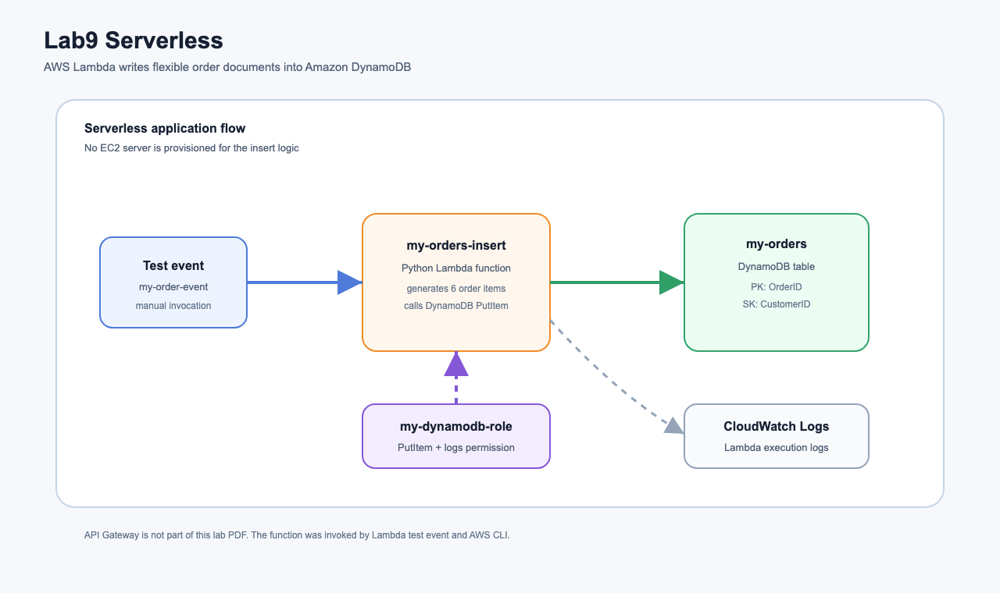
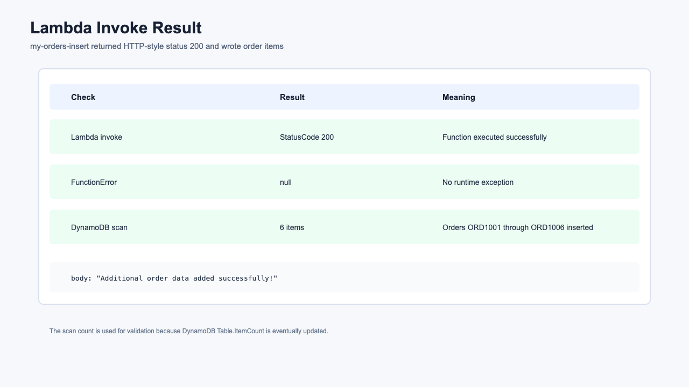
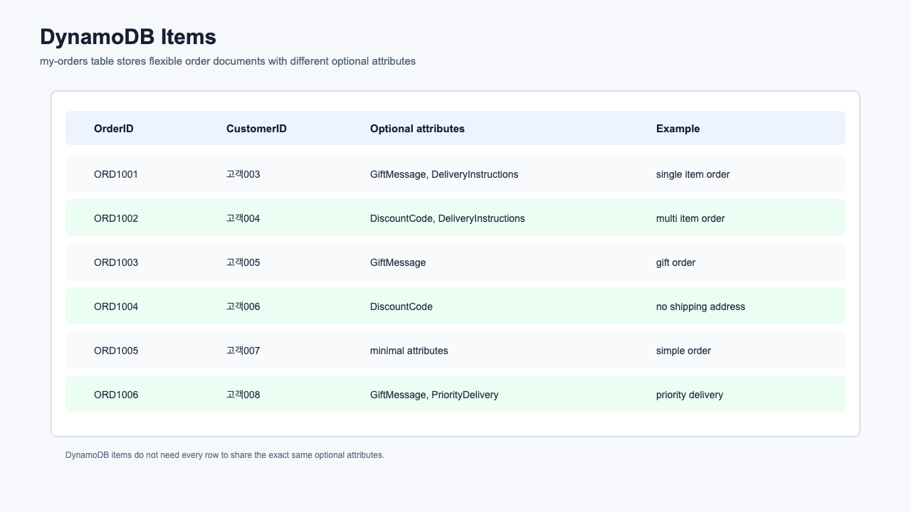

# Lab9 Serverless

AWS 서버리스 개념과 실습 기록입니다. 이번 실습에서는 DynamoDB 테이블을 만들고, Lambda 함수가 IAM 실행 역할을 통해 주문 데이터를 DynamoDB에 저장하는 흐름을 확인했습니다.

## 아키텍처



원본 SVG는 [architecture.svg](architecture.svg)에 함께 보관했습니다.

## 실습 목표

- DynamoDB 테이블 `my-orders` 생성
- 파티션 키 `OrderID`, 정렬 키 `CustomerID` 구성
- Lambda가 DynamoDB에 쓸 수 있는 IAM 정책 생성
- Lambda 실행 역할 `my-dynamodb-role` 생성
- `AWSLambdaBasicExecutionRole`로 CloudWatch Logs 기록 권한 추가
- Lambda 함수 `my-orders-insert` 생성
- 테스트 이벤트로 Lambda 호출
- DynamoDB scan으로 주문 항목 저장 확인
- 서버리스, Lambda, 이벤트 객체, DynamoDB, API Gateway 개념 정리

## 실습 결과 요약

| 구간 | 수행 결과 | 설명 |
| --- | --- | --- |
| DynamoDB Table | 성공 | `my-orders`, PK `OrderID`, SK `CustomerID`, On-demand |
| IAM Policy | 성공 | `my-dynamodb-policy`, `PutItem`, `BatchWriteItem` 허용 |
| IAM Role | 성공 | `my-dynamodb-role`, Lambda service trust policy |
| Lambda Function | 성공 | `my-orders-insert`, Python 3.13 |
| Lambda Invoke | 성공 | `StatusCode` 200, `FunctionError` null |
| DynamoDB Items | 성공 | scan 결과 주문 6개 확인 |

## 리소스 구성

| 리소스 | 역할 |
| --- | --- |
| `my-orders` | 주문 데이터를 저장하는 DynamoDB 테이블 |
| `my-dynamodb-policy` | Lambda가 DynamoDB에 주문을 쓰기 위한 IAM 정책 |
| `my-dynamodb-role` | Lambda 실행 역할 |
| `my-orders-insert` | 샘플 주문 6개를 DynamoDB에 넣는 Lambda 함수 |
| CloudWatch Logs | Lambda 실행 로그 저장 |

## 실습 캡처

### Lambda 호출 결과



### DynamoDB 항목 확인



## 실제 확인한 결과

### Lambda invoke

```json
{
  "StatusCode": 200,
  "FunctionError": null,
  "ExecutedVersion": "$LATEST"
}
```

Lambda 응답 본문은 다음과 같았습니다.

```text
Additional order data added successfully!
```

### DynamoDB scan 결과

| OrderID | CustomerID | 특징 |
| --- | --- | --- |
| `ORD1001` | `고객003` | 선물 메시지와 배송 요청 포함 |
| `ORD1002` | `고객004` | 여러 상품, 할인 코드 포함 |
| `ORD1003` | `고객005` | 선물 메시지 포함 |
| `ORD1004` | `고객006` | 배송 주소 없이 할인 코드만 포함 |
| `ORD1005` | `고객007` | 최소 속성만 포함 |
| `ORD1006` | `고객008` | 우선 배송과 추가 서비스 포함 |

`describe-table`의 `ItemCount`는 즉시 갱신되지 않을 수 있으므로, 이번 검증은 `scan` 결과 기준으로 정리했습니다.

## 핵심 개념

### 서버리스

서버리스는 서버가 없다는 뜻이 아니라, 사용자가 서버를 직접 프로비저닝하고 운영하지 않는다는 뜻입니다. 서버는 AWS가 관리하고, 사용자는 함수 코드, 이벤트, 권한, 데이터 저장소 같은 애플리케이션 구성에 집중합니다.

서버리스 아키텍처의 대표 특징은 다음과 같습니다.

- 서버 프로비저닝 불필요
- 사용량 기반 과금
- 자동 확장
- 이벤트 기반 실행
- 관리형 서비스 조합
- 고가용성 구성이 서비스에 내장됨

이번 실습에서는 EC2 서버 없이 Lambda 함수가 주문 데이터를 처리하고 DynamoDB에 저장했습니다.

### 서버리스 서비스 예시

| 영역 | 대표 서비스 |
| --- | --- |
| 컴퓨팅 | AWS Lambda, AWS Fargate |
| 데이터 저장 | DynamoDB, S3, Aurora Serverless |
| API | API Gateway, AppSync |
| 메시징 | SNS, SQS, EventBridge |
| 워크플로 | Step Functions |
| 분석 | Kinesis, Athena |

Lab9 PDF에는 API Gateway가 포함되어 있지 않습니다. 이번 실습은 Lambda 테스트 이벤트와 AWS CLI invoke로 함수를 실행했습니다.

### AWS Lambda

AWS Lambda는 이벤트가 발생했을 때 코드를 실행하는 완전관리형 컴퓨팅 서비스입니다.

Lambda는 다음 상황에서 자주 사용됩니다.

- S3 업로드 이벤트 처리
- DynamoDB Streams 변경 이벤트 처리
- API Gateway 요청 처리
- EventBridge 스케줄 기반 작업
- 간단한 백엔드 마이크로서비스
- 서버 관리가 필요 없는 자동화 작업

이번 실습에서는 수동 테스트 이벤트가 Lambda를 호출했고, Lambda는 DynamoDB에 `PutItem` 요청을 보냈습니다.

### Lambda 함수 구조

Lambda 함수에는 handler가 있습니다. handler는 이벤트가 들어왔을 때 Lambda 런타임이 호출하는 함수입니다.

```python
def lambda_handler(event, context):
    ...
```

| 객체 | 의미 |
| --- | --- |
| `event` | 호출자가 전달한 입력 데이터 |
| `context` | 요청 ID, 로그 그룹, 남은 실행 시간 같은 런타임 정보 |

이번 함수는 event 값을 크게 사용하지 않고, 내부에 정의한 샘플 주문 리스트를 DynamoDB에 저장합니다.

### Lambda 실행 역할

Lambda 함수가 AWS 리소스를 호출하려면 IAM 실행 역할이 필요합니다.

이번 실습의 역할 흐름은 다음과 같습니다.

```text
Lambda function -> my-dynamodb-role -> my-dynamodb-policy -> DynamoDB PutItem
```

역할에는 두 종류의 권한을 붙였습니다.

| 정책 | 목적 |
| --- | --- |
| `my-dynamodb-policy` | `my-orders` 테이블에 `PutItem`, `BatchWriteItem` 허용 |
| `AWSLambdaBasicExecutionRole` | CloudWatch Logs에 Lambda 실행 로그 기록 |

수업 자료는 DynamoDB 리소스를 전체로 선택하는 흐름이지만, 이번 CLI 실습에서는 `my-orders` 테이블 ARN으로 범위를 줄였습니다. 서버리스 실습이지만 최소 권한 원칙은 계속 중요합니다.

### DynamoDB

DynamoDB는 서버리스 NoSQL 데이터베이스입니다. 테이블의 기본 키를 중심으로 항목을 빠르게 읽고 쓸 수 있고, 각 항목이 서로 다른 속성을 가질 수 있습니다.

이번 테이블의 키 구조는 다음과 같습니다.

| 키 | 속성 | 의미 |
| --- | --- | --- |
| Partition key | `OrderID` | 주문 번호 |
| Sort key | `CustomerID` | 고객 식별자 |

샘플 주문들은 모두 `OrderID`, `CustomerID`, `Items`는 갖지만, `GiftMessage`, `DiscountCode`, `DeliveryInstructions`, `PriorityDelivery` 같은 속성은 주문마다 다릅니다. 이 점이 DynamoDB 같은 NoSQL 데이터베이스의 유연한 속성 모델을 보여줍니다.

### DynamoDB 요금 모드

DynamoDB에는 대표적으로 두 가지 용량 모드가 있습니다.

| 모드 | 설명 |
| --- | --- |
| On-demand | 요청량에 따라 자동 처리, 예측 어려운 워크로드에 적합 |
| Provisioned | 읽기/쓰기 용량을 미리 지정, 예측 가능한 워크로드에 적합 |

이번 실습에서는 실습용으로 간단하고 관리가 쉬운 On-demand 모드를 사용했습니다.

### CloudWatch Logs

Lambda 함수는 실행 로그를 CloudWatch Logs에 기록합니다. 로그를 보려면 Lambda 실행 역할에 `logs:CreateLogGroup`, `logs:CreateLogStream`, `logs:PutLogEvents` 권한이 필요합니다.

AWS 관리형 정책 `AWSLambdaBasicExecutionRole`이 이 권한을 제공합니다.

### 서버리스 비용 관점

서버리스는 사용하지 않을 때 서버를 계속 켜두는 비용을 줄일 수 있습니다. Lambda는 요청 수와 실행 시간에 따라 과금되고, DynamoDB On-demand는 읽기/쓰기 요청량에 따라 과금됩니다.

다만 서버리스도 공짜는 아닙니다. 호출 횟수, 실행 시간, 로그 저장량, DynamoDB 요청량, 데이터 저장량이 많아지면 비용이 증가합니다.

### 서버리스 설계 시 주의점

서버리스는 운영 부담을 줄여주지만, 다음을 고려해야 합니다.

- Lambda cold start
- 실행 시간 최대 15분 제한
- 외부 API 호출 실패 처리
- 재시도와 중복 실행 가능성
- IAM 최소 권한
- 로그와 모니터링
- DynamoDB 파티션 키 설계

이번 함수는 `ORD1001`부터 같은 키를 생성하므로, 반복 호출하면 같은 `OrderID`와 `CustomerID` 조합의 항목을 덮어쓸 수 있습니다. 실습에서는 괜찮지만 운영 환경에서는 UUID, ULID, timestamp, 시퀀스 관리 등 중복 방지 전략이 필요합니다.

## 이번 실습에서 확인한 흐름

```text
1. DynamoDB 테이블 my-orders 생성
2. OrderID 파티션 키, CustomerID 정렬 키 설정
3. DynamoDB 쓰기 권한 정책 my-dynamodb-policy 생성
4. Lambda 실행 역할 my-dynamodb-role 생성
5. 역할에 my-dynamodb-policy와 AWSLambdaBasicExecutionRole 연결
6. Lambda 함수 my-orders-insert 생성
7. 제공된 Python 코드를 Lambda에 배포
8. Lambda 테스트 이벤트로 함수 호출
9. StatusCode 200과 FunctionError null 확인
10. DynamoDB scan으로 주문 6개 확인
```

## 명령어

실습 중 사용한 주요 명령어는 [commands.md](commands.md)에 정리했습니다.

## 정리 주의

DynamoDB 테이블, Lambda 함수, CloudWatch Logs, IAM 역할/정책은 계정에 남아 있습니다. 사용하지 않을 경우 [commands.md](commands.md)의 정리 명령어로 삭제해야 합니다.
