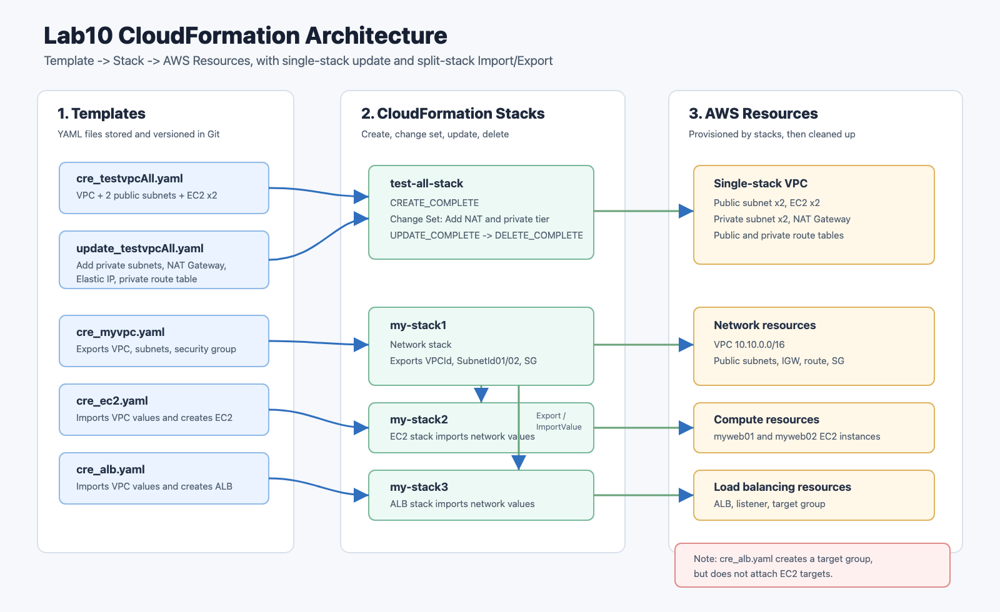
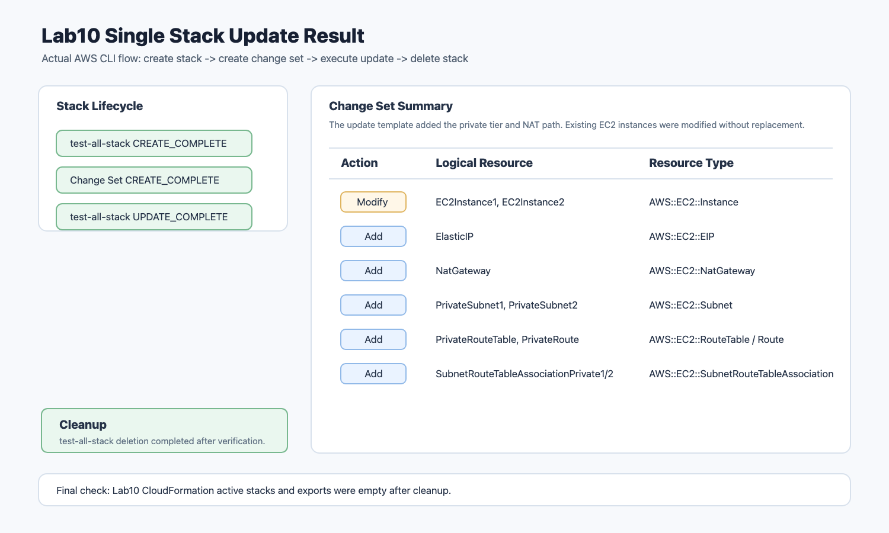
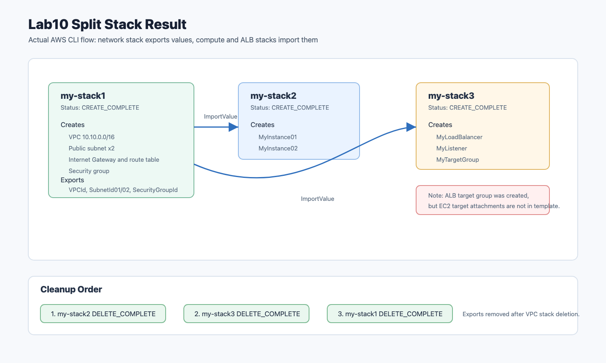

# Lab10 CloudFormation

AWS CloudFormation을 사용해 인프라를 코드로 생성, 업데이트, 분리, 삭제한 실습 기록입니다. 이번 실습에서는 단일 스택으로 VPC와 EC2를 만들고 변경 세트로 프라이빗 서브넷과 NAT Gateway를 추가한 뒤, VPC, EC2, ALB를 분리된 스택으로 구성하는 흐름을 확인했습니다.

## 아키텍처



원본 SVG는 [architecture.svg](architecture.svg)에 함께 보관했습니다.

## 실습 목표

- CloudFormation 템플릿 검증
- `test-all-stack` 단일 스택 생성
- 변경 세트로 프라이빗 서브넷, NAT Gateway, Elastic IP, 프라이빗 라우팅 추가
- `test-all-stack` 업데이트 결과 확인 후 삭제
- `my-stack1` VPC 스택 생성 및 Export 확인
- `my-stack2` EC2 스택에서 VPC 스택 Export Import
- `my-stack3` ALB 스택에서 VPC 스택 Export Import
- 의존성 순서에 맞춰 EC2, ALB, VPC 스택 삭제
- CloudFormation, IaC, 변경 세트, 드리프트 감지, 스택 분리 개념 정리

## 실습 결과 요약

| 구간 | 수행 결과 | 설명 |
| --- | --- | --- |
| 템플릿 검증 | 성공 | Lab10 YAML 5개 모두 `validate-template` 통과 |
| 단일 스택 생성 | 성공 | `test-all-stack` `CREATE_COMPLETE` |
| 변경 세트 생성 | 성공 | NAT Gateway, EIP, 프라이빗 서브넷/라우팅 추가 예정 사항 확인 |
| 단일 스택 업데이트 | 성공 | `test-all-stack` `UPDATE_COMPLETE` |
| 단일 스택 삭제 | 성공 | `test-all-stack` `DELETE_COMPLETE` 대기 완료 |
| VPC 분리 스택 | 성공 | `my-stack1` `CREATE_COMPLETE`, 4개 Export 생성 |
| EC2 분리 스택 | 성공 | `my-stack2` `CREATE_COMPLETE`, VPC Export Import |
| ALB 분리 스택 | 성공 | `my-stack3` `CREATE_COMPLETE`, VPC Export Import |
| 분리 스택 삭제 | 성공 | `my-stack2` -> `my-stack3` -> `my-stack1` 순서로 삭제 |
| 정리 확인 | 성공 | Lab10 CloudFormation 활성 스택과 Export 없음 |

## 실습 캡처

### 단일 스택 업데이트 결과



### 분리 스택 생성 결과



## 실제 확인한 결과

### 변경 세트

`test-all-stack` 업데이트 전에 변경 세트를 만들어 실제 적용될 리소스 변경을 확인했습니다.

| Action | Logical ID | Resource Type | Replacement |
| --- | --- | --- | --- |
| Modify | `EC2Instance1` | `AWS::EC2::Instance` | `False` |
| Modify | `EC2Instance2` | `AWS::EC2::Instance` | `False` |
| Add | `ElasticIP` | `AWS::EC2::EIP` | `None` |
| Add | `NatGateway` | `AWS::EC2::NatGateway` | `None` |
| Add | `PrivateRouteTable` | `AWS::EC2::RouteTable` | `None` |
| Add | `PrivateRoute` | `AWS::EC2::Route` | `None` |
| Add | `PrivateSubnet1` | `AWS::EC2::Subnet` | `None` |
| Add | `PrivateSubnet2` | `AWS::EC2::Subnet` | `None` |
| Add | `SubnetRouteTableAssociationPrivate1` | `AWS::EC2::SubnetRouteTableAssociation` | `None` |
| Add | `SubnetRouteTableAssociationPrivate2` | `AWS::EC2::SubnetRouteTableAssociation` | `None` |

`Replacement=False`는 해당 EC2가 새 인스턴스로 교체되지 않고 속성 수정으로 처리된다는 뜻입니다. 이번 변경에서는 EC2 Name 태그 변경과 네트워크 리소스 추가가 함께 포함되었습니다.

### 업데이트 후 리소스

| 리소스 | 상태 |
| --- | --- |
| VPC, Internet Gateway, Public Route | `CREATE_COMPLETE` |
| Public Subnet 2개 | `CREATE_COMPLETE` |
| Private Subnet 2개 | `CREATE_COMPLETE` |
| NAT Gateway, Elastic IP | `CREATE_COMPLETE` |
| Private Route Table, Private Route | `CREATE_COMPLETE` |
| EC2 2개 | `UPDATE_COMPLETE` |

### 분리 스택

| 스택 | 역할 | 생성 결과 |
| --- | --- | --- |
| `my-stack1` | VPC, 퍼블릭 서브넷 2개, IGW, 라우팅, 보안 그룹 생성 | `CREATE_COMPLETE` |
| `my-stack2` | `my-stack1`의 Export를 Import해 EC2 2개 생성 | `CREATE_COMPLETE` |
| `my-stack3` | `my-stack1`의 Export를 Import해 ALB, Listener, Target Group 생성 | `CREATE_COMPLETE` |

`my-stack1`은 `VPCId`, `SubnetId01`, `SubnetId02`, `SecurityGroupId`를 Export했습니다. `my-stack2`와 `my-stack3`는 `!ImportValue`로 이 값을 참조했습니다.

## 핵심 개념

### CloudFormation

CloudFormation은 AWS 리소스를 YAML 또는 JSON 템플릿으로 정의하고, 그 템플릿을 기준으로 리소스 묶음을 생성, 업데이트, 삭제하는 IaC 서비스입니다. CloudFormation 자체 사용료는 없고, 템플릿으로 생성한 EC2, NAT Gateway, ALB 같은 실제 리소스 비용만 발생합니다.

CloudFormation에서 중요한 단위는 스택입니다. 스택은 템플릿으로 생성된 리소스 묶음이며, CloudFormation은 스택 안의 리소스 관계와 상태를 계속 추적합니다. 따라서 콘솔에서 하나씩 삭제하지 않아도 스택 삭제만으로 그 스택이 만든 리소스를 함께 정리할 수 있습니다.

### Infrastructure as Code

Infrastructure as Code는 인프라 구성을 사람이 클릭해서 만드는 대신 코드 파일로 정의하는 방식입니다.

IaC의 장점은 다음과 같습니다.

- 동일한 환경을 반복해서 만들 수 있음
- 템플릿을 Git으로 버전 관리할 수 있음
- 변경 내용을 리뷰하고 되돌리기 쉬움
- 수동 작업으로 생기는 구성 차이를 줄일 수 있음
- 장애 또는 실수 후 마지막 정상 템플릿으로 복구하기 쉬움
- 스택 삭제로 실습 리소스를 한 번에 정리할 수 있음

이번 실습에서는 같은 VPC, 서브넷, 라우팅, EC2 구성을 템플릿으로 생성했습니다. 콘솔에서 클릭으로 만들 때보다 리소스 관계가 명확하게 남고, 어떤 리소스가 왜 만들어졌는지 추적하기 쉬웠습니다.

### 템플릿 기본 구조

CloudFormation 템플릿에서 자주 보는 섹션은 다음과 같습니다.

| 섹션 | 의미 |
| --- | --- |
| `AWSTemplateFormatVersion` | 템플릿 형식 버전 |
| `Description` | 템플릿 설명 |
| `Parameters` | 스택 생성 시 외부에서 입력받을 값 |
| `Resources` | 실제 생성할 AWS 리소스 |
| `Outputs` | 생성 후 사용자 또는 다른 스택에 제공할 값 |

이번 제공 템플릿은 대부분 `Resources`와 `Outputs` 중심으로 구성되어 있습니다. 운영 환경이라면 KeyPair 이름, AMI ID, CIDR, 인스턴스 타입은 `Parameters`로 분리하는 편이 더 재사용하기 좋습니다.

### 주요 내장 함수

| 함수 | 역할 | 이번 실습 예 |
| --- | --- | --- |
| `!Ref` | 리소스 ID 또는 파라미터 값을 참조 | VPC ID, Subnet ID, Security Group ID 참조 |
| `!GetAtt` | 리소스 속성 값을 가져옴 | EIP의 `AllocationId`, ALB DNS 이름 |
| `!Sub` | 문자열 안에서 변수 치환 | EC2 UserData 작성 |
| `!ImportValue` | 다른 스택의 Export 값을 가져옴 | EC2/ALB 스택이 VPC 스택 값을 참조 |

`!ImportValue`는 스택 분리에서 특히 중요합니다. 네트워크 스택이 만든 VPC와 서브넷을 애플리케이션 스택이 재사용할 수 있게 해줍니다.

### 변경 세트

변경 세트는 스택 업데이트 전에 CloudFormation이 어떤 리소스를 추가, 수정, 삭제할지 미리 보여주는 기능입니다. 운영 환경에서는 바로 `update-stack`을 실행하기보다 변경 세트를 먼저 확인하는 것이 안전합니다.

이번 변경 세트에서는 다음을 확인했습니다.

- 프라이빗 서브넷 2개 추가
- NAT Gateway와 Elastic IP 추가
- 프라이빗 라우트 테이블과 기본 경로 추가
- 프라이빗 서브넷과 라우트 테이블 연결 추가
- 기존 EC2는 교체 없이 수정

### 스택 업데이트와 롤백

스택 업데이트는 기존 스택을 새 템플릿 상태에 맞게 변경합니다. CloudFormation은 리소스별로 필요한 작업을 계산하고, 실패하면 가능한 범위에서 롤백을 수행합니다.

업데이트할 때 특히 주의할 점은 리소스 교체 여부입니다. 어떤 속성은 수정만 가능하지만, 어떤 속성은 변경 시 새 리소스로 교체됩니다. EC2 교체가 발생하면 인스턴스 ID와 퍼블릭 IP가 바뀔 수 있으므로 변경 세트의 `Replacement` 값을 확인해야 합니다.

### 드리프트 감지

드리프트는 템플릿에 정의된 상태와 실제 AWS 리소스 상태가 달라진 것을 뜻합니다. 예를 들어 CloudFormation으로 만든 보안 그룹을 콘솔에서 직접 수정하면 템플릿과 실제 상태가 달라집니다.

드리프트를 줄이려면 리소스를 콘솔에서 직접 고치기보다 템플릿을 수정하고 스택 업데이트로 반영하는 습관이 중요합니다.

### 스택 분리

모든 리소스를 하나의 템플릿에 넣으면 시작은 쉽지만, 규모가 커질수록 변경 영향 범위가 넓어집니다. 그래서 네트워크, 컴퓨팅, 로드밸런싱, 데이터베이스처럼 책임이 다른 영역은 스택을 나누는 것이 좋습니다.

이번 실습의 분리 구조는 다음과 같습니다.

```text
my-stack1: VPC, subnet, route, security group
my-stack2: EC2, imports values from my-stack1
my-stack3: ALB, listener, target group, imports values from my-stack1
```

스택 분리는 재사용성과 관리성을 높이지만, 의존성도 생깁니다. `my-stack2`와 `my-stack3`가 `my-stack1`의 Export를 Import하고 있는 동안에는 `my-stack1`의 Export를 삭제하거나 이름을 바꾸기 어렵습니다. 삭제할 때도 참조하는 스택을 먼저 삭제해야 합니다.

### Export와 ImportValue

`cre_myvpc.yaml`은 다음 값을 Export합니다.

| Export 이름 | 의미 |
| --- | --- |
| `VPCId` | 생성된 VPC ID |
| `SubnetId01` | 첫 번째 퍼블릭 서브넷 ID |
| `SubnetId02` | 두 번째 퍼블릭 서브넷 ID |
| `SecurityGroupId` | 웹 서버용 보안 그룹 ID |

`cre_ec2.yaml`과 `cre_alb.yaml`은 이 값을 `!ImportValue`로 가져옵니다. 이 방식은 스택 간 연결을 명확하게 만들지만, Export 이름은 리전과 계정 안에서 고유해야 합니다.

### Well-Architected 관점

이번 Lab10은 단순히 CloudFormation 명령을 실행하는 실습이 아니라, 앞선 아키텍처 원칙과 연결됩니다.

| 원칙 | 연결되는 내용 |
| --- | --- |
| 운영 우수성 | 인프라 변경을 코드로 관리하고 반복 가능한 작업으로 만듦 |
| 보안 | 보안 그룹, 라우팅, 서브넷 구성을 템플릿으로 일관되게 관리 |
| 신뢰성 | 수동 복구 대신 템플릿으로 동일 환경 재생성 가능 |
| 성능 효율성 | 필요한 리소스 유형과 배치를 템플릿에서 명시 |
| 비용 최적화 | 스택 삭제로 실습 리소스 정리, 불필요한 리소스 방치 방지 |
| 지속 가능성 | 필요한 만큼 만들고 사용 후 제거하는 운영 습관 |

### 제공 템플릿별 역할

| 템플릿 | 역할 |
| --- | --- |
| [cre_testvpcAll.yaml](templates/cre_testvpcAll.yaml) | VPC, 퍼블릭 서브넷 2개, EC2 2개를 단일 스택으로 생성 |
| [update_testvpcAll.yaml](templates/update_testvpcAll.yaml) | 기존 단일 스택에 프라이빗 서브넷 2개, NAT Gateway, 프라이빗 라우팅 추가 |
| [cre_myvpc.yaml](templates/cre_myvpc.yaml) | VPC, 퍼블릭 서브넷, 보안 그룹을 만들고 Export 제공 |
| [cre_ec2.yaml](templates/cre_ec2.yaml) | `!ImportValue`로 VPC 정보를 가져와 EC2 2개 생성 |
| [cre_alb.yaml](templates/cre_alb.yaml) | `!ImportValue`로 VPC 정보를 가져와 ALB, Listener, Target Group 생성 |

`cre_alb.yaml`은 대상 그룹과 ALB를 만들지만 EC2 인스턴스를 대상 그룹에 등록하는 `AWS::ElasticLoadBalancingV2::TargetGroupAttachment` 리소스는 포함하지 않습니다. 그래서 실제 서비스 트래픽 분산까지 완성하려면 EC2 대상 등록 리소스를 추가해야 합니다.

## 이번 실습에서 확인한 흐름

```text
1. Lab10 템플릿 5개 CloudFormation 문법 검증
2. cre_testvpcAll.yaml로 test-all-stack 생성
3. 스택 생성 후 VPC, 퍼블릭 서브넷, EC2 생성 상태 확인
4. update_testvpcAll.yaml로 변경 세트 생성
5. 변경 세트에서 추가/수정 리소스 확인
6. 변경 세트 실행 후 UPDATE_COMPLETE 확인
7. test-all-stack 삭제
8. cre_myvpc.yaml로 my-stack1 생성
9. VPCId, SubnetId01, SubnetId02, SecurityGroupId Export 확인
10. cre_ec2.yaml로 my-stack2 생성
11. cre_alb.yaml로 my-stack3 생성
12. 세 스택 리소스 상태 확인
13. my-stack2, my-stack3, my-stack1 순서로 삭제
14. Lab10 활성 CloudFormation 스택과 Export가 남지 않은 것 확인
```

## 명령어

실습 중 사용한 주요 명령어는 [commands.md](commands.md)에 정리했습니다.

## 정리 주의

이번 Lab10에서 생성한 CloudFormation 스택은 모두 삭제했습니다. 다만 이전 실습에서 만든 EC2, RDS, ALB, DynamoDB, Lambda 등은 별도의 실습 리소스이므로 사용하지 않을 경우 각 Lab의 정리 명령어로 삭제해야 합니다.
