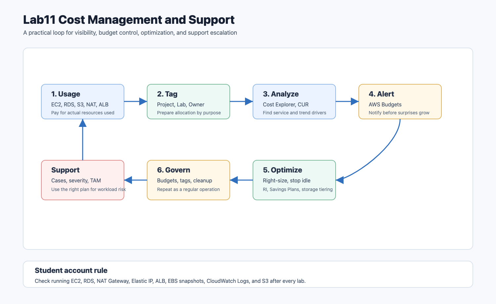

# Lab11 Cost Management and Support

AWS 비용 관리와 기술 지원 개념 정리입니다. 이 단원은 별도 실습 파일이 없으므로 비용이 발생하는 리소스를 새로 만들지 않고, 강의 PDF의 핵심 개념과 실제 계정에서 확인할 수 있는 읽기 전용 CLI 점검 흐름을 함께 정리했습니다.

## 아키텍처

원본 SVG는 [architecture.svg](architecture.svg)에 함께 보관했습니다.

## 정리 목표

- AWS 과금 기본 구조 이해
- 사용한 만큼 지불, 예약/약정 할인, 규모의 경제 개념 정리
- TCO와 AWS Pricing Calculator 사용 목적 정리
- Billing and Cost Management 주요 도구 비교
- Cost Explorer, AWS Budgets, Cost and Usage Reports 역할 정리
- Cost allocation tags와 비용 가시성 개념 정리
- AWS Support 플랜과 심각도 개념 정리
- 실습 계정에서 과금 위험을 줄이기 위한 점검 체크리스트 작성

## 실습 방식

| 구간 | 수행 방식 | 설명 |
| --- | --- | --- |
| 비용 리소스 생성 | 생성하지 않음 | Budgets, Cost Explorer, CUR 설정은 계정 비용/알림 설정과 연결되므로 문서화 중심으로 정리 |
| AWS CLI | 읽기 전용 명령 정리 | 실제 비용 금액, 계정 ID, ARN은 저장소에 남기지 않음 |
| 개념 정리 | 수행 | 강의 PDF 내용과 AWS 공식 문서 기준으로 정리 |
| GitHub 업로드 | 수행 | README, 명령어, 아키텍처 이미지 추가 |

## 핵심 개념

### AWS 요금 기본 구조

AWS 비용은 대체로 다음 세 가지 축에서 발생합니다.

| 비용 축 | 설명 | 예시 |
| --- | --- | --- |
| 컴퓨팅 | 실행 시간 또는 초 단위 사용량 기반 | EC2, Lambda, ECS, RDS 인스턴스 |
| 스토리지 | 저장 용량, 요청 수, 스토리지 클래스 기반 | S3, EBS, EFS, RDS 스토리지 |
| 데이터 전송 | 주로 아웃바운드 트래픽 중심 | 인터넷 아웃바운드, 리전 간 전송 |

일반적으로 AWS 인바운드 데이터 전송은 무료인 경우가 많지만, 아웃바운드 전송, 리전 간 복제, NAT Gateway 처리량, CloudFront 원본 전송 등은 비용이 될 수 있습니다. 그래서 네트워크 실습에서 만든 NAT Gateway, ALB, CloudFront 같은 리소스는 사용 후 정리가 중요합니다.

### AWS 요금 지불 방식

| 방식 | 의미 | 사용 상황 |
| --- | --- | --- |
| 사용한 만큼 지불 | 선불 장비 구매 없이 실제 사용량만 비용 지불 | 실습, 개발, 사용량 예측이 어려운 서비스 |
| 예약 또는 약정 할인 | 일정 기간 사용을 약정해 단가를 낮춤 | 안정적으로 오래 실행되는 워크로드 |
| 규모 기반 할인 | 사용량이 증가하면 단위 비용이 낮아지는 구조 | S3, EBS, EFS 같은 스토리지 계층 |

EC2에는 On-Demand, Reserved Instances, Savings Plans, Spot Instance 같은 선택지가 있습니다. 강의 PDF는 예약 인스턴스 중심으로 설명하지만, 실제 운영에서는 Savings Plans와 Reserved Instances를 함께 비교해야 합니다.

### AWS Free Tier

Free Tier는 실습을 시작하기 좋지만, 모든 서비스가 무료는 아닙니다. 특히 다음 리소스는 실습 계정에서도 비용이 쉽게 발생합니다.

- NAT Gateway
- Elastic IP 미연결 상태
- RDS 인스턴스
- ALB와 NLB
- EBS 스냅샷
- CloudWatch Logs 장기 보관
- S3 객체 저장량과 요청량
- 리전 간 데이터 전송

Free Tier 조건은 시간이 지나며 바뀔 수 있으므로 실제 계정에서는 Billing 콘솔의 Free Tier 페이지와 공식 문서를 확인해야 합니다.

### TCO

TCO는 Total Cost of Ownership의 약자로, 시스템을 보유하고 운영하는 전체 비용을 뜻합니다. 단순히 서버 가격만 비교하는 것이 아니라 다음 비용을 함께 봅니다.

| 영역 | 온프레미스에서 고려할 비용 |
| --- | --- |
| 서버 | 하드웨어 구매, 유지보수, 랙, 전원 |
| 스토리지 | SAN, 디스크, 백업 장비, 관리 비용 |
| 네트워크 | 스위치, 로드밸런서, 회선, 대역폭 |
| 시설 | 공간, 전력, 냉각 |
| 소프트웨어 | OS, 가상화, 라이선스 |
| 인력 | 설치, 운영, 장애 대응, 패치 |

클라우드는 선불 자본 지출을 줄이고 사용량 기반 운영 비용으로 전환할 수 있습니다. 하지만 클라우드도 방치하면 비용이 증가하므로 지속적인 모니터링과 최적화가 필요합니다.

### AWS Pricing Calculator

AWS Pricing Calculator는 아키텍처를 만들기 전에 월 예상 비용을 계산하는 도구입니다.

주요 사용 목적은 다음과 같습니다.

- 서비스별 월 예상 비용 산정
- 인스턴스 타입, 스토리지 용량, 데이터 전송량 비교
- 온프레미스와 AWS 비용 비교 자료 작성
- 설계 변경 전 비용 영향 검토
- 팀 또는 프로젝트별 비용 그룹 구성

실무에서는 “구현 후 비용 확인”보다 “설계 전에 비용 추정”이 더 안전합니다.

### Billing and Cost Management

AWS Billing and Cost Management는 계정 비용을 확인하고 관리하는 중심 콘솔입니다.

| 도구 | 역할 |
| --- | --- |
| Billing Dashboard | 현재 월 비용, 결제 정보, Free Tier 사용량 확인 |
| Cost Explorer | 비용과 사용량을 서비스, 계정, 태그, 기간별로 분석 |
| AWS Budgets | 비용, 사용량, RI/Savings Plans 기준으로 알림 설정 |
| Cost and Usage Reports | 가장 상세한 비용/사용량 데이터를 S3로 내보냄 |
| Cost allocation tags | 프로젝트, 서비스, 환경별 비용 분류 |
| Cost Anomaly Detection | 평소와 다른 비용 증가 탐지 |

비용 관리는 “사용량을 본다”에서 끝나지 않습니다. 태그 기준을 정하고, 예산을 만들고, 이상 비용을 탐지하고, 불필요한 리소스를 줄이는 흐름이 반복되어야 합니다.

### Cost Explorer

Cost Explorer는 비용을 그래프로 보고 분석하는 도구입니다. 서비스별 비용, 일별/월별 추세, 계정별 비용, 태그별 비용을 확인할 수 있습니다.

실습 계정에서는 다음 질문을 던져보면 좋습니다.

- 이번 달 비용이 가장 큰 서비스는 무엇인가?
- EC2, RDS, NAT Gateway, ALB 비용이 남아 있는가?
- 지난주보다 비용이 갑자기 늘어난 날이 있는가?
- `Lab` 태그 기준으로 실습별 비용을 나눌 수 있는가?

### AWS Budgets

AWS Budgets는 비용 또는 사용량이 기준을 넘을 때 알림을 보내는 도구입니다. 실습 계정이라면 월 비용 예산을 낮게 잡아두는 것이 좋습니다.

예산 예시는 다음과 같습니다.

| 예산 | 목적 |
| --- | --- |
| 월 전체 비용 예산 | 계정 전체 과금 폭주 방지 |
| 서비스별 예산 | EC2, RDS, NAT Gateway 같은 고위험 서비스 감시 |
| 태그별 예산 | Lab별 비용 추적 |
| 사용량 예산 | 데이터 전송량, 인스턴스 시간 등 사용량 기준 감시 |

### Cost and Usage Reports

Cost and Usage Reports는 비용 분석용 상세 원천 데이터입니다. S3 버킷으로 비용과 사용량 데이터를 내보내고 Athena, QuickSight, Glue 등과 연결해 분석할 수 있습니다.

Cost Explorer는 빠른 확인에 좋고, CUR은 상세 분석과 장기 비용 데이터 파이프라인에 적합합니다.

### Cost allocation tags

태그는 비용 관리의 기본 단위입니다. 리소스에 태그를 붙여야 비용을 프로젝트, 환경, 소유자 기준으로 나눌 수 있습니다.

추천 태그 예시는 다음과 같습니다.

| 태그 | 예시 |
| --- | --- |
| `Project` | `aws-study` |
| `Lab` | `Lab11` |
| `Environment` | `dev`, `test`, `prod` |
| `Owner` | 사용자 또는 팀 |
| `ExpireOn` | 정리 예정일 |

태그를 붙이는 것만으로 비용 보고서에 바로 나타나는 것은 아닙니다. Billing 콘솔에서 비용 할당 태그로 활성화해야 비용 분석에 사용할 수 있습니다.

### AWS Support

AWS Support는 계정, 서비스, 아키텍처, 장애 대응을 지원하는 서비스입니다. 강의 PDF에서는 Basic, Developer, Business, Enterprise Support를 중심으로 설명합니다.

지원 플랜은 시간이 지나며 이름, 기능, 가격이 바뀔 수 있습니다. 실제 가입이나 응답 시간 확인은 AWS 공식 Support Plans 페이지를 기준으로 확인해야 합니다.

지원 관련 주요 개념은 다음과 같습니다.

| 개념 | 설명 |
| --- | --- |
| Support plan | 지원 범위와 응답 수준을 결정 |
| Case severity | 장애 영향도에 따라 지원 우선순위 결정 |
| Trusted Advisor | 비용, 성능, 보안, 내결함성, 서비스 한도 관점 권장 사항 제공 |
| TAM | Enterprise 계열 지원에서 제공되는 기술 계정 관리자 역할 |
| Concierge | 결제와 계정 관련 비기술 문의 지원 |

### 사례 심각도

지원 케이스는 대체로 영향도에 따라 심각도가 나뉩니다.

| 심각도 | 의미 |
| --- | --- |
| Critical | 비즈니스 핵심 기능 사용 불가 |
| Urgent | 중요한 기능이 크게 영향받음 |
| High | 주요 기능이 손상 또는 저하 |
| Normal | 일반적인 기능 문제 또는 시간 민감 질문 |
| Low | 일반 질문 또는 기능 요청 |

Basic Support는 기술 지원 케이스 범위가 제한적입니다. 운영 워크로드가 있다면 지원 플랜과 장애 대응 요구사항을 함께 검토해야 합니다.

## 실습 계정 비용 점검 체크리스트

| 점검 항목 | 이유 |
| --- | --- |
| 실행 중 EC2 확인 | 켜져 있는 시간만큼 비용 발생 |
| RDS 인스턴스 확인 | 중지하지 않으면 지속 비용 발생 |
| NAT Gateway 확인 | 시간 비용과 처리량 비용 발생 |
| 미연결 Elastic IP 확인 | 연결되지 않은 EIP는 비용 발생 가능 |
| ALB/NLB 확인 | 로드밸런서는 시간 단위 비용 발생 |
| EBS 볼륨과 스냅샷 확인 | 인스턴스 삭제 후에도 남을 수 있음 |
| CloudWatch Logs 보관 기간 확인 | 로그가 쌓이면 스토리지 비용 증가 |
| S3 버킷 크기와 객체 수 확인 | 저장량과 요청량에 따라 비용 증가 |
| Budget 알림 설정 | 예상 밖 과금 조기 감지 |

## 읽기 전용 명령어

비용을 새로 발생시키지 않고 계정 상태를 확인하는 CLI 명령은 [commands.md](commands.md)에 정리했습니다.

## 참고 링크

- [AWS Cost Explorer](https://docs.aws.amazon.com/cost-management/latest/userguide/ce-what-is.html)
- [AWS Budgets](https://docs.aws.amazon.com/cost-management/latest/userguide/budgets-managing-costs.html)
- [AWS Cost and Usage Reports](https://docs.aws.amazon.com/cur/latest/userguide/what-is-cur.html)
- [Cost allocation tags](https://docs.aws.amazon.com/awsaccountbilling/latest/aboutv2/cost-alloc-tags.html)
- [AWS Support plans](https://aws.amazon.com/premiumsupport/plans/)
- [AWS Free Tier plans](https://docs.aws.amazon.com/awsaccountbilling/latest/aboutv2/free-tier-plans.html)
