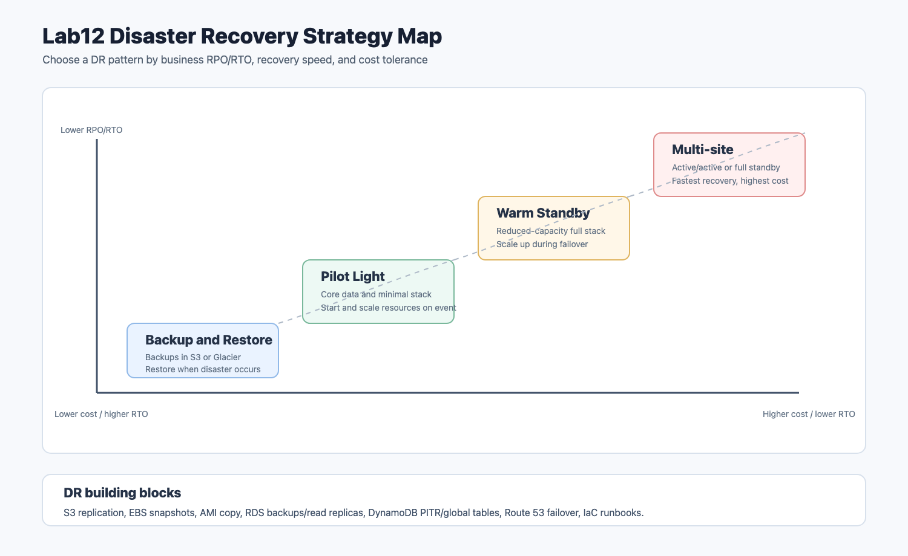

# Lab12 Disaster Recovery

AWS 재해 복구 개념 정리입니다. 이 단원은 별도 실습 파일이 없으므로 비용이 발생하는 복구 환경을 새로 만들지 않고, DR 전략과 서비스별 복구 설계 포인트를 문서화했습니다. 실제 계정에서 안전하게 확인할 수 있는 읽기 전용 CLI 명령은 별도 파일에 정리했습니다.

## 아키텍처



원본 SVG는 [architecture.svg](architecture.svg)에 함께 보관했습니다.

## 정리 목표

- 고가용성, 백업, 재해 복구의 차이 이해
- RPO와 RTO 개념 정리
- 스토리지, 컴퓨팅, 네트워크, 데이터베이스 DR 빌딩 블록 정리
- 백업 및 복원, 파일럿 라이트, 웜 스탠바이, 다중 사이트 패턴 비교
- Route 53, ELB, CloudFormation, AWS Backup, RDS, DynamoDB가 DR에 기여하는 방식 정리
- DR runbook과 game day 점검 흐름 작성

## 실습 방식

| 구간 | 수행 방식 | 설명 |
| --- | --- | --- |
| DR 리소스 생성 | 생성하지 않음 | 다중 리전 복구 환경은 비용과 운영 리스크가 크므로 개념과 점검 명령으로 대체 |
| AWS CLI | 읽기 전용 명령 정리 | 백업, 스냅샷, RDS, DynamoDB, Route 53 상태 확인 명령 제공 |
| 개념 정리 | 수행 | 강의 PDF와 AWS DR 공식 문서 기준으로 정리 |
| GitHub 업로드 | 수행 | README, 명령어, 아키텍처 이미지 추가 |

## 핵심 개념

### 고가용성, 백업, 재해 복구

세 개념은 비슷해 보이지만 목표가 다릅니다.

| 개념 | 목적 | 예시 |
| --- | --- | --- |
| 고가용성 | 장애가 나도 서비스 중단 가능성을 낮춤 | Multi-AZ, ALB, Auto Scaling |
| 백업 | 데이터 손실에 대비해 복원 지점을 보관 | EBS snapshot, RDS automated backup, S3 versioning |
| 재해 복구 | 큰 장애 후 서비스를 복구 위치에서 다시 온라인으로 전환 | 다른 리전 복구, DNS failover, DR runbook |

고가용성은 장애를 피하거나 짧게 만드는 설계이고, 재해 복구는 장애가 발생했을 때 어떻게 돌아올 것인지에 대한 계획입니다.

### RPO

RPO는 Recovery Point Objective입니다. 장애가 났을 때 허용 가능한 최대 데이터 손실 시간을 뜻합니다.

예를 들어 RPO가 8시간이면 최악의 경우 최근 8시간 데이터 손실은 허용한다는 의미입니다. RPO를 줄이려면 백업 주기를 짧게 하거나 복제 방식을 사용해야 합니다.

### RTO

RTO는 Recovery Time Objective입니다. 장애 발생 후 서비스를 다시 사용할 수 있게 만들기까지 허용 가능한 최대 시간을 뜻합니다.

예를 들어 RTO가 1시간이면 장애 후 1시간 안에 핵심 서비스를 복구해야 합니다. RTO를 줄이려면 인프라 자동화, 사전 배포된 DR 환경, DNS 전환, 복구 절차 테스트가 필요합니다.

### RPO/RTO와 비용의 관계

일반적으로 RPO와 RTO를 낮출수록 비용은 올라갑니다.

| 요구사항 | 비용 경향 | 이유 |
| --- | --- | --- |
| 긴 RPO/RTO 허용 | 낮음 | 백업만 보관하고 필요할 때 복원 |
| 중간 RPO/RTO | 중간 | 핵심 데이터와 일부 인프라를 미리 준비 |
| 짧은 RPO/RTO | 높음 | DR 환경을 계속 실행하고 복제 유지 |
| 거의 즉시 복구 | 매우 높음 | 다중 사이트 또는 active-active 운영 필요 |

DR 전략은 기술적으로 가장 강한 것을 고르는 문제가 아니라, 비즈니스가 요구하는 복구 목표와 비용 사이의 균형을 잡는 문제입니다.

## DR 빌딩 블록

### 스토리지와 백업

| 서비스 | DR에 쓰이는 기능 |
| --- | --- |
| S3 | 버전 관리, 수명 주기, Cross-Region Replication |
| S3 Glacier | 장기 보관, 저비용 아카이브 |
| EBS | 스냅샷, 스냅샷 복사, Data Lifecycle Manager |
| EFS | 백업, 복제, 다중 AZ 파일 시스템 |
| FSx | 파일 시스템 백업과 복제 |
| AWS Backup | 여러 서비스의 백업 정책 중앙 관리 |
| DataSync | 온프레미스와 AWS 간 데이터 이동 |
| Storage Gateway | 온프레미스 백업과 클라우드 스토리지 연결 |

인스턴스 스토어는 인스턴스 생명주기에 묶여 있으므로 DR 데이터 저장소로 적합하지 않습니다.

### 컴퓨팅

컴퓨팅 복구는 “서버를 백업해두는 것”보다 “서버를 빠르게 다시 만들 수 있게 하는 것”이 중요합니다.

| 방식 | 설명 |
| --- | --- |
| AMI | EC2 이미지를 만들어 빠르게 인스턴스 재생성 |
| Launch Template | 인스턴스 설정을 코드화 |
| Auto Scaling Group | 복구 시 필요한 용량 자동 확보 |
| 컨테이너 이미지 | ECS/EKS에서 동일한 애플리케이션 재배포 |
| CloudFormation | VPC, EC2, ALB, 보안 그룹을 템플릿으로 재생성 |

가능하면 애플리케이션 상태는 인스턴스 내부가 아니라 S3, EFS, RDS, DynamoDB 같은 외부 데이터 저장소에 두는 것이 좋습니다.

### 네트워킹

| 서비스 | DR에서의 역할 |
| --- | --- |
| Route 53 | DNS failover, health check, weighted routing |
| ELB | 상태 확인과 트래픽 분산 |
| VPC | 복구 리전의 네트워크 기반 |
| Direct Connect | 온프레미스와 AWS 간 안정적인 연결 |
| Site-to-Site VPN | 복구 경로 또는 백업 연결 |

DNS 전환은 DR에서 매우 중요합니다. 복구 환경이 준비되어도 사용자가 그 환경으로 이동하지 못하면 서비스는 복구되지 않은 것과 같습니다.

### 데이터베이스

| 서비스 | DR 기능 |
| --- | --- |
| RDS | 자동 백업, 수동 스냅샷, Multi-AZ, read replica, cross-region snapshot copy |
| Aurora | Aurora Replicas, Global Database |
| DynamoDB | Point-in-time recovery, on-demand backup, global tables |
| Redshift | snapshot, cross-region snapshot copy |

데이터베이스는 RPO/RTO를 결정하는 핵심 요소입니다. 애플리케이션 서버는 다시 만들 수 있어도 데이터 손실은 복구하기 어렵기 때문입니다.

### 자동화

CloudFormation, CDK, Terraform 같은 IaC 도구는 DR에서 매우 중요합니다. 장애가 난 뒤 콘솔에서 수동으로 리소스를 만들면 시간이 오래 걸리고 실수 가능성이 큽니다.

DR 환경은 다음 항목까지 코드화하는 것이 좋습니다.

- VPC와 서브넷
- 라우팅 테이블
- 보안 그룹
- EC2 Launch Template
- ALB와 Target Group
- RDS subnet group
- IAM role과 policy
- Route 53 record
- CloudWatch alarm

## DR 패턴

### Backup and Restore

가장 비용이 낮은 방식입니다. 평소에는 백업만 보관하고, 장애가 나면 백업에서 새 환경을 복원합니다.

| 항목 | 내용 |
| --- | --- |
| 비용 | 낮음 |
| RTO | 김 |
| RPO | 백업 주기에 따라 달라짐 |
| 적합한 경우 | 우선순위가 낮은 서비스, 개발/테스트, 긴 복구 시간이 허용되는 업무 |

준비 단계에서는 백업 생성, S3/Glacier 보관, 복구 절차 문서화, AMI와 CloudFormation 템플릿 준비가 필요합니다.

### Pilot Light

핵심 데이터와 최소 구성만 DR 리전에 유지하고, 장애 시 서버를 켜고 확장합니다. 꺼진 전등의 작은 불씨를 유지하다가 필요할 때 키우는 방식과 비슷합니다.

| 항목 | 내용 |
| --- | --- |
| 비용 | 낮음에서 중간 |
| RTO | Backup and Restore보다 짧음 |
| RPO | 복제 구성에 따라 짧아짐 |
| 적합한 경우 | 핵심 데이터는 계속 복제해야 하지만 전체 환경을 계속 켜두기 부담스러운 경우 |

Pilot Light는 장애 시 추가 인프라 배포와 스케일 업이 필요합니다.

### Warm Standby

DR 리전에 축소된 전체 환경을 계속 실행합니다. 평상시에도 낮은 용량으로 동작 가능하며, 장애 시 빠르게 스케일 업합니다.

| 항목 | 내용 |
| --- | --- |
| 비용 | 중간에서 높음 |
| RTO | 짧음 |
| RPO | 짧음 |
| 적합한 경우 | 비즈니스 크리티컬 서비스, 짧은 복구 시간이 필요한 서비스 |

Warm Standby는 DR 환경이 이미 동작하고 있으므로 Pilot Light보다 전환이 빠릅니다.

### Multi-site Active/Active

두 개 이상의 사이트가 동시에 전체 트래픽을 처리할 수 있는 구성입니다. 가장 빠른 복구가 가능하지만 비용과 운영 복잡도가 가장 큽니다.

| 항목 | 내용 |
| --- | --- |
| 비용 | 높음 |
| RTO | 매우 짧음 |
| RPO | 매우 짧음 |
| 적합한 경우 | 중단 허용 시간이 거의 없는 핵심 서비스 |

Active/Active에서는 데이터 충돌, 전역 라우팅, 상태 동기화, 장애 감지, 운영 복잡성을 반드시 고려해야 합니다.

## 패턴 비교

| 패턴 | 비용 | RTO | RPO | 준비 상태 |
| --- | --- | --- | --- | --- |
| Backup and Restore | 낮음 | 김 | 백업 주기 의존 | 백업 중심 |
| Pilot Light | 낮음-중간 | 중간 | 짧게 설계 가능 | 핵심 구성만 대기 |
| Warm Standby | 중간-높음 | 짧음 | 짧음 | 축소된 전체 환경 실행 |
| Multi-site | 높음 | 매우 짧음 | 매우 짧음 | 복수 사이트가 운영 중 |

## DR Runbook 예시

```text
1. 장애 범위 확인
2. 영향 서비스와 우선순위 확인
3. 현재 RPO/RTO 기준 확인
4. 데이터 백업 또는 복제 상태 확인
5. 복구 리전에 네트워크와 컴퓨팅 환경 준비
6. 데이터베이스 또는 스토리지 복원
7. 애플리케이션 배포 및 상태 확인
8. Route 53 또는 로드밸런서 트래픽 전환
9. 사용자 관점 테스트
10. 장애 원인과 복구 시간 기록
11. 원 리전 복구 또는 failback 계획 실행
```

## Game Day

DR 계획은 문서로만 있으면 충분하지 않습니다. 정기적으로 복구 훈련을 해야 합니다.

훈련에서 확인할 항목은 다음과 같습니다.

- 실제 복구 시간이 RTO 안에 들어오는가?
- 백업 데이터가 RPO 기준을 만족하는가?
- 복구 절차에 빠진 권한이나 수동 작업은 없는가?
- DNS 전환이 예상대로 동작하는가?
- 담당자가 runbook만 보고 복구할 수 있는가?
- 복구 후 모니터링과 알림이 정상 동작하는가?

## 읽기 전용 명령어

실제 계정에서 백업과 복구 준비 상태를 확인하는 CLI 명령은 [commands.md](commands.md)에 정리했습니다.

## 참고 링크

- [Disaster recovery options in the cloud](https://docs.aws.amazon.com/whitepapers/latest/disaster-recovery-workloads-on-aws/disaster-recovery-options-in-the-cloud.html)
- [AWS Well-Architected Reliability Pillar - Disaster recovery](https://docs.aws.amazon.com/wellarchitected/latest/reliability-pillar/rel_planning_for_recovery_disaster_recovery.html)
- [Database disaster recovery strategy](https://docs.aws.amazon.com/prescriptive-guidance/latest/strategy-database-disaster-recovery/defining.html)
