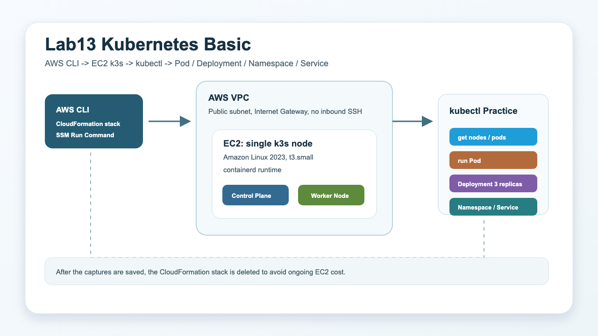
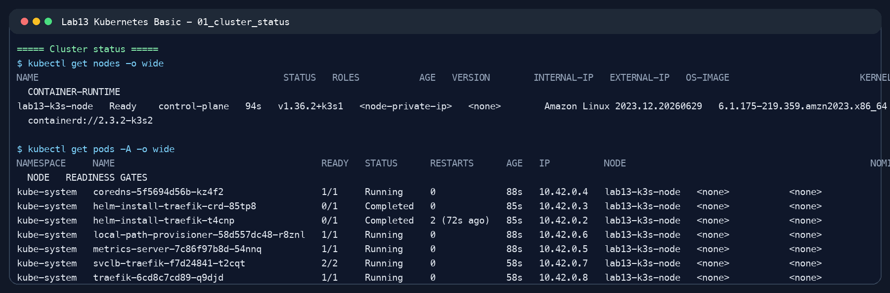
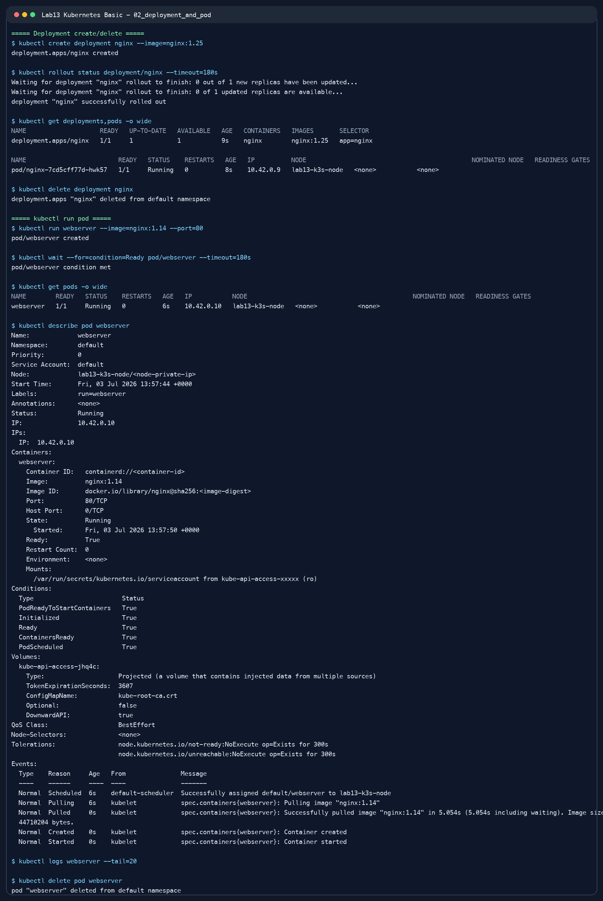
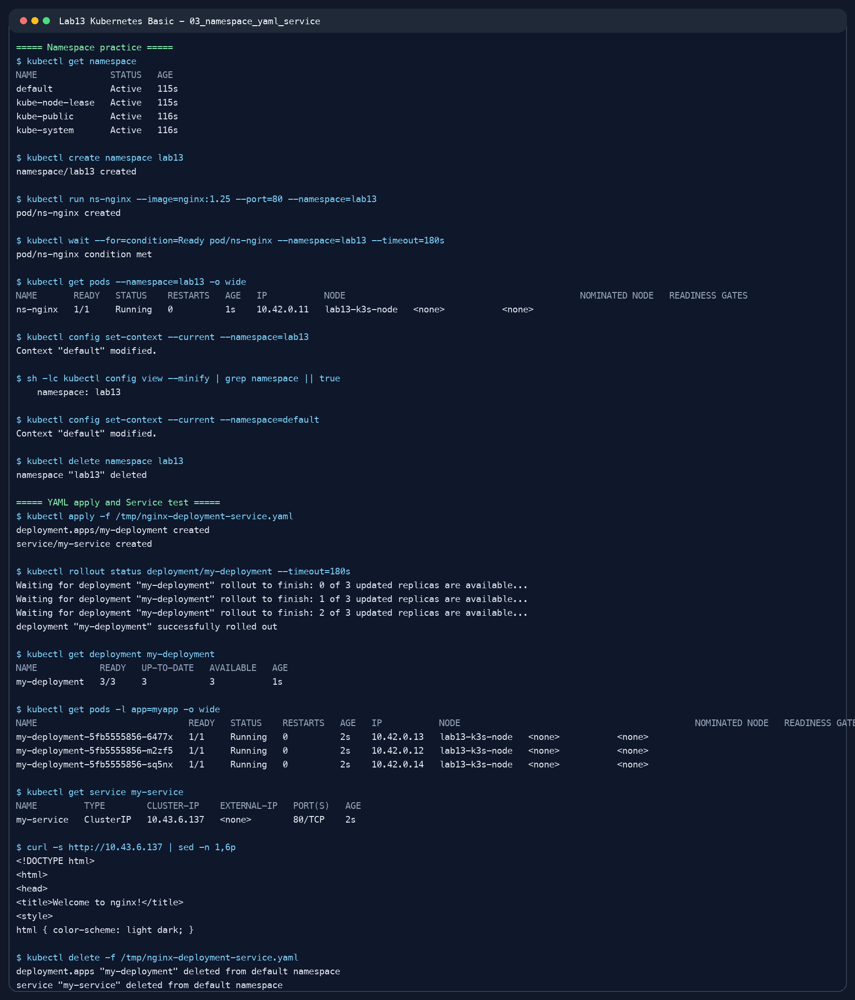
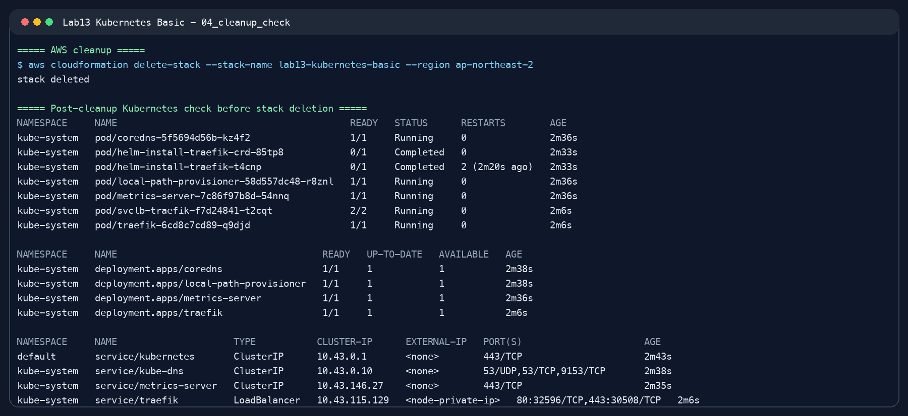

# Lab13 Kubernetes Basic

Kubernetes 개요와 k3s 기반 단일 노드 Kubernetes 실습 기록입니다.



## 실습 요약

이번 실습은 AWS CLI로 EC2 1대를 생성하고, 그 위에 경량 Kubernetes 배포판인 k3s를 설치한 뒤 `kubectl` 기본 명령을 확인하는 방식으로 진행했습니다. SSH 키는 사용하지 않았고, SSM Run Command로 원격 명령을 실행했습니다. 실습 캡처 저장 후 CloudFormation 스택은 삭제했습니다.

| 항목 | 내용 |
| --- | --- |
| 실습 환경 | AWS EC2 단일 노드 k3s |
| 리전 | `ap-northeast-2` |
| 인스턴스 타입 | `t3.small` |
| OS | Amazon Linux 2023 |
| Kubernetes 배포판 | k3s |
| 접속 방식 | AWS Systems Manager Run Command |
| 최종 정리 | CloudFormation 스택 삭제 완료 |

## 왜 Kubernetes가 필요한가

Docker는 컨테이너를 만들고 실행하는 도구입니다. 하지만 운영 환경에서는 컨테이너가 수십 개, 수백 개 이상으로 늘어납니다. 이때 컨테이너를 어느 서버에 배치할지, 장애가 난 컨테이너를 어떻게 다시 띄울지, 트래픽을 어떤 Pod로 보낼지, 배포 중 다운타임을 어떻게 줄일지를 사람이 직접 처리하기 어렵습니다.

Kubernetes는 이런 문제를 자동화하는 컨테이너 오케스트레이션 도구입니다.

| 운영 문제 | Kubernetes가 하는 일 |
| --- | --- |
| 컨테이너 배치 | 스케줄러가 적절한 노드에 Pod 배치 |
| 장애 복구 | 실패한 Pod를 다시 생성하거나 교체 |
| 확장 | Deployment replica 수를 기준으로 Pod 수 유지 |
| 네트워킹 | Service로 변하는 Pod IP 앞에 고정 접근 지점 제공 |
| 배포 | 선언한 상태로 rollout/rollback 관리 |
| 상태 관리 | 현재 상태를 계속 감시하고 원하는 상태로 조정 |

## Docker와 Kubernetes 차이

| 구분 | Docker | Kubernetes |
| --- | --- | --- |
| 역할 | 컨테이너 이미지 빌드와 컨테이너 실행 | 여러 컨테이너의 배포, 확장, 복구, 네트워킹 자동화 |
| 관점 | 단일 호스트 중심 | 클러스터 중심 |
| 실행 단위 | Container | Pod |
| 네트워크 노출 | 포트 매핑, Docker network | Service, Ingress |
| 상태 관리 | 사용자가 직접 실행/중지 | Desired State를 선언하면 컨트롤러가 유지 |

## 핵심 설계 사상

### Desired State

Kubernetes는 사용자가 원하는 상태를 선언하면, 현재 상태를 계속 비교하면서 그 상태에 맞추려고 합니다. 예를 들어 Deployment에 `replicas: 3`을 선언하면 Kubernetes는 Nginx Pod가 3개 유지되도록 계속 감시합니다. Pod 하나가 죽으면 새 Pod를 만들어 다시 3개로 맞춥니다.

### Declarative Configuration

명령어로 직접 만들 수도 있지만, 운영에서는 YAML manifest를 사용해 원하는 상태를 파일로 남깁니다. 이렇게 하면 Git으로 버전 관리하고, 리뷰하고, 같은 환경을 반복해서 만들 수 있습니다.

### Immutable Infrastructure

운영 중인 서버나 컨테이너를 직접 고치는 대신, 변경된 이미지를 새로 배포하고 기존 것을 교체합니다. Kubernetes의 rollout/rollback은 이런 방식과 잘 맞습니다.

## Kubernetes 구조

| 구성 요소 | 역할 |
| --- | --- |
| Control Plane | 클러스터 상태를 관리하고 의사결정 수행 |
| kube-api-server | 모든 Kubernetes API 요청의 진입점 |
| etcd | 클러스터 상태와 설정을 저장하는 key-value 저장소 |
| kube-scheduler | 새 Pod를 어떤 노드에 배치할지 결정 |
| kube-controller-manager | 현재 상태를 원하는 상태로 맞추는 컨트롤러 실행 |
| Worker Node | 실제 애플리케이션 Pod가 실행되는 노드 |
| kubelet | 노드에서 Pod 실행 상태를 관리하는 에이전트 |
| kube-proxy | Service 네트워킹을 구현하는 프록시 |
| Container Runtime | 컨테이너 실행 담당. k3s에서는 containerd 사용 |

이번 실습은 단일 EC2에 Control Plane과 Worker Node 역할이 함께 있는 k3s 단일 노드 클러스터로 진행했습니다.

## 주요 Object

| Object | 의미 |
| --- | --- |
| Pod | Kubernetes에서 컨테이너가 실행되는 최소 단위 |
| Deployment | Pod와 ReplicaSet을 선언적으로 관리 |
| ReplicaSet | 지정한 수의 Pod 복제본을 유지 |
| Service | 변하는 Pod IP 앞에 고정 접근 지점 제공 |
| Ingress | HTTP/HTTPS 요청을 Service로 라우팅 |
| Namespace | 클러스터 내부 리소스를 논리적으로 분리 |
| Volume | Pod가 사용할 저장 공간 |
| ConfigMap | 일반 설정값을 key-value로 전달 |
| Secret | 비밀번호, 토큰 등 민감값을 전달 |

## kubectl 기본 구조

`kubectl`은 Kubernetes API 서버와 통신하는 CLI입니다.

```bash
kubectl [command] [TYPE] [NAME] [flags]
```

| 명령 | 설명 |
| --- | --- |
| `get` | 리소스 목록 조회 |
| `describe` | 리소스 상세 상태 확인 |
| `create` | 리소스 생성 |
| `apply` | YAML에 선언한 원하는 상태 적용 |
| `delete` | 리소스 삭제 |
| `logs` | 컨테이너 로그 확인 |
| `exec` | 컨테이너 안에서 명령 실행 |
| `config` | kubeconfig와 context 설정 관리 |

## 실습 결과

### 1. k3s 클러스터 상태 확인

단일 EC2에 k3s를 설치했고, 노드가 `Ready` 상태로 올라온 것을 확인했습니다. kube-system namespace에는 CoreDNS, metrics-server, Traefik, local-path-provisioner 등이 실행되었습니다.



### 2. Deployment와 단일 Pod 실습

`kubectl create deployment nginx --image=nginx:1.25`로 Deployment를 생성하고 rollout 성공을 확인했습니다. 이후 `kubectl run webserver --image=nginx:1.14 --port=80`로 단일 Pod를 실행하고 `describe`, `logs`, `delete` 흐름을 확인했습니다.



### 3. Namespace와 YAML manifest 실습

`lab13` namespace를 생성하고 namespace 내부에 Pod를 실행했습니다. 이후 YAML manifest로 Nginx Deployment 3개 replica와 ClusterIP Service를 생성했고, Service IP로 Nginx HTML 응답을 확인했습니다.



### 4. 정리 확인

실습에서 만든 Deployment, Pod, Service, Namespace를 삭제했고, 마지막으로 CloudFormation 스택도 삭제했습니다.



## 실습에서 확인한 포인트

| 확인 항목 | 결과 |
| --- | --- |
| k3s 설치 | 성공 |
| 노드 상태 | `Ready` |
| `kubectl get nodes/pods` | 정상 조회 |
| Deployment rollout | 성공 |
| 단일 Pod 실행 | `Ready` |
| Namespace 생성/삭제 | 성공 |
| YAML `apply` | 성공 |
| Deployment replica | `3/3` |
| ClusterIP Service 접속 | Nginx HTML 응답 확인 |
| AWS 리소스 정리 | CloudFormation 스택 삭제 완료 |

## 파일 구성

- [commands.md](commands.md): AWS CLI와 kubectl 실습 명령
- [verification.md](verification.md): 검증 결과 요약
- [templates/k3s_single_node.yaml](templates/k3s_single_node.yaml): EC2 k3s 실습 환경 CloudFormation 템플릿
- [manifests](manifests): Kubernetes YAML 예제
- [results/kubectl_result_sanitized.txt](results/kubectl_result_sanitized.txt): 마스킹된 kubectl 실습 로그

## 보안 및 비용 주의

- GitHub에는 AWS Account ID, Access Key, Secret Key, 퍼블릭 IP를 올리지 않습니다.
- 실습 EC2는 캡처 저장 후 삭제했습니다.
- 실제로 다시 실습할 경우 `aws cloudformation delete-stack`까지 반드시 수행합니다.
