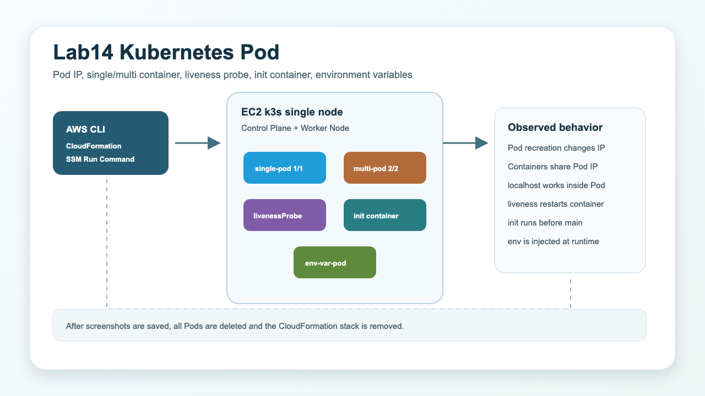
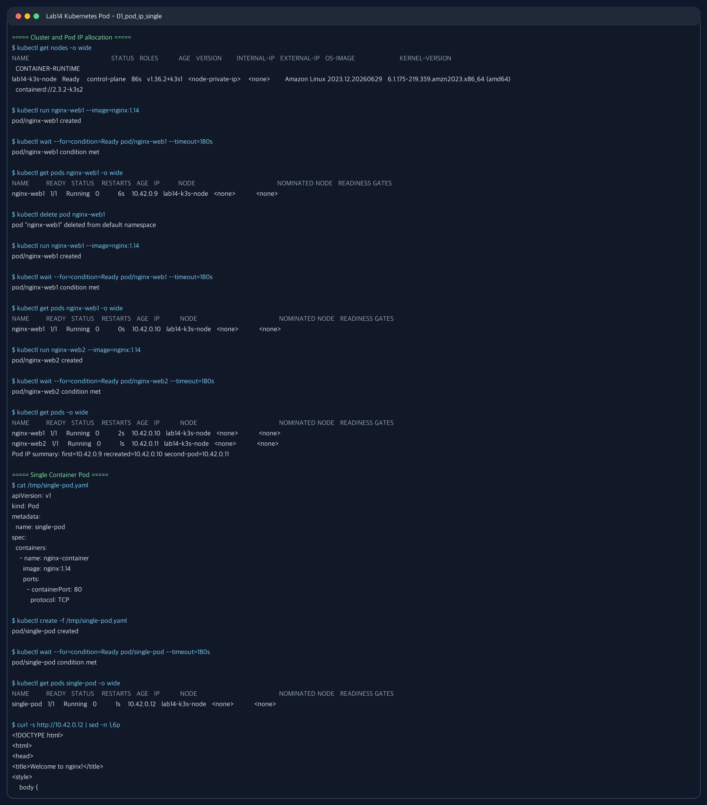
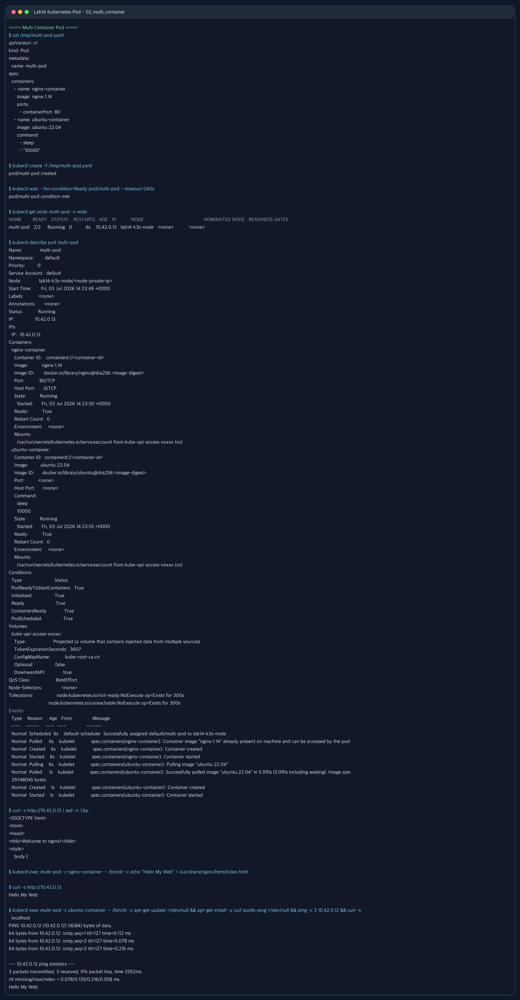
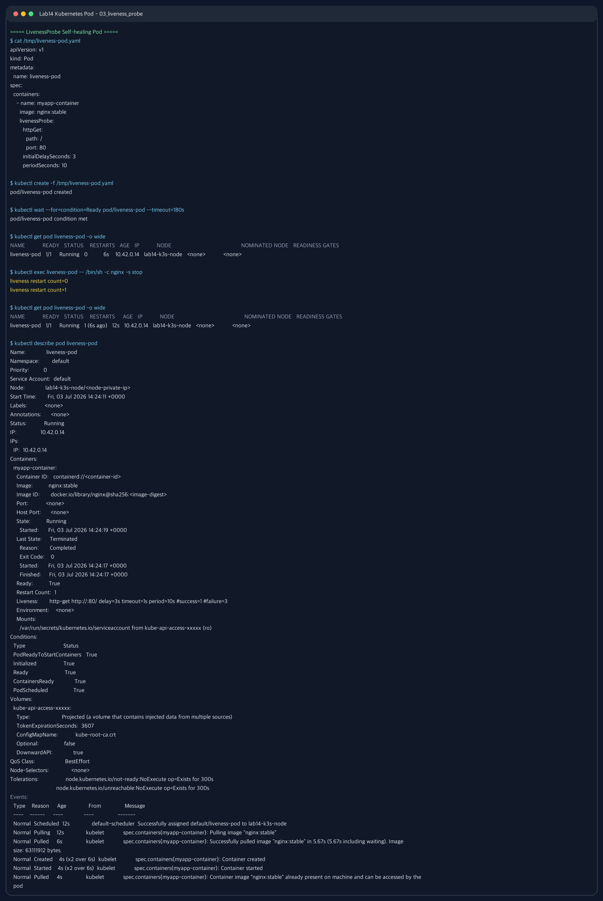
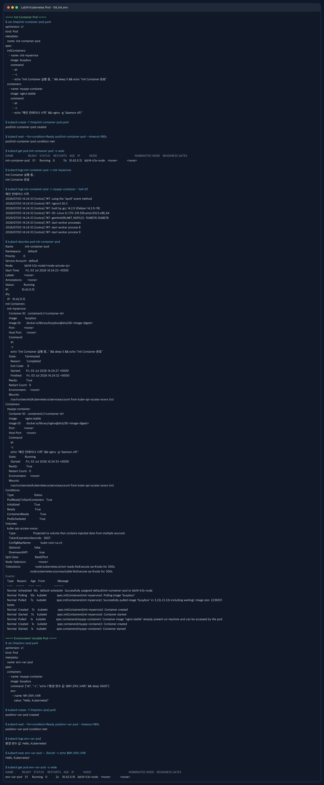
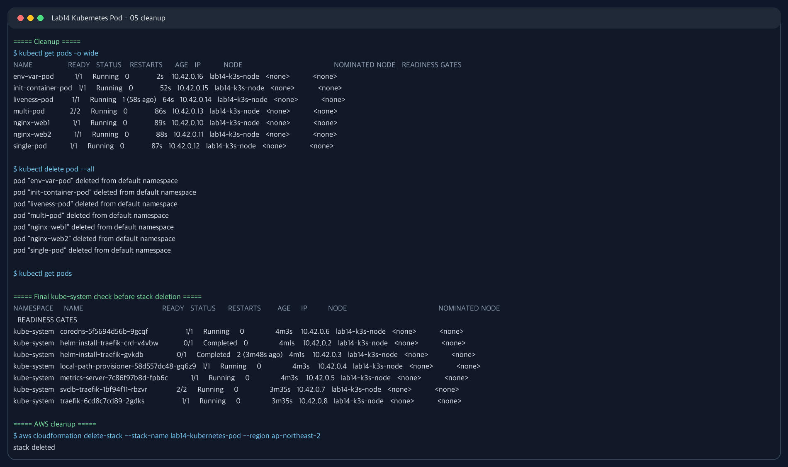

# Lab14 Kubernetes Pod

Kubernetes Pod 개념과 Pod 내부 동작을 k3s 단일 노드 클러스터에서 확인한 실습 기록입니다.



## 실습 요약

이번 실습은 AWS CLI로 EC2 1대를 생성하고, k3s를 설치한 뒤 Pod 중심 실습을 진행했습니다. SSH는 사용하지 않고 SSM Run Command로 kubectl 명령을 실행했습니다. 실습 후 모든 Pod를 삭제하고 CloudFormation 스택도 삭제했습니다.

| 항목 | 내용 |
| --- | --- |
| 실습 환경 | AWS EC2 단일 노드 k3s |
| 리전 | `ap-northeast-2` |
| 인스턴스 타입 | `t3.small` |
| Kubernetes 배포판 | k3s |
| Container runtime | containerd |
| 접속 방식 | AWS Systems Manager Run Command |
| 최종 정리 | Pod 삭제 및 CloudFormation 스택 삭제 완료 |

## Pod란?

Pod는 Kubernetes에서 배포하고 관리하는 가장 작은 실행 단위입니다. Docker에서는 컨테이너 하나를 직접 실행하지만, Kubernetes는 컨테이너를 바로 관리하지 않고 Pod라는 껍데기 안에 넣어서 관리합니다.

Pod는 하나 이상의 컨테이너를 포함할 수 있습니다.

| 개념 | 설명 |
| --- | --- |
| Container | 실제 애플리케이션 프로세스 실행 단위 |
| Pod | Kubernetes가 스케줄링하고 관리하는 최소 단위 |
| Pod IP | 클러스터 내부에서 Pod에 부여되는 고유 IP |
| Shared network | 같은 Pod 안의 컨테이너들이 같은 IP와 localhost 공유 |
| Shared volume | 같은 Pod 안의 컨테이너들이 같은 volume을 공유 가능 |

## Pod와 Container 차이

| 구분 | Container | Pod |
| --- | --- | --- |
| 관리 주체 | containerd 같은 runtime | Kubernetes |
| IP | 단독으로 Kubernetes IP를 갖지 않음 | 클러스터 내부 Pod IP를 가짐 |
| 실행 위치 | runtime이 실행 | scheduler가 노드에 배치 |
| 구성 | 하나의 프로세스 단위 | 하나 이상의 컨테이너 묶음 |
| 통신 | 컨테이너별 격리 | 같은 Pod 안에서는 localhost 통신 가능 |

## Pod 생성 흐름

`kubectl run nginx --image=nginx` 명령을 실행하면 다음 흐름으로 Pod가 생성됩니다.

1. `kubectl`이 API Server에 Pod 생성 요청을 보냅니다.
2. API Server가 요청을 검증하고 etcd에 원하는 상태를 저장합니다.
3. Scheduler가 Pod를 실행할 노드를 선택합니다.
4. 선택된 노드의 kubelet이 Pod 할당을 감지합니다.
5. kubelet이 container runtime에 컨테이너 생성을 요청합니다.
6. runtime이 이미지를 pull하고 컨테이너를 실행합니다.
7. kubelet이 Pod 상태를 API Server에 다시 보고합니다.

## Pod 생명주기 상태

| 상태 | 의미 |
| --- | --- |
| Pending | 스케줄링 중이거나 이미지 pull 대기 |
| ContainerCreating | 컨테이너 생성 중 |
| Running | 컨테이너가 정상 실행 중 |
| Succeeded | 모든 컨테이너가 정상 종료 |
| Failed | 컨테이너가 실패로 종료 |
| CrashLoopBackOff | 컨테이너가 반복 실패 후 재시작 대기 |
| ImagePullBackOff | 이미지 pull 실패 |

Pod 상태를 볼 때는 `kubectl get pods -o wide`, 문제 원인을 볼 때는 `kubectl describe pod <pod-name>`을 먼저 확인합니다.

## Single Container Pod

가장 일반적인 Pod 형태입니다. Pod 하나에 컨테이너 하나가 들어가며 `READY` 값은 `1/1`로 표시됩니다.

```yaml
apiVersion: v1
kind: Pod
metadata:
  name: single-pod
spec:
  containers:
    - name: nginx-container
      image: nginx:1.14
```

## Multi Container Pod

Pod 하나에 여러 컨테이너가 들어갈 수 있습니다. 이 컨테이너들은 같은 노드에 함께 배치되고, 같은 Pod IP를 공유합니다. 같은 Pod 안에서는 `localhost`로 서로 접근할 수 있습니다.

대표적인 사용 예시는 다음과 같습니다.

| 패턴 | 설명 |
| --- | --- |
| Sidecar | 주 컨테이너를 보조하는 로그 수집, 프록시, 동기화 컨테이너 |
| Adapter | 애플리케이션 출력 형식을 표준화 |
| Ambassador | 외부 서비스 접근을 대신 처리하는 프록시 |

이번 실습에서는 `nginx-container`와 `ubuntu-container`를 같은 Pod에 넣고, Ubuntu 컨테이너에서 `localhost`로 Nginx에 접근했습니다.

## LivenessProbe

LivenessProbe는 컨테이너가 살아 있는지 주기적으로 검사합니다. 검사에 실패하면 kubelet이 컨테이너를 재시작합니다.

| Probe 방식 | 설명 |
| --- | --- |
| HTTP GET | 지정한 경로로 HTTP 요청을 보내 200-399 응답이면 정상 |
| TCP Socket | 지정 포트에 연결되면 정상 |
| Exec | 컨테이너 안에서 명령을 실행하고 exit code 0이면 정상 |

이번 실습에서는 Nginx 컨테이너를 일부러 중지했고, `RESTARTS` 값이 `1`로 증가하는 것을 확인했습니다.

## Init Container

Init container는 main container보다 먼저 실행되는 컨테이너입니다. init container가 정상 종료되어야 main container가 시작됩니다.

주요 사용 사례:

- DB 연결 가능 상태 대기
- 설정 파일 사전 생성
- Secret 또는 설정 다운로드
- 권한 설정
- 의존 서비스 헬스체크

이번 실습에서는 `init-myservice`가 먼저 실행되고 `Completed` 상태가 된 뒤 `myapp-container`가 실행되는 것을 확인했습니다.

## Environment Variable

환경 변수는 컨테이너 이미지를 다시 만들지 않고 실행 시점에 설정값을 주입하는 방법입니다.

예시:

```yaml
env:
  - name: MY_ENV_VAR
    value: "Hello, Kubernetes!"
```

비밀번호, 토큰 같은 민감 정보는 일반 env 값으로 직접 넣기보다 Kubernetes Secret을 사용하는 것이 좋습니다.

## 실습 결과

### 1. Pod IP와 Single Container Pod

같은 이름의 Pod를 삭제 후 다시 생성하면 새 Pod IP를 받는 것을 확인했습니다. 이후 `single-pod`를 YAML로 생성하고 Pod IP로 Nginx 응답을 확인했습니다.



### 2. Multi Container Pod

`multi-pod` 안에 Nginx와 Ubuntu 컨테이너를 함께 실행했습니다. `READY`가 `2/2`로 표시되고, Ubuntu 컨테이너에서 `localhost`로 Nginx 응답을 확인했습니다.



### 3. LivenessProbe

Nginx 컨테이너를 강제로 중지한 뒤 livenessProbe와 restart policy에 의해 컨테이너가 재시작되는 것을 확인했습니다.



### 4. Init Container와 환경 변수

init container가 먼저 실행 완료된 뒤 main container가 시작되는 것을 확인했습니다. 환경 변수 Pod에서는 `MY_ENV_VAR` 값이 컨테이너 로그와 exec 결과에 정상 출력되었습니다.



### 5. 정리

실습에서 만든 모든 Pod를 삭제하고, CloudFormation 스택까지 삭제했습니다.



## 실습에서 확인한 포인트

| 확인 항목 | 결과 |
| --- | --- |
| Pod 재생성 시 IP 변경 | 확인 |
| Single Container Pod | `READY 1/1`, Nginx 응답 확인 |
| Multi Container Pod | `READY 2/2`, 같은 Pod IP 공유 확인 |
| Pod 내부 localhost 통신 | Ubuntu 컨테이너에서 Nginx 응답 확인 |
| livenessProbe | 컨테이너 재시작 및 `RESTARTS=1` 확인 |
| init container | `Completed` 후 main container 시작 확인 |
| 환경 변수 | 로그와 exec에서 값 확인 |
| 실습 리소스 정리 | `kubectl delete pod --all` |
| AWS 리소스 정리 | CloudFormation 스택 삭제 완료 |

## 파일 구성

- [commands.md](commands.md): AWS CLI와 kubectl 실습 명령
- [verification.md](verification.md): 검증 결과 요약
- [templates/k3s_single_node.yaml](templates/k3s_single_node.yaml): EC2 k3s 실습 환경 CloudFormation 템플릿
- [manifests](manifests): Pod YAML 예제
- [results/kubectl_result_sanitized.txt](results/kubectl_result_sanitized.txt): 마스킹된 kubectl 실습 로그

## 보안 및 비용 주의

- GitHub에는 AWS Account ID, Access Key, Secret Key, 퍼블릭 IP를 올리지 않습니다.
- 캡처와 로그에는 실제 EC2 인스턴스 ID, VPC ID, 노드 private IP를 남기지 않았습니다.
- 실습 EC2는 캡처 저장 후 삭제했습니다.
- 실제로 다시 실습할 경우 `aws cloudformation delete-stack`까지 반드시 수행합니다.
