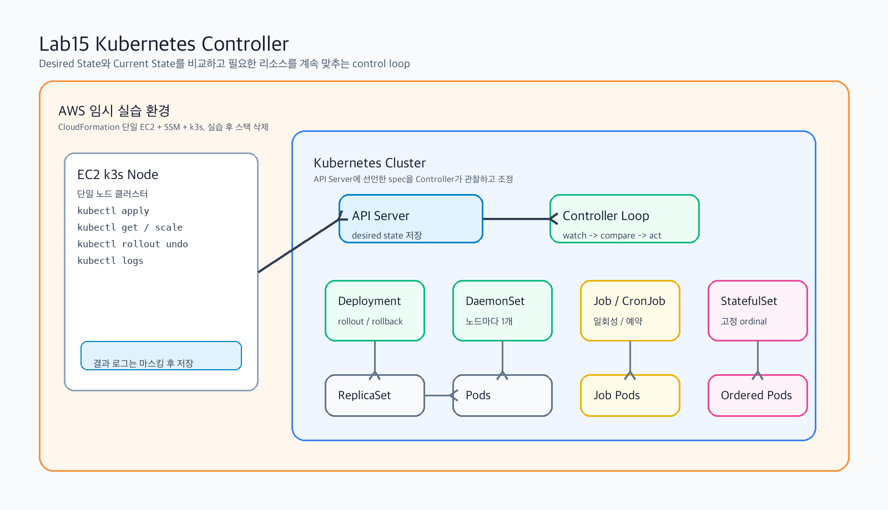
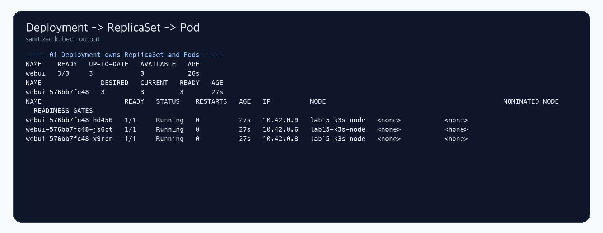
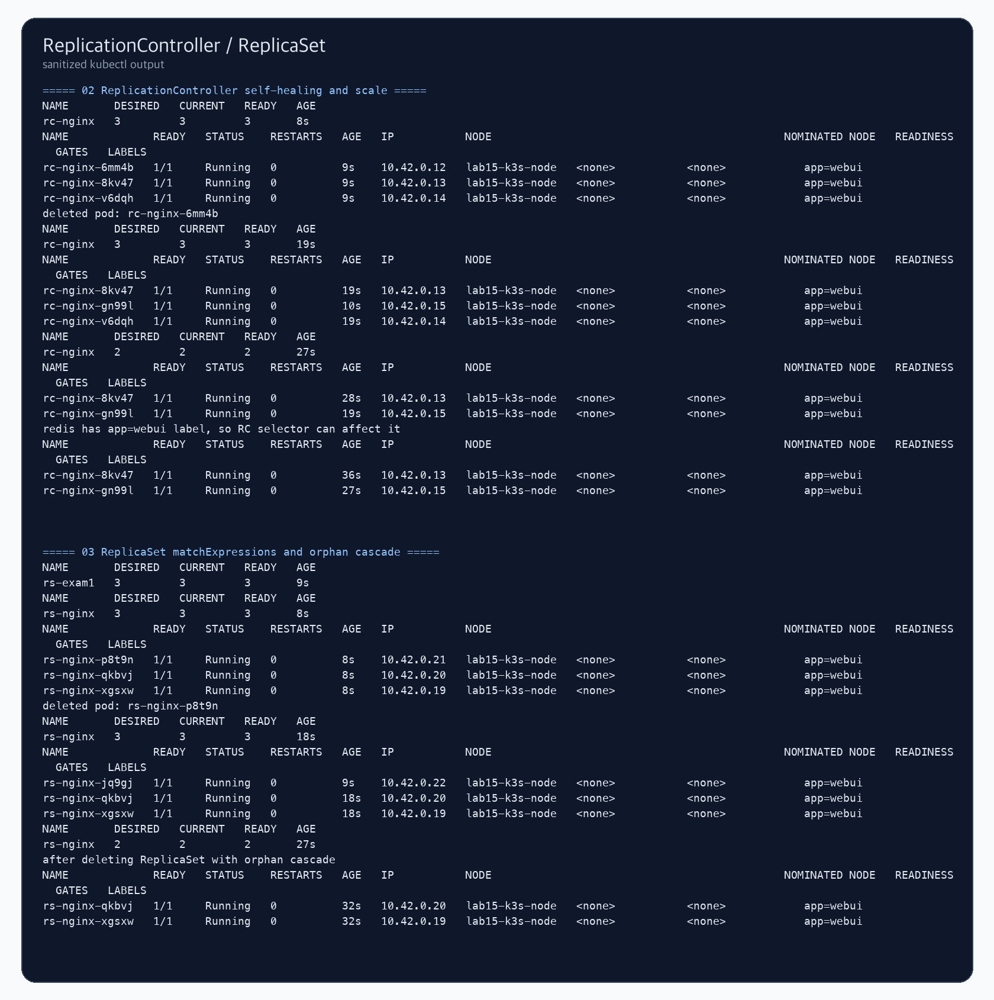
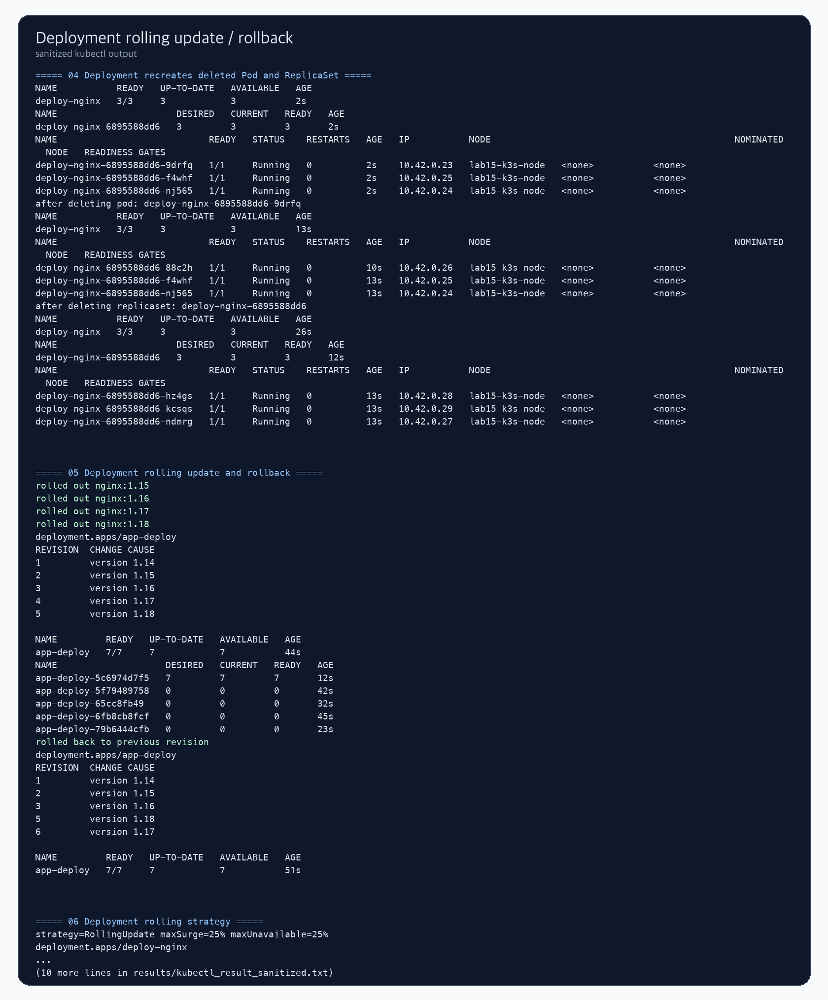
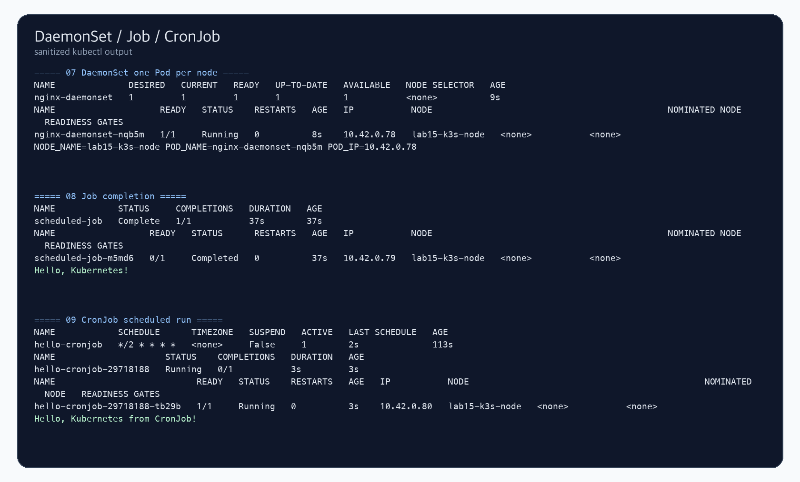
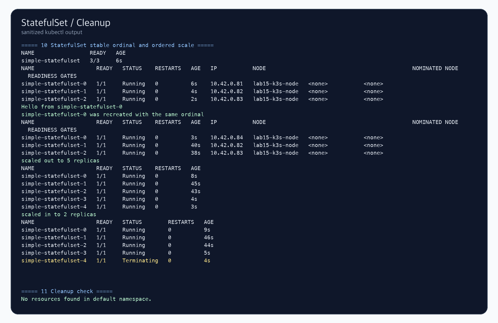

# Lab15 Kubernetes Controller

Kubernetes Controller 개념과 각 Controller가 Pod를 유지, 갱신, 예약 실행, 순차 실행하는 방식을 k3s 단일 노드 클러스터에서 확인한 실습 기록입니다.

## 실습 요약

이번 실습은 AWS CLI로 EC2 1대를 생성하고, k3s를 설치한 뒤 Kubernetes Controller 실습을 진행했습니다. SSH는 사용하지 않고 SSM Run Command로 kubectl 명령을 실행했습니다. 실습 후 모든 Kubernetes 리소스를 삭제하고 CloudFormation 스택도 삭제했습니다.

| 항목 | 내용 |
| --- | --- |
| 실습 환경 | AWS EC2 단일 노드 k3s |
| 리전 | `ap-northeast-2` |
| 인스턴스 타입 | `t3.small` |
| Kubernetes 배포판 | k3s |
| Container runtime | containerd |
| 접속 방식 | AWS Systems Manager Run Command |
| 최종 정리 | Kubernetes 리소스 삭제 및 CloudFormation 스택 삭제 완료 |

## Controller란?

Controller는 Kubernetes에서 원하는 상태를 실제 상태로 맞추는 반복 제어 장치입니다. 사용자가 YAML이나 kubectl 명령으로 "Pod 3개가 떠 있어야 한다"라고 선언하면, Controller는 현재 클러스터 상태를 계속 관찰하면서 부족한 Pod를 만들거나, 필요 없는 Pod를 줄이거나, 새 버전으로 교체합니다.

Controller 동작은 보통 다음 흐름으로 이해하면 됩니다.

1. Watch: API Server를 통해 현재 리소스 상태를 관찰합니다.
2. Compare: 사용자가 선언한 desired state와 실제 current state를 비교합니다.
3. Act: 차이가 있으면 Pod 생성, 삭제, 교체, 재시도 같은 조치를 수행합니다.

이 흐름 때문에 Kubernetes에서는 서버 하나가 죽거나 Pod 하나를 직접 삭제해도, 선언된 상태가 남아 있다면 Controller가 다시 복구하려고 합니다. 이것이 Kubernetes의 self-healing 특성입니다.

## Controller별 역할

| Controller | 핵심 역할 | 이번 실습에서 확인한 내용 |
| --- | --- | --- |
| ReplicationController | 지정한 Pod 개수를 유지하는 예전 방식의 Controller | Pod 삭제 시 재생성, replicas scale |
| ReplicaSet | ReplicationController의 개선판 | `matchExpressions` selector, Pod orphan 처리 |
| Deployment | ReplicaSet을 관리하는 상위 Controller | Pod/ReplicaSet 복구, rolling update, rollback |
| DaemonSet | 각 노드마다 Pod를 1개씩 실행 | 단일 노드에서 DaemonSet Pod 1개 생성 |
| Job | 완료될 때까지 Pod를 실행 | busybox 명령 완료와 로그 확인 |
| CronJob | 일정 주기로 Job을 생성 | 2분 주기 Job 생성과 로그 확인 |
| StatefulSet | 고정된 이름과 순서를 가진 Pod 관리 | ordinal 유지, 순차 scale out/in |

## ReplicationController와 ReplicaSet

ReplicationController와 ReplicaSet은 모두 "Pod 복제본 수를 유지"하는 Controller입니다. 예를 들어 replicas가 3이면 Pod가 하나 삭제되어도 다시 하나를 만들어 3개를 맞춥니다.

차이는 selector 표현력입니다.

| 구분 | ReplicationController | ReplicaSet |
| --- | --- | --- |
| 상태 | 오래된 방식, 현재는 주로 학습/호환 목적 | Deployment가 내부적으로 사용하는 표준 Controller |
| Selector | 단순 label selector 중심 | `matchLabels`, `matchExpressions` 지원 |
| 사용 방식 | 직접 만들 수는 있으나 신규 구성에는 잘 쓰지 않음 | 보통 직접 만들기보다 Deployment를 통해 생성 |

이번 실습에서는 RC가 `app=webui` label을 가진 Pod를 관리하는 모습을 확인했습니다. 같은 label을 가진 `redis` Pod를 만들면 RC selector 범위에 들어갈 수 있으므로, label 설계가 Controller 동작에 직접 영향을 준다는 점도 확인했습니다.

## Deployment와 ReplicaSet 관계

Deployment는 직접 Pod를 하나씩 관리하기보다 ReplicaSet을 만들고, ReplicaSet이 Pod 개수를 유지하게 합니다.

흐름은 다음과 같습니다.

1. Deployment에 `replicas: 3`과 이미지 버전을 선언합니다.
2. Deployment Controller가 해당 버전에 맞는 ReplicaSet을 만듭니다.
3. ReplicaSet Controller가 Pod 3개를 유지합니다.
4. 이미지 버전을 바꾸면 Deployment가 새 ReplicaSet을 만들고 기존 ReplicaSet을 줄입니다.
5. 문제가 있으면 이전 ReplicaSet revision으로 rollback할 수 있습니다.

그래서 Deployment와 ReplicaSet 둘 다 replicas 개수를 보여주지만, 의미가 다릅니다. Deployment의 replicas는 사용자가 선언한 목표 상태이고, ReplicaSet의 replicas는 특정 Pod template 버전에 대해 실제 복제본을 유지하는 하위 실행 단위입니다.

## Rolling Update와 Rollback

Deployment는 서비스 중단을 줄이기 위해 rolling update를 수행합니다. 새 버전 Pod를 조금씩 늘리고, 기존 버전 Pod를 조금씩 줄이는 방식입니다.

| 설정 | 의미 |
| --- | --- |
| `maxSurge` | 업데이트 중 목표 replicas보다 추가로 더 만들 수 있는 Pod 수 또는 비율 |
| `maxUnavailable` | 업데이트 중 일시적으로 unavailable해도 되는 Pod 수 또는 비율 |
| `revisionHistoryLimit` | rollback을 위해 보관할 ReplicaSet revision 수 |
| `change-cause` | rollout history에서 변경 이유를 읽기 쉽게 남기는 annotation |

이번 실습에서는 `nginx:1.14`에서 `1.15`, `1.16`, `1.17`, `1.18`로 이미지를 변경하고 rollout history를 확인한 뒤, `kubectl rollout undo`로 이전 revision으로 되돌렸습니다.

## DaemonSet

DaemonSet은 모든 노드마다 Pod를 1개씩 실행해야 할 때 사용합니다. 로그 수집 agent, 모니터링 agent, 네트워크 plugin, 보안 agent처럼 노드 단위로 항상 떠 있어야 하는 구성에 적합합니다.

이번 실습은 단일 노드 k3s 환경이므로 DaemonSet의 desired/current/ready 값이 모두 `1`로 표시되었습니다. Pod 내부 환경 변수로 `NODE_NAME`, `POD_NAME`, `POD_IP`도 확인했습니다.

## Job과 CronJob

Job은 "끝나는 작업"을 관리합니다. 웹 서버처럼 계속 떠 있는 Pod가 아니라, 데이터 처리나 배치 작업처럼 명령을 실행하고 정상 종료되면 성공으로 봅니다.

CronJob은 Job을 시간표에 따라 반복 생성합니다. Linux cron과 비슷하게 `*/2 * * * *` 같은 schedule을 사용합니다. 이번 실습에서는 2분마다 busybox Pod가 실행되고 `Hello, Kubernetes from CronJob!` 로그를 남기는 것을 확인했습니다.

## StatefulSet

StatefulSet은 순서와 고정 이름이 중요한 워크로드에 사용합니다. 일반 Deployment Pod는 이름이 랜덤하게 바뀌어도 괜찮지만, StatefulSet Pod는 `simple-statefulset-0`, `simple-statefulset-1`처럼 ordinal이 붙습니다.

StatefulSet의 특징은 다음과 같습니다.

| 특징 | 설명 |
| --- | --- |
| Stable identity | Pod 이름이 ordinal 기반으로 고정됩니다. |
| Ordered deployment | 낮은 ordinal부터 순서대로 생성됩니다. |
| Ordered scale down | 높은 ordinal부터 순서대로 줄어듭니다. |
| Stable network identity | headless Service와 함께 고정 DNS 이름을 사용할 수 있습니다. |
| Storage 연계 | 보통 PVC와 함께 상태 저장 애플리케이션에 사용합니다. |

이번 실습에서는 `simple-statefulset-0`을 삭제해도 같은 ordinal 이름으로 다시 생성되는 것을 확인했고, replicas를 5로 늘렸다가 2로 줄이며 순차 scale 동작을 확인했습니다.

## 실습 결과

### 1. Deployment와 ReplicaSet/Pod 관계

`kubectl create deployment webui --image=nginx --replicas=3` 실행 후 Deployment가 ReplicaSet을 만들고, ReplicaSet이 Pod 3개를 유지하는 구조를 확인했습니다.

### 2. ReplicationController와 ReplicaSet

RC와 ReplicaSet 모두 Pod 삭제 시 복구하고 replicas 수를 유지하는 것을 확인했습니다. ReplicaSet에서는 `--cascade=orphan`으로 ReplicaSet만 삭제하고 Pod는 남기는 동작도 확인했습니다.

### 3. Deployment self-healing, rolling update, rollback

Deployment가 Pod 삭제와 ReplicaSet 삭제를 복구하는 것을 확인했습니다. 이후 이미지 버전을 여러 번 변경하고 rollout history와 rollback을 확인했습니다.

### 4. DaemonSet, Job, CronJob

DaemonSet이 노드마다 Pod를 실행하는 구조, Job의 완료 상태, CronJob의 예약 Job 생성과 로그 출력을 확인했습니다.

### 5. StatefulSet과 정리

StatefulSet Pod의 ordinal 유지, scale out/in 동작을 확인했습니다. 실습 후 Kubernetes 리소스와 AWS CloudFormation 스택을 삭제했습니다.

## 실습에서 확인한 포인트

| 확인 항목 | 결과 |
| --- | --- |
| Deployment → ReplicaSet → Pod 관계 | 확인 |
| RC self-healing | Pod 삭제 후 새 Pod 생성 확인 |
| RC scale | replicas 3에서 2로 조정 확인 |
| ReplicaSet selector | `matchExpressions` 기반 Pod 선택 확인 |
| ReplicaSet orphan cascade | ReplicaSet 삭제 후 Pod 유지 확인 |
| Deployment self-healing | Pod/ReplicaSet 삭제 후 복구 확인 |
| Rolling update | 이미지 버전 변경 시 새 ReplicaSet 생성 확인 |
| Rollback | `kubectl rollout undo` 확인 |
| DaemonSet | 단일 노드에서 Pod 1개 실행 확인 |
| Job | `Complete 1/1`, 로그 확인 |
| CronJob | 예약 Job 생성과 로그 확인 |
| StatefulSet | ordinal 유지와 순차 scale 확인 |
| AWS 리소스 정리 | CloudFormation 스택 삭제 완료 |

## 파일 구성

- [commands.md](commands.md): AWS CLI와 kubectl 실습 명령
- [verification.md](verification.md): 검증 결과 요약
- [templates/k3s_single_node.yaml](templates/k3s_single_node.yaml): EC2 k3s 실습 환경 CloudFormation 템플릿
- [manifests](manifests): Kubernetes Controller YAML 예제
- [results/kubectl_result_sanitized.txt](results/kubectl_result_sanitized.txt): 마스킹된 kubectl 실습 로그

## 보안 및 비용 주의

- GitHub에는 AWS Account ID, Access Key, Secret Key, 퍼블릭 IP를 올리지 않습니다.
- 캡처와 로그에는 실제 EC2 인스턴스 ID, VPC ID, 노드 private IP를 남기지 않았습니다.
- 실습 EC2는 캡처 저장 후 삭제했습니다.
- 실제로 다시 실습할 경우 `aws cloudformation delete-stack`까지 반드시 수행합니다.
