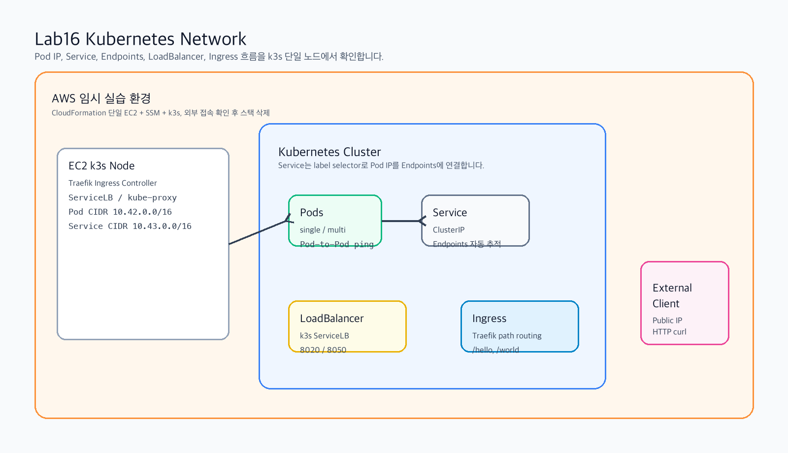
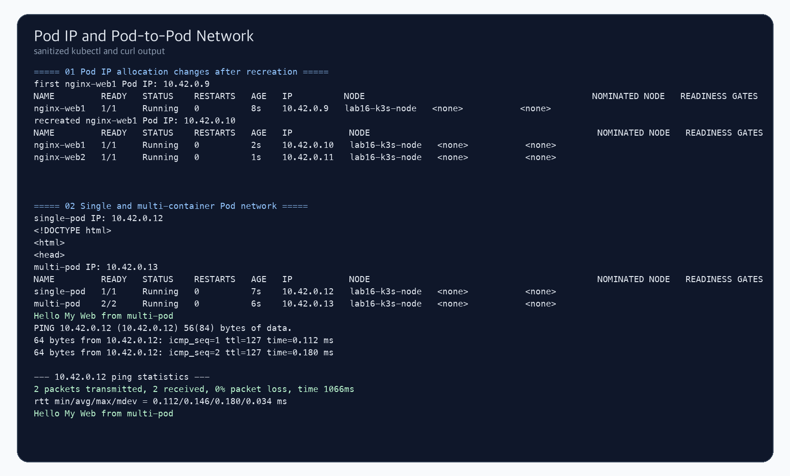
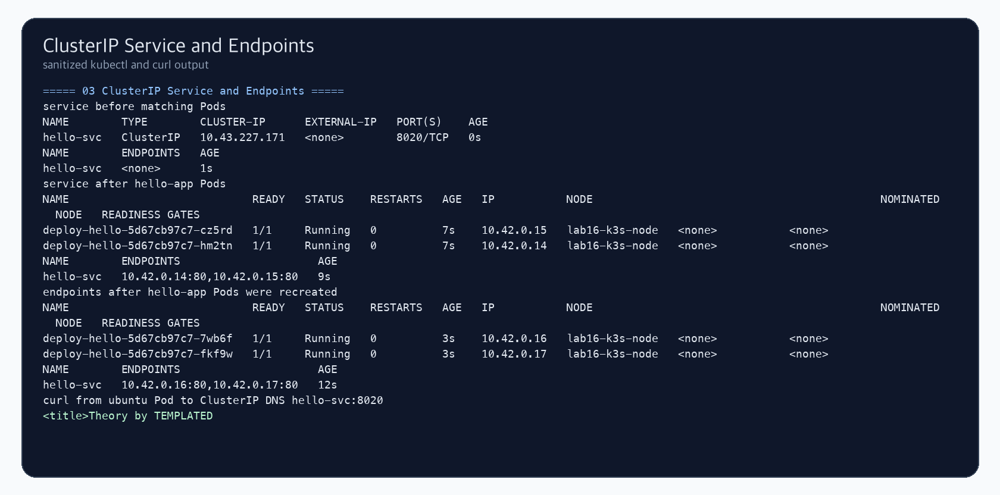
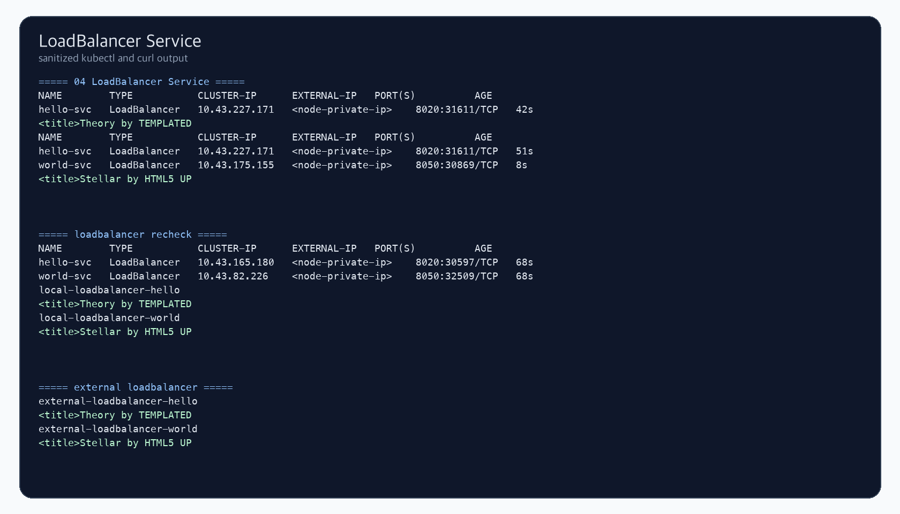
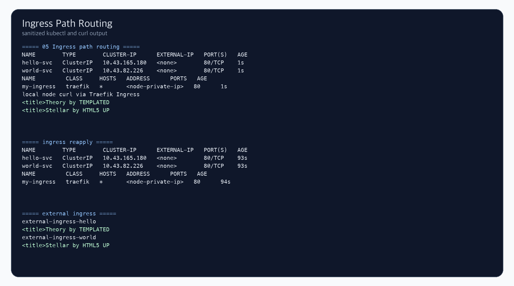
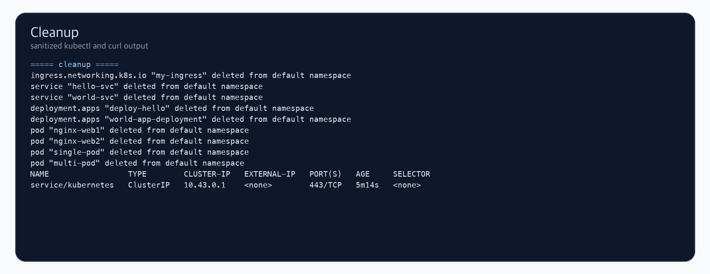

# Lab16 Kubernetes Network

Kubernetes 네트워크 개념과 Pod IP, Service, Endpoints, LoadBalancer, Ingress 흐름을 k3s 단일 노드 클러스터에서 확인한 실습 기록입니다.

## 실습 요약

이번 실습은 AWS CLI로 EC2 1대를 생성하고, k3s를 설치한 뒤 Kubernetes 네트워크 실습을 진행했습니다. SSH는 사용하지 않고 SSM Run Command로 kubectl 명령을 실행했습니다. LoadBalancer와 Ingress 외부 접속 확인을 위해 80, 8020, 8050 포트를 임시로 열었고, 실습 후 CloudFormation 스택을 삭제했습니다.

| 항목 | 내용 |
| --- | --- |
| 실습 환경 | AWS EC2 단일 노드 k3s |
| 리전 | `ap-northeast-2` |
| 인스턴스 타입 | `t3.small` |
| Kubernetes 배포판 | k3s |
| Ingress Controller | Traefik |
| LoadBalancer 구현 | k3s ServiceLB |
| 접속 방식 | AWS Systems Manager Run Command |
| 최종 정리 | Kubernetes 리소스 삭제 및 CloudFormation 스택 삭제 완료 |

## Kubernetes Network 개요

Kubernetes 네트워크는 Pod가 자주 생성되고 삭제되는 환경에서도 애플리케이션끼리 안정적으로 통신하게 만드는 구조입니다. Pod는 고유한 IP를 받지만, Pod IP는 고정 주소로 쓰기 어렵습니다. Deployment가 Pod를 다시 만들면 새 IP를 받을 수 있기 때문입니다.

이 문제를 해결하기 위해 Service가 사용됩니다. Service는 고정된 이름과 ClusterIP를 제공하고, label selector로 연결된 Pod IP들을 Endpoints로 추적합니다.

Kubernetes 네트워크에서 주로 봐야 할 통신은 다음 네 가지입니다.

| 통신 구분 | 의미 |
| --- | --- |
| Container-to-Container | 같은 Pod 안의 컨테이너끼리 localhost로 통신 |
| Pod-to-Pod | 서로 다른 Pod가 Pod IP로 통신 |
| Pod-to-Service | Pod가 Service 이름이나 ClusterIP로 backend Pod에 접근 |
| External-to-Service | 외부 사용자가 LoadBalancer나 Ingress를 통해 내부 Service에 접근 |

## Pod IP와 CNI

Kubernetes에서 각 Pod는 자체 IP를 받습니다. 같은 Pod 안의 컨테이너들은 네트워크 네임스페이스를 공유하므로 동일한 IP를 사용하고, 서로 `localhost`로 통신할 수 있습니다.

Pod 네트워크는 CNI(Container Network Interface) 플러그인이 구성합니다. k3s 기본 구성에서는 Pod CIDR이 `10.42.0.0/16`, Service CIDR이 `10.43.0.0/16`으로 잡힙니다.

이번 실습에서는 같은 이름의 `nginx-web1` Pod를 삭제 후 다시 생성했을 때 Pod IP가 바뀌는 것을 확인했습니다. 또한 `multi-pod` 안의 Ubuntu 컨테이너에서 `single-pod`로 ping이 되고, 같은 Pod 안의 Nginx에는 `localhost`로 접근되는 것을 확인했습니다.

## Service와 Endpoints

Service는 동적으로 바뀌는 Pod IP 앞에 고정된 네트워크 진입점을 만드는 Kubernetes 리소스입니다.

Service가 동작하는 핵심은 selector와 Endpoints입니다.

| 구성 요소 | 역할 |
| --- | --- |
| Selector | Service가 어떤 Pod를 backend로 삼을지 label로 선택 |
| Endpoints | selector에 매칭되는 실제 Pod IP와 port 목록 |
| kube-proxy | Service IP로 들어온 요청을 backend Pod로 전달하는 규칙 관리 |
| DNS | Pod가 Service 이름으로 접근할 수 있게 이름 해석 제공 |

이번 실습에서는 `hello-svc`를 먼저 만들었을 때 Endpoints가 `<none>`으로 표시되는 것을 확인했습니다. 이후 `hello-app` Pod가 생성되자 Endpoints에 실제 Pod IP가 등록되었고, Pod 재생성 후 Endpoints도 새 Pod IP로 바뀌었습니다.

## Service 타입

Kubernetes Service는 외부 노출 수준에 따라 여러 타입을 가집니다.

| 타입 | 설명 | 사용 상황 |
| --- | --- | --- |
| ClusterIP | 클러스터 내부에서만 접근 가능한 기본 Service | Pod 간 내부 통신 |
| NodePort | 각 노드의 30000-32767 범위 포트로 외부 노출 | 개발/테스트 |
| LoadBalancer | 외부 Load Balancer나 k3s ServiceLB로 노출 | 외부 HTTP/TCP 접근 |
| ExternalName | 외부 DNS 이름을 Kubernetes Service처럼 참조 | 외부 DB/API 연결 |

이번 실습에서는 ClusterIP와 LoadBalancer를 직접 확인했습니다. k3s의 LoadBalancer는 AWS ELB를 새로 만들지 않고 ServiceLB가 노드 포트를 열어 외부 접근을 처리합니다.

## LoadBalancer와 Ingress 차이

LoadBalancer는 Service 하나를 외부 포트 하나로 노출하는 방식입니다. 서비스가 많아지면 외부 포트나 Load Balancer가 늘어날 수 있습니다.

Ingress는 HTTP/HTTPS 라우팅 규칙입니다. Ingress Controller가 필요하며, 하나의 외부 진입점으로 여러 Service를 path나 host 기준으로 나눠 보낼 수 있습니다.

| 구분 | LoadBalancer | Ingress |
| --- | --- | --- |
| 계층 | L4 중심 | L7 HTTP/HTTPS |
| 라우팅 기준 | port 중심 | host/path 중심 |
| 외부 진입점 | Service마다 생길 수 있음 | 하나의 진입점으로 여러 Service 연결 |
| 이번 실습 | `:8020`, `:8050` 포트 접근 | `/hello/`, `/world/` path routing |

## 실습 결과

### 1. Pod IP와 Pod 간 통신

같은 이름의 Pod를 삭제 후 다시 생성하면 Pod IP가 변경되는 것을 확인했습니다. `multi-pod` 안의 Ubuntu 컨테이너에서 `single-pod`로 ping을 보내 Pod-to-Pod 통신도 확인했습니다.

### 2. ClusterIP Service와 Endpoints

Service를 먼저 만들면 Endpoints가 없고, selector에 맞는 Pod가 생성되면 Endpoints가 자동으로 등록되는 것을 확인했습니다. Pod 재생성 후 Endpoints도 새 Pod IP로 바뀌었습니다.

### 3. LoadBalancer Service

`hello-svc`와 `world-svc`를 LoadBalancer 타입으로 노출하고, 내부 노드 curl과 Public IP 기반 외부 curl 모두 정상 응답을 확인했습니다.

### 4. Ingress Path Routing

Traefik Ingress를 사용해 `/hello/` 요청은 `hello-svc`, `/world/` 요청은 `world-svc`로 라우팅되는 것을 확인했습니다.

### 5. 정리

실습에서 만든 Ingress, Service, Deployment, Pod를 삭제하고 CloudFormation 스택까지 삭제했습니다.

## 실습에서 확인한 포인트

| 확인 항목 | 결과 |
| --- | --- |
| Pod IP 재할당 | 같은 이름 Pod 삭제/재생성 시 IP 변경 확인 |
| Single Pod 접속 | Pod IP로 Nginx 응답 확인 |
| Multi-container Pod | `READY 2/2`, 같은 Pod 내 localhost 응답 확인 |
| Pod-to-Pod 통신 | Ubuntu 컨테이너에서 `single-pod` ping 성공 |
| ClusterIP Service | Service DNS `hello-svc:8020` 접속 확인 |
| Endpoints 자동 갱신 | Pod 생성/삭제에 따라 backend IP 변경 확인 |
| LoadBalancer Service | Public IP `:8020`, `:8050` 외부 접속 확인 |
| Ingress | Public IP `/hello/`, `/world/` path routing 확인 |
| Kubernetes cleanup | 기본 `kubernetes` Service 외 리소스 삭제 확인 |
| AWS cleanup | CloudFormation 스택 삭제 완료 |

## 파일 구성

- [commands.md](commands.md): AWS CLI와 kubectl 실습 명령
- [verification.md](verification.md): 검증 결과 요약
- [templates/k3s_network_single_node.yaml](templates/k3s_network_single_node.yaml): EC2 k3s 네트워크 실습 환경 CloudFormation 템플릿
- [manifests](manifests): Kubernetes Network YAML 예제
- [results/kubectl_result_sanitized.txt](results/kubectl_result_sanitized.txt): 마스킹된 kubectl/curl 실습 로그

## 보안 및 비용 주의

- GitHub에는 AWS Account ID, Access Key, Secret Key, 퍼블릭 IP를 올리지 않습니다.
- 캡처와 로그에는 실제 EC2 인스턴스 ID, VPC ID, 노드 private IP, public IP를 남기지 않았습니다.
- 외부 확인용 80, 8020, 8050 포트는 실습 중에만 열었고, 실습 후 스택을 삭제했습니다.
- 실제로 다시 실습할 경우 `aws cloudformation delete-stack`까지 반드시 수행합니다.
