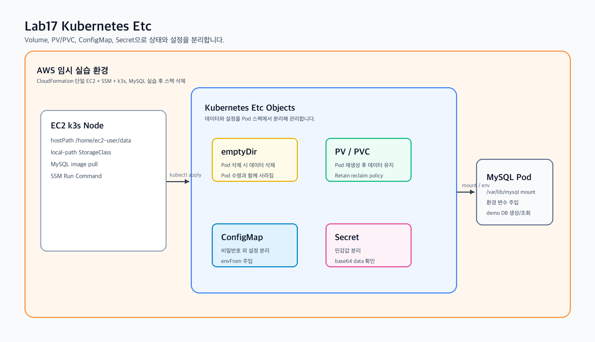
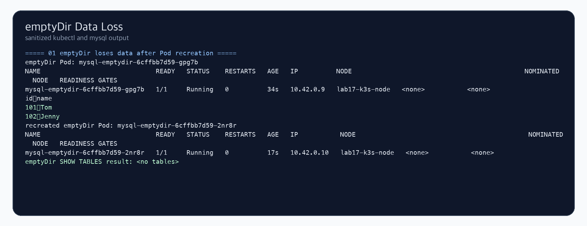
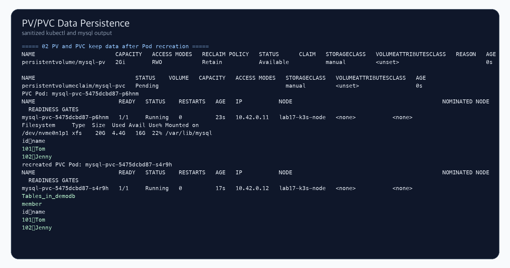
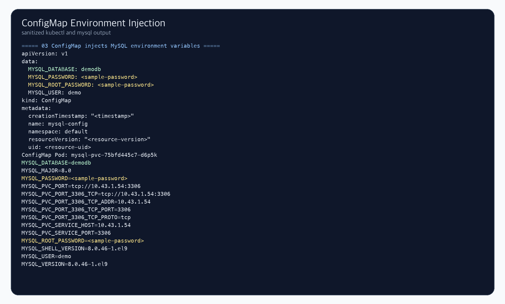
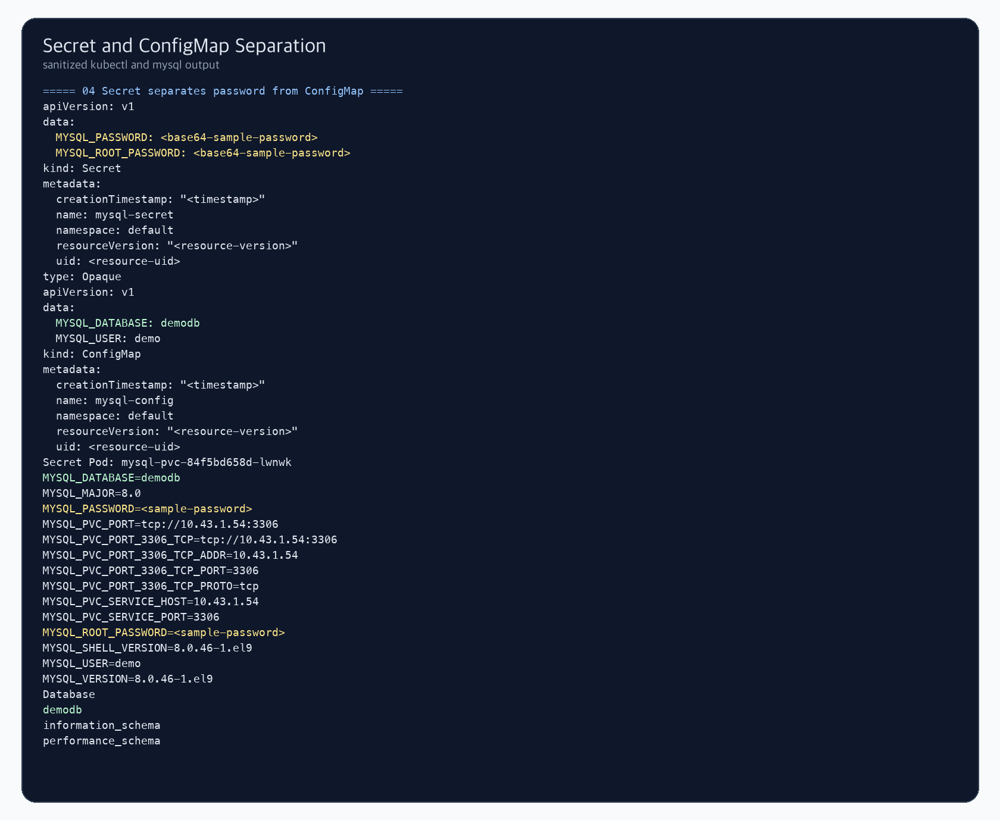
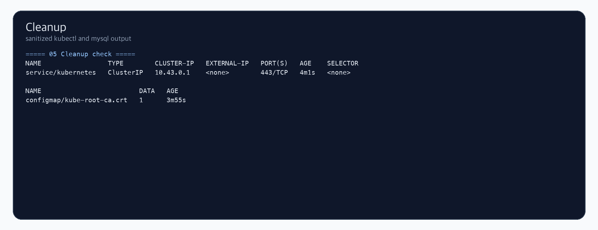

# Lab17 Kubernetes Etc

Kubernetes Volume, PersistentVolume/PersistentVolumeClaim, ConfigMap, Secret 개념을 k3s 단일 노드 클러스터에서 확인한 실습 기록입니다.

## 실습 요약

이번 실습은 AWS CLI로 EC2 1대를 생성하고, k3s를 설치한 뒤 MySQL Pod를 사용해 Kubernetes의 데이터 저장과 설정 분리 방식을 확인했습니다. SSH 접속은 사용하지 않고 AWS Systems Manager Run Command로 kubectl 명령을 실행했습니다. 실습 후 Kubernetes 리소스와 CloudFormation 스택을 삭제했습니다.

| 항목 | 내용 |
| --- | --- |
| 실습 환경 | AWS EC2 단일 노드 k3s |
| 리전 | `ap-northeast-2` |
| 인스턴스 타입 | `t3.small` |
| Kubernetes 배포판 | k3s |
| Container runtime | containerd |
| 데이터베이스 이미지 | `mysql:8.0` |
| 접속 방식 | AWS Systems Manager Run Command |
| 최종 정리 | Kubernetes 리소스 삭제 및 CloudFormation 스택 삭제 완료 |

## 왜 Volume이 필요한가

컨테이너 파일시스템은 기본적으로 컨테이너 생명주기에 묶여 있습니다. Pod가 새로 만들어지거나 컨테이너가 교체되면 컨테이너 내부에 저장한 데이터는 사라질 수 있습니다. 데이터베이스처럼 상태를 저장해야 하는 애플리케이션은 컨테이너 밖에 데이터를 저장할 공간이 필요합니다.

Kubernetes에서는 이 문제를 Volume으로 해결합니다. Pod 스펙에 Volume을 선언하고, 컨테이너의 특정 경로에 마운트하면 컨테이너 내부 애플리케이션은 그 경로를 일반 디렉터리처럼 사용합니다.

## emptyDir

`emptyDir`은 Pod가 노드에 할당될 때 생성되는 임시 Volume입니다. 같은 Pod 안에서 컨테이너가 재시작되는 정도라면 데이터가 유지될 수 있지만, Pod 자체가 삭제되고 다시 생성되면 `emptyDir`도 새로 만들어집니다.

그래서 `emptyDir`은 캐시, 임시 파일, 컨테이너 간 파일 공유처럼 Pod 수명 안에서만 필요한 데이터에 적합합니다. MySQL 데이터 디렉터리처럼 오래 유지해야 하는 저장소로 쓰면 Pod 재생성 시 데이터가 사라지는 것을 이번 실습에서 확인했습니다.

## PV와 PVC

PersistentVolume(PV)은 클러스터에 준비된 저장소 리소스이고, PersistentVolumeClaim(PVC)은 Pod가 필요한 저장소를 요청하는 객체입니다.

Pod는 실제 저장소가 어디에 있는지 직접 알 필요 없이 PVC를 참조합니다. Kubernetes는 PVC 조건에 맞는 PV를 찾아 바인딩하고, Pod가 실행될 때 해당 저장소를 컨테이너에 마운트합니다.

| 구성 요소 | 역할 |
| --- | --- |
| PersistentVolume | 클러스터에 등록된 실제 저장소 자원 |
| PersistentVolumeClaim | Pod가 사용할 저장소 요청서 |
| StorageClass | 동적 볼륨 생성 방식 정의 |
| Reclaim Policy | PVC 삭제 후 PV 데이터를 어떻게 처리할지 결정 |

이번 실습에서는 단일 노드 학습 환경이므로 `hostPath` 기반 PV를 사용했습니다. `hostPath`는 노드 로컬 디렉터리를 Pod에 연결하는 방식이라 구조가 단순하지만, Pod가 다른 노드로 이동할 수 있는 운영 환경에서는 적합하지 않습니다. 운영 환경에서는 EBS CSI, EFS CSI 같은 스토리지 드라이버를 사용하는 것이 일반적입니다.

## Reclaim Policy

PV의 `persistentVolumeReclaimPolicy`는 PVC가 삭제된 뒤 PV와 실제 데이터를 어떻게 처리할지 정합니다.

| 정책 | 의미 |
| --- | --- |
| `Retain` | PVC가 삭제되어도 PV와 실제 데이터를 보존 |
| `Delete` | PVC 삭제 시 PV와 연결된 저장소도 삭제 |
| `Recycle` | 오래된 방식이며 현재는 거의 사용하지 않음 |

이번 실습의 PV는 `Retain`으로 구성했습니다. 그래서 MySQL Pod를 삭제하고 새 Pod가 같은 PVC를 다시 마운트해도 `member` 테이블과 데이터가 유지되었습니다.

## ConfigMap

ConfigMap은 애플리케이션 설정값을 이미지나 Pod 스펙에서 분리하기 위한 Kubernetes 객체입니다. 예를 들어 DB 이름, 일반 사용자 이름, 기능 플래그, 환경별 설정값을 ConfigMap에 넣고 Pod에서는 환경 변수나 파일로 주입받을 수 있습니다.

이번 실습에서는 MySQL의 `MYSQL_DATABASE`, `MYSQL_USER` 같은 값을 ConfigMap으로 관리했습니다. 설정을 ConfigMap으로 분리하면 컨테이너 이미지를 다시 빌드하지 않아도 실행 환경별 설정을 바꿀 수 있습니다.

## Secret

Secret은 비밀번호, 토큰, 인증서처럼 민감한 값을 ConfigMap과 분리해 관리하기 위한 객체입니다. 이번 실습에서는 MySQL root password와 user password를 Secret으로 분리했습니다.

주의할 점은 Kubernetes Secret의 기본 표현이 암호화가 아니라 base64 인코딩이라는 점입니다. base64는 쉽게 복원할 수 있으므로 운영 환경에서는 RBAC으로 Secret 접근 권한을 제한하고, 필요하면 etcd encryption at rest와 외부 Secret Manager 연동을 함께 고려해야 합니다.

## 실습 결과

### 1. emptyDir 데이터 손실

`emptyDir`을 `/var/lib/mysql`에 마운트한 MySQL Pod에서 `member` 테이블과 데이터를 만들었습니다. 이후 Pod를 삭제하고 재생성하자 `SHOW TABLES` 결과가 비어 있어 데이터가 유지되지 않는 것을 확인했습니다.

### 2. PV/PVC 데이터 유지

`hostPath` 기반 PV와 PVC를 만들고 MySQL 데이터 디렉터리에 마운트했습니다. Pod 삭제 후 새 Pod가 같은 PVC를 다시 사용하자 `member` 테이블과 데이터가 그대로 유지되었습니다.

### 3. ConfigMap 환경 변수 주입

MySQL 환경 변수를 ConfigMap으로 생성하고 `envFrom`으로 Pod에 주입했습니다. Pod 내부에서 `MYSQL_DATABASE`, `MYSQL_USER` 등이 환경 변수로 들어간 것을 확인했습니다.

### 4. Secret 분리

비밀번호 값은 Secret으로 분리하고, ConfigMap에는 비밀번호가 아닌 설정만 남겼습니다. Secret의 data가 base64 형태로 저장되는 것과 Pod 내부 환경 변수로 주입되는 것을 확인했습니다.

### 5. 정리

실습에서 만든 Deployment, Service, PV, PVC, ConfigMap, Secret을 삭제하고 CloudFormation 스택도 삭제했습니다.

## 실습에서 확인한 포인트

| 확인 항목 | 결과 |
| --- | --- |
| k3s 노드 상태 | `Ready` 확인 |
| StorageClass | k3s 기본 `local-path` 확인 |
| `emptyDir` | Pod 재생성 후 MySQL 테이블 삭제 확인 |
| PV/PVC | Pod 재생성 후 MySQL 테이블 유지 확인 |
| PV reclaim policy | `Retain` 설정 확인 |
| ConfigMap | MySQL 일반 설정 환경 변수 주입 확인 |
| Secret | MySQL 비밀번호 환경 변수 분리 확인 |
| Kubernetes cleanup | 기본 Service/ConfigMap 외 실습 리소스 삭제 확인 |
| AWS cleanup | CloudFormation 스택 삭제 완료 |

## 파일 구성

- [commands.md](commands.md): AWS CLI와 kubectl 실습 명령
- [verification.md](verification.md): 검증 결과 요약
- [templates/k3s_single_node.yaml](templates/k3s_single_node.yaml): EC2 k3s 실습 환경 CloudFormation 템플릿
- [manifests](manifests): Kubernetes Volume, ConfigMap, Secret YAML 예제
- [results/kubectl_result_sanitized.txt](results/kubectl_result_sanitized.txt): 마스킹된 kubectl/mysql 실습 로그

## 보안 및 비용 주의

- GitHub에는 AWS Account ID, Access Key, Secret Key, 퍼블릭 IP를 올리지 않습니다.
- 캡처와 로그에는 실제 EC2 인스턴스 ID, VPC ID, 노드 private IP를 남기지 않았습니다.
- 문서와 매니페스트의 `1234` 비밀번호는 교육용 샘플 값입니다.
- 실제 운영에서는 Secret 접근 권한, 암호화, 외부 Secret Manager 사용을 함께 검토해야 합니다.
- 실습 EC2는 캡처 저장 후 삭제했습니다.
