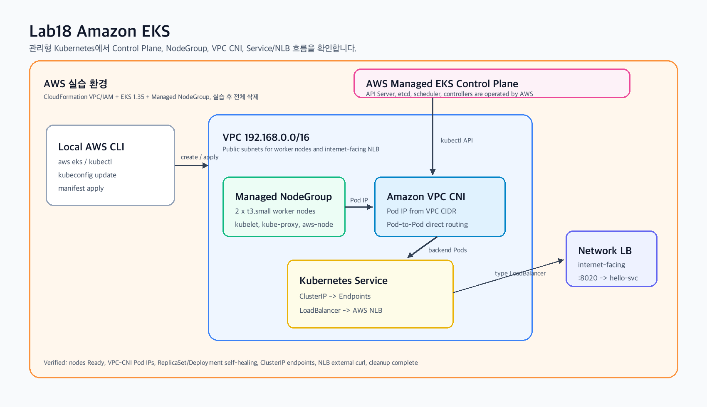
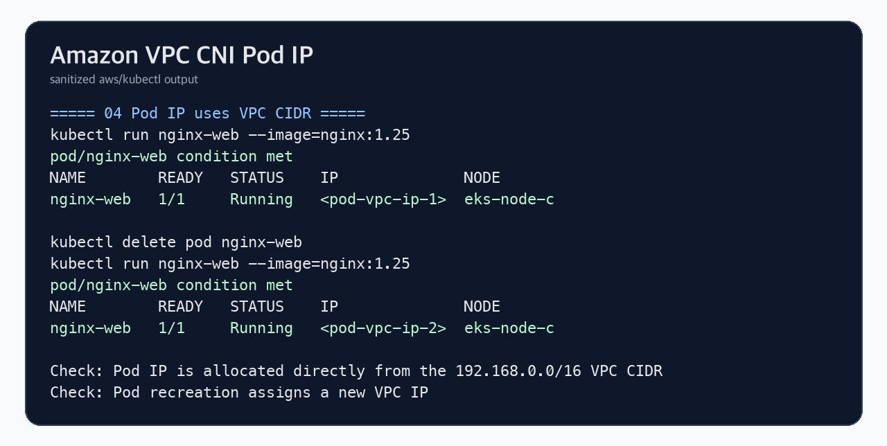
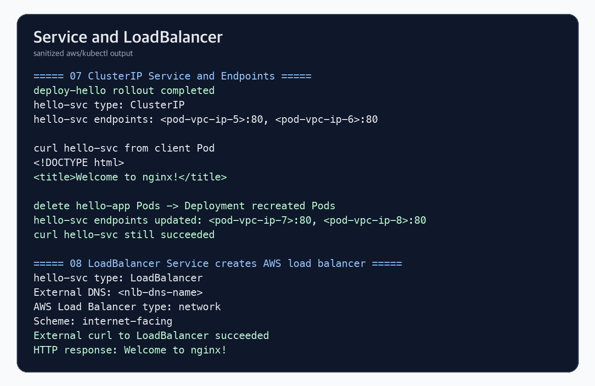
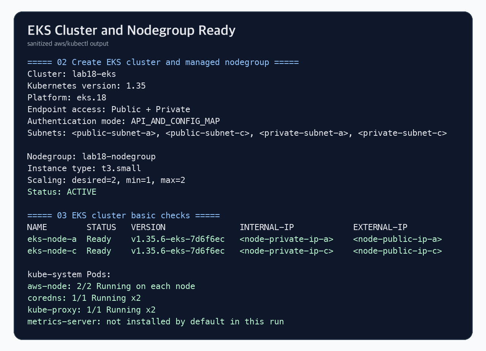
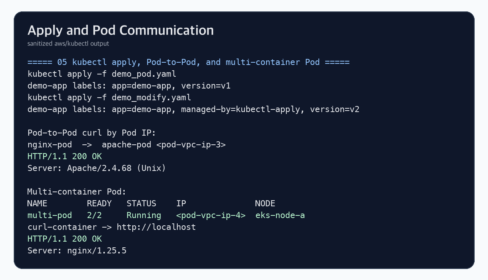
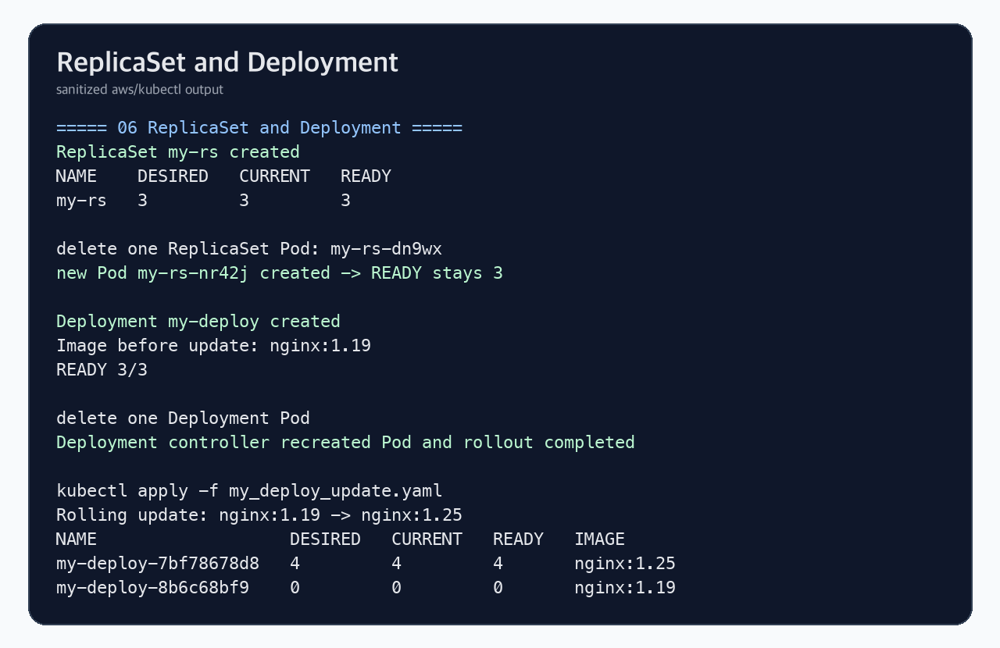
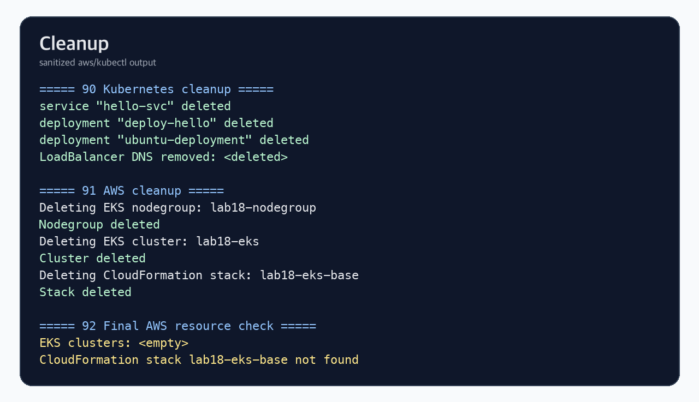

# Lab18 Amazon EKS

Amazon EKS 개념과 EKS 클러스터 생성, Managed Node Group, Amazon VPC CNI, Kubernetes Service/LoadBalancer 동작을 AWS CLI와 kubectl로 확인한 실습 기록입니다.

## 실습 요약

이번 실습은 CloudFormation으로 VPC와 IAM Role을 만들고, AWS CLI로 EKS 1.35 클러스터와 Managed Node Group을 생성한 뒤 Kubernetes 기본 리소스를 배포해 확인했습니다. 실습 후 Service LoadBalancer가 만든 Network Load Balancer, EKS Node Group, EKS Cluster, CloudFormation Stack까지 삭제했습니다.

| 항목 | 내용 |
| --- | --- |
| 실습 환경 | Amazon EKS Standard |
| 리전 | `ap-northeast-2` |
| Kubernetes 버전 | `1.35` |
| Worker Node | Managed Node Group |
| 인스턴스 타입 | `t3.small` 2대 |
| 네트워크 | VPC `192.168.0.0/16`, Public/Private Subnet |
| CNI | Amazon VPC CNI |
| 외부 노출 | Kubernetes `LoadBalancer` Service가 AWS Network Load Balancer 생성 |
| 최종 정리 | Kubernetes 리소스, NLB, Node Group, EKS Cluster, CloudFormation Stack 삭제 완료 |

원본 실습 자료는 `t3.medium` 노드그룹을 사용하지만, 현재 실습 계정은 Free Tier 대상 인스턴스만 허용되어 `t3.small`로 조정했습니다.

## Amazon EKS란?

Amazon EKS는 AWS가 Kubernetes Control Plane을 관리해주는 완전관리형 Kubernetes 서비스입니다. 사용자는 Kubernetes API를 그대로 사용하면서, API Server, etcd, scheduler, controller-manager 같은 핵심 Control Plane 구성요소의 설치, 패치, 고가용성 운영 부담을 AWS에 맡길 수 있습니다.

EKS를 사용하면 기존 Kubernetes 리소스인 Pod, Deployment, ReplicaSet, Service, Ingress를 그대로 사용할 수 있고, AWS의 IAM, VPC, Load Balancer, EBS, ECR, CloudWatch 같은 서비스와 자연스럽게 통합할 수 있습니다.

## EKS Standard와 EKS Auto Mode

EKS를 사용할 때는 크게 두 가지 운영 방식이 있습니다.

| 구분 | 설명 |
| --- | --- |
| EKS Standard | AWS가 Control Plane을 관리하고, 사용자가 Node Group, Fargate, Add-on, 네트워크 구성을 선택해 운영 |
| EKS Auto Mode | AWS가 데이터 플레인까지 더 많이 자동화해 노드 프로비저닝, 스케일링, 패치, 비용 최적화를 관리 |

이번 실습은 EKS Standard 방식입니다. Control Plane은 AWS가 관리하고, Worker Node는 Managed Node Group으로 만들었습니다.

## EKS 아키텍처

EKS는 Control Plane과 Data Plane을 분리해 이해하면 쉽습니다.

| 영역 | 역할 | 이번 실습 |
| --- | --- | --- |
| Control Plane | Kubernetes API Server, etcd, scheduler, controller 관리 | AWS 관리형 EKS Control Plane |
| Data Plane | 실제 Pod가 실행되는 Worker Node | Managed Node Group의 EC2 2대 |
| Add-on | CNI, CoreDNS, kube-proxy 등 클러스터 기본 기능 | `aws-node`, `coredns`, `kube-proxy` 확인 |
| Kubernetes API 접근 | kubectl이 EKS API Endpoint로 요청 | `aws eks update-kubeconfig`로 kubeconfig 생성 |

Control Plane은 사용자의 EC2 인스턴스 안에 직접 뜨지 않습니다. AWS가 관리하는 영역에 있고, 사용자는 EKS API Endpoint를 통해 접근합니다. 다만 Control Plane이 사용자 VPC의 노드나 Service와 통신할 수 있도록 VPC 안에 EKS 관리 ENI가 생성됩니다.

## Managed Node Group

Managed Node Group은 EKS가 EC2 Worker Node의 생성, 교체, 업데이트를 관리하는 방식입니다. 내부적으로 Auto Scaling Group이 만들어지고, 사용자가 지정한 desired/min/max 개수에 맞춰 EC2 노드를 유지합니다.

이번 실습에서는 `desired=2`, `min=1`, `max=2`로 구성했습니다. 두 노드가 `Ready` 상태가 된 뒤 `aws-node`, `coredns`, `kube-proxy`가 실행되는 것을 확인했습니다.

## Amazon VPC CNI

일반적인 Kubernetes CNI는 Pod 전용 오버레이 네트워크를 만들 수 있습니다. 반면 Amazon VPC CNI는 Pod가 VPC CIDR 대역의 IP를 직접 할당받도록 구성합니다.

이 방식의 특징은 다음과 같습니다.

| 특징 | 의미 |
| --- | --- |
| Pod IP가 VPC IP | Pod IP가 `192.168.0.0/16` 같은 VPC CIDR에서 할당됨 |
| AWS 네트워크와 직접 통합 | Pod가 VPC 내부 리소스와 더 직관적으로 통신 |
| ENI/IP 자원 영향 | 노드 타입별 ENI와 IP 한도에 따라 Pod 수가 제한될 수 있음 |
| 보안 그룹/라우팅 이해 필요 | Kubernetes 네트워크와 AWS VPC 네트워크를 함께 봐야 함 |

이번 실습에서는 `nginx-web` Pod를 삭제 후 재생성했을 때 새로운 VPC 대역 Pod IP가 할당되는 것을 확인했습니다.

## EKS Endpoint 접근 방식

EKS Cluster Endpoint는 kubectl이 Control Plane에 접근하는 주소입니다.

| 방식 | 설명 |
| --- | --- |
| Public | 인터넷에서 EKS API Endpoint 접근 가능 |
| Public + Private | kubectl은 Public Endpoint를 사용할 수 있고, VPC 내부 통신은 Private Endpoint 사용 가능 |
| Private | VPC 내부에서만 EKS API Endpoint 접근 가능 |

이번 실습은 학습 편의를 위해 Public + Private endpoint를 모두 활성화했습니다. 운영 환경에서는 접근 CIDR 제한, Bastion/SSM, VPN, VPC Endpoint 등을 함께 고려해야 합니다.

## IAM과 Kubernetes 권한

EKS는 AWS IAM 인증과 Kubernetes RBAC 권한 모델을 함께 사용합니다. AWS CLI로 `aws eks update-kubeconfig`를 실행하면 kubeconfig에는 EKS 클러스터 주소와 IAM 기반 인증 방식이 들어갑니다.

이번 실습에서는 클러스터 생성자에게 admin access를 부여하는 `API_AND_CONFIG_MAP` 인증 모드를 사용했습니다. 운영에서는 IAM principal별 access entry와 Kubernetes Role/ClusterRoleBinding을 분리해서 최소 권한으로 설계해야 합니다.

## Service와 AWS Load Balancer

Kubernetes Service는 Pod 앞에 안정적인 네트워크 진입점을 만듭니다.

| Service 타입 | 의미 |
| --- | --- |
| ClusterIP | 클러스터 내부에서만 접근 가능한 기본 Service |
| NodePort | 각 Worker Node의 포트로 외부 접근 |
| LoadBalancer | AWS Load Balancer를 생성해 외부 트래픽을 Service로 전달 |

이번 실습에서는 `hello-svc`를 ClusterIP로 만들고 Endpoints가 backend Pod IP로 채워지는 것을 확인했습니다. 이후 `LoadBalancer` 타입으로 다시 만들어 AWS Network Load Balancer가 생성되고, 외부 curl 요청이 Nginx Pod까지 도달하는 것을 확인했습니다.

## Ingress와 AWS Load Balancer Controller

Ingress는 HTTP path/host 기반 라우팅을 Kubernetes 리소스로 선언하는 방식입니다. EKS에서 ALB 기반 Ingress를 쓰려면 AWS Load Balancer Controller가 필요합니다.

AWS Load Balancer Controller 설치에는 다음 요소가 필요합니다.

- IAM Policy
- EKS OIDC Provider
- IRSA 기반 ServiceAccount
- Helm chart 설치
- IngressClass와 Ingress manifest

이번 실습에서는 비용과 삭제 범위를 명확하게 유지하기 위해 Ingress Controller는 설치하지 않았고, 선택 실습용 manifest만 포함했습니다.

## 실습 결과

### 1. EKS Cluster와 Managed Node Group

EKS 1.35 Cluster가 `ACTIVE` 상태가 되었고, `t3.small` Worker Node 2대가 `Ready` 상태로 등록되었습니다.

### 2. Pod IP와 Amazon VPC CNI

Pod가 VPC CIDR 대역의 IP를 직접 할당받는 것을 확인했습니다. 같은 이름의 Pod를 삭제 후 재생성하면 새 Pod IP가 할당되었습니다.

### 3. kubectl apply와 Pod 통신

`kubectl apply`로 Pod label 변경을 반영하고, Nginx Pod에서 Apache Pod로 Pod IP 기반 curl 요청이 성공하는 것을 확인했습니다. Multi-container Pod에서는 같은 Pod 내부 컨테이너끼리 `localhost` 통신이 되는 것도 확인했습니다.

### 4. ReplicaSet과 Deployment

ReplicaSet이 Pod 삭제 후 복제본 수를 복구했고, Deployment가 Pod self-healing과 rolling update를 수행하는 것을 확인했습니다.

### 5. ClusterIP와 LoadBalancer Service

ClusterIP Service의 Endpoints가 backend Pod IP를 따라 갱신되는 것을 확인했습니다. LoadBalancer Service는 AWS Network Load Balancer를 생성했고, 외부 curl 요청이 성공했습니다.

### 6. 정리

Kubernetes 리소스, NLB, Node Group, EKS Cluster, CloudFormation Stack을 모두 삭제했습니다.

## 실습에서 확인한 포인트

| 확인 항목 | 결과 |
| --- | --- |
| EKS Cluster | `ACTIVE` |
| Managed Node Group | `ACTIVE`, `t3.small` 2대 |
| Worker Node | 2개 노드 `Ready` |
| EKS 기본 Add-on | `aws-node`, `coredns`, `kube-proxy` Running |
| Metrics Server | 기본 설치되지 않음 확인 |
| Amazon VPC CNI | Pod IP가 VPC CIDR에서 할당됨 |
| Pod-to-Pod 통신 | Nginx Pod에서 Apache Pod curl 성공 |
| Multi-container Pod | 같은 Pod 내부 `localhost` 통신 성공 |
| ReplicaSet | Pod 삭제 후 복제본 수 복구 |
| Deployment | Pod self-healing, rolling update 확인 |
| ClusterIP Service | Endpoints 자동 갱신 확인 |
| LoadBalancer Service | AWS Network Load Balancer 생성 및 외부 curl 성공 |
| AWS cleanup | EKS/NLB/CloudFormation 리소스 삭제 완료 |

## 파일 구성

- [commands.md](commands.md): AWS CLI와 kubectl 실습 명령
- [verification.md](verification.md): 검증 결과 요약
- [templates/eks_base.yaml](templates/eks_base.yaml): VPC와 EKS IAM Role CloudFormation 템플릿
- [manifests](manifests): EKS에서 실행한 Kubernetes YAML 예제
- [results/kubectl_result_sanitized.txt](results/kubectl_result_sanitized.txt): 마스킹된 AWS CLI/kubectl 실습 로그

## 보안 및 비용 주의

- GitHub에는 AWS Account ID, IAM Role ARN, VPC/Subnet ID, EKS Endpoint, Public IP, NLB DNS를 올리지 않습니다.
- EKS Control Plane, EC2 Worker Node, Load Balancer는 과금 대상입니다.
- 실습 후 `LoadBalancer` Service를 먼저 삭제해 NLB를 제거하고, Node Group, EKS Cluster, CloudFormation Stack 순서로 삭제해야 합니다.
- 운영 환경에서는 Public Endpoint 접근 범위 제한, IAM 최소 권한, RBAC, IRSA, 로깅과 모니터링 구성이 필요합니다.
