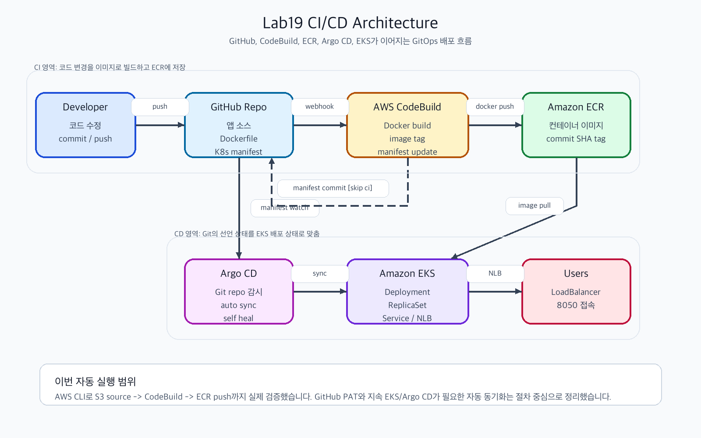
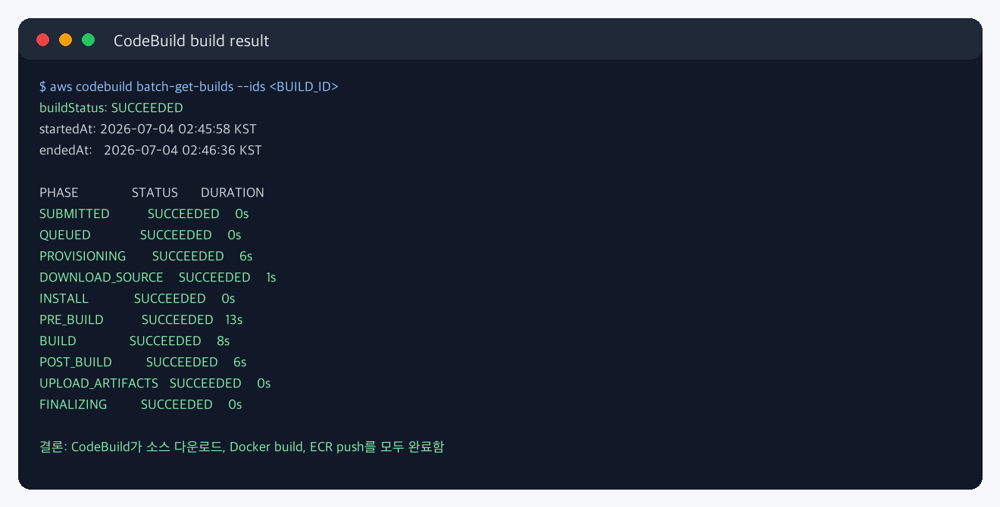
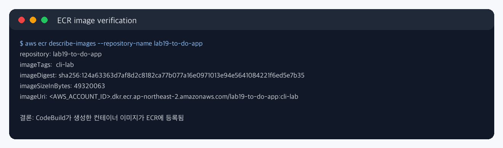
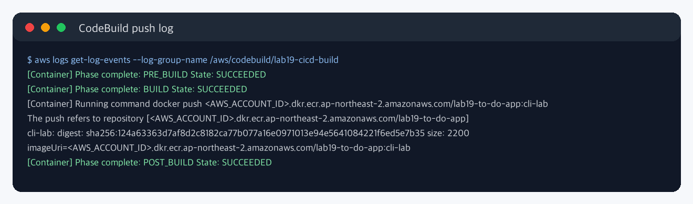
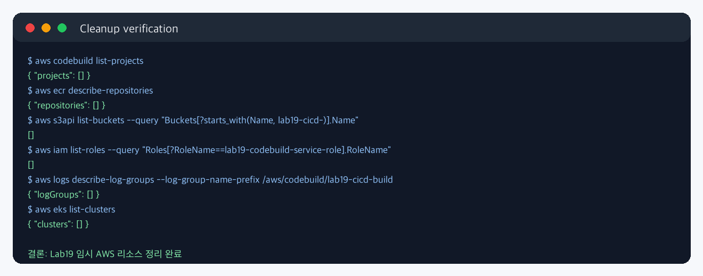

# Lab19 CI/CD

AWS CodeBuild, Amazon ECR, Argo CD, Amazon EKS를 연결하는 CI/CD 자동화 파이프라인 개념과 AWS CLI 실습 기록입니다.

## 실습 요약

이번 실습 자료의 목표는 GitHub에 애플리케이션 변경 사항을 push하면 CodeBuild가 Docker 이미지를 빌드하고 ECR에 push한 뒤, Argo CD가 Git 저장소의 Kubernetes manifest 변경을 감지해 EKS에 자동 배포하는 흐름을 이해하는 것입니다.

| 항목 | 내용 |
| --- | --- |
| 애플리케이션 | Flask 기반 TODO 앱 |
| CI 도구 | AWS CodeBuild |
| 이미지 저장소 | Amazon ECR |
| CD 방식 | Argo CD 기반 GitOps |
| 배포 대상 | Amazon EKS |
| Kubernetes 노출 방식 | `LoadBalancer` Service, NLB |
| 실제 AWS CLI 검증 | S3 source bundle -> CodeBuild -> ECR image push |
| 미실행 범위 | GitHub PAT Webhook, 지속 EKS/Argo CD 배포 환경 |
| 최종 정리 | CodeBuild, ECR, S3, IAM Role, CloudWatch Logs 삭제 완료 |

GitHub Personal Access Token은 민감 정보이고, EKS/Argo CD는 지속 리소스가 필요합니다. 그래서 이번 자동 실행에서는 PAT 없이 가능한 CodeBuild와 ECR 빌드/푸시 경로를 실제로 검증하고, GitHub Webhook 및 Argo CD 자동 동기화는 절차와 개념 중심으로 정리했습니다.

## CI/CD란?

CI/CD는 애플리케이션 변경 사항을 더 자주, 더 안정적으로 배포하기 위한 자동화 방식입니다.

| 구분 | 의미 | 핵심 질문 |
| --- | --- | --- |
| CI | Continuous Integration, 지속적 통합 | 변경된 코드가 정상적으로 빌드/테스트되는가? |
| CD | Continuous Delivery 또는 Continuous Deployment | 검증된 변경 사항을 배포 환경에 어떻게 반영할 것인가? |

CI는 여러 개발자의 코드가 자주 합쳐질 때 생기는 충돌과 품질 문제를 줄입니다. 코드가 push되면 자동으로 빌드, 테스트, 패키징이 수행되고, 실패하면 빠르게 피드백을 받습니다.

CD는 CI 이후의 배포 단계를 자동화합니다. Continuous Delivery는 운영 반영 직전에 사람의 승인을 둘 수 있고, Continuous Deployment는 승인 단계 없이 성공한 변경 사항을 운영까지 자동 배포합니다.

## 이번 실습의 전체 흐름

| 단계 | 서비스/도구 | 역할 |
| --- | --- | --- |
| 1 | GitHub | 애플리케이션 소스, Dockerfile, Kubernetes manifest 저장 |
| 2 | CodeBuild | GitHub push 이벤트를 받아 Docker 이미지 빌드 |
| 3 | ECR | 빌드된 컨테이너 이미지를 태그와 함께 저장 |
| 4 | CodeBuild post_build | `to_do_app.yaml`의 image 값을 새 ECR 이미지 태그로 수정 |
| 5 | GitHub | 수정된 manifest를 `[skip ci]` 메시지로 다시 commit |
| 6 | Argo CD | Git 저장소의 manifest 변경을 감지 |
| 7 | EKS | Deployment/ReplicaSet/Pod를 새 이미지로 rolling update |
| 8 | Service/NLB | 외부 사용자가 `:8050`으로 앱에 접속 |

핵심은 "이미지를 직접 서버에 복사해서 배포"하는 방식이 아니라, Git과 Registry를 기준으로 배포 상태를 선언하고 자동화 도구가 그 상태를 맞추도록 하는 것입니다.

## CodeBuild와 buildspec.yml

CodeBuild는 AWS의 관리형 빌드 서비스입니다. 빌드 서버를 직접 운영하지 않고도 컨테이너 환경에서 명령을 실행할 수 있습니다. 실습에서는 Docker 이미지를 빌드해야 하므로 CodeBuild 환경에서 `privilegedMode=true`가 필요합니다.

`buildspec.yml`은 CodeBuild가 어떤 순서로 명령을 실행할지 정의하는 파일입니다.

| phase | 역할 |
| --- | --- |
| `pre_build` | 계정 ID, 리전, 이미지 태그를 준비하고 ECR에 로그인 |
| `build` | Docker 이미지를 빌드하고 ECR URI로 태깅 |
| `post_build` | ECR에 push하고 Kubernetes manifest의 image 값을 새 태그로 수정 |
| `artifacts` | 빌드 결과로 남길 파일 지정 |

이번 실습에서 이미지 태그는 `CODEBUILD_RESOLVED_SOURCE_VERSION`의 앞 7자리를 사용합니다. Git commit SHA 일부를 태그로 쓰면 어떤 코드가 어떤 이미지로 배포되었는지 추적하기 쉬워집니다.

## 왜 `[skip ci]`가 필요한가?

이 실습에서는 CodeBuild가 이미지 빌드 후 `to_do_app.yaml`을 수정하고 다시 GitHub에 commit합니다. 만약 이 commit도 일반 push와 똑같이 CodeBuild를 다시 트리거하면 다음 문제가 생깁니다.

| 상황 | 결과 |
| --- | --- |
| 개발자가 코드 push | CodeBuild 실행 |
| CodeBuild가 manifest 수정 commit | 다시 CodeBuild 실행 |
| 새 CodeBuild가 manifest 수정 commit | 또 다시 CodeBuild 실행 |

이렇게 무한 빌드 루프가 생길 수 있습니다. 그래서 CodeBuild Webhook 필터에서 commit message에 `[skip ci]`가 포함된 경우 빌드를 시작하지 않도록 설정합니다.

## Amazon ECR의 역할

ECR은 AWS의 컨테이너 이미지 저장소입니다. Docker Hub처럼 이미지를 저장하지만, IAM 권한과 VPC/EKS/ECS 연동이 AWS 환경에 맞게 통합되어 있습니다.

| 개념 | 설명 |
| --- | --- |
| Repository | 이미지 저장 단위, 예: `to-do-app` |
| Image Tag | 이미지 버전 표시, 예: `149e3f0`, `cli-lab` |
| Image Digest | 이미지 내용을 기준으로 계산된 고유 해시 |
| Scan on Push | 이미지 push 시 취약점 스캔 수행 |

운영 환경에서는 `latest`만 사용하는 것보다 commit SHA 기반 태그를 사용하는 편이 좋습니다. `latest`는 어떤 코드인지 추적하기 어렵고, 롤백 시점도 불명확해질 수 있습니다.

## GitOps와 Argo CD

GitOps는 "Git에 선언된 상태가 실제 배포 상태의 기준"이라는 운영 방식입니다. 사람이 kubectl로 직접 배포 상태를 바꾸기보다, Git에 manifest를 올리고 Argo CD 같은 도구가 클러스터를 Git 상태와 맞춥니다.

| Argo CD 기능 | 의미 |
| --- | --- |
| `repoURL` | 감시할 Git 저장소 |
| `path` | manifest가 있는 경로 |
| `targetRevision` | 추적할 브랜치나 태그 |
| `automated.prune` | Git에서 삭제된 리소스를 클러스터에서도 삭제 |
| `automated.selfHeal` | 클러스터가 Git 상태와 달라지면 다시 복구 |

이번 manifest의 `todoapp_argo.yaml`은 GitHub 저장소의 루트 경로를 감시하고, 변경된 Deployment와 Service를 EKS의 `default` namespace에 반영하도록 구성합니다.

## EKS에서 일어나는 배포 변화

`to_do_app.yaml`의 container image 값이 새 ECR 이미지 태그로 바뀌면 Deployment의 Pod template이 변경됩니다. Kubernetes는 이것을 새 버전으로 판단하고 rolling update를 시작합니다.

| 리소스 | 배포 시 역할 |
| --- | --- |
| Deployment | 원하는 Pod 복제본 수와 이미지 버전을 선언 |
| ReplicaSet | 특정 Pod template 버전의 복제본 수를 유지 |
| Pod | 실제 컨테이너 실행 단위 |
| Service | Pod 앞에 안정적인 접속 지점 제공 |
| LoadBalancer | AWS NLB를 생성해 외부 트래픽을 Service로 전달 |

교안 예시처럼 업데이트 후 ReplicaSet이 2개 보이는 이유는 이전 버전 ReplicaSet과 새 버전 ReplicaSet이 함께 남기 때문입니다. 새 ReplicaSet은 원하는 복제본 수를 갖고, 이전 ReplicaSet은 롤백을 위해 복제본 0개 상태로 남을 수 있습니다.

## 실제 실행 결과

### 1. CodeBuild 성공

S3에 업로드한 소스 번들을 CodeBuild가 내려받고 Docker build와 ECR push를 완료했습니다.

### 2. ECR 이미지 확인

`lab19-to-do-app:cli-lab` 이미지가 ECR에 등록된 것을 확인했습니다.

### 3. Docker push 로그 확인

CodeBuild 로그에서 Docker image layer push와 image digest 생성을 확인했습니다.

### 4. 실습 리소스 정리

실습 후 CodeBuild project, ECR repository, S3 bucket, IAM Role, CloudWatch Logs를 삭제했습니다.

## 파일 구성

- [commands.md](commands.md): 원본 실습 흐름과 AWS CLI 검증 명령
- [verification.md](verification.md): 실제 검증 결과와 미실행 범위
- [results/codebuild_result_sanitized.txt](results/codebuild_result_sanitized.txt): 마스킹된 CodeBuild/ECR 결과 로그
- [source](source): Flask TODO 앱, Dockerfile, CodeBuild buildspec, Kubernetes/Argo CD manifest

## 보안 및 비용 주의

- GitHub PAT는 절대 소스 코드에 직접 저장하지 않습니다.
- CodeBuild 환경변수의 `GITHUB_TOKEN`은 암호로 저장하고 로그에 출력하지 않습니다.
- ECR 이미지 URI에는 AWS Account ID가 포함되므로 공개 저장소에 올릴 때는 마스킹합니다.
- CodeBuild, ECR image storage, EKS, LoadBalancer, S3는 비용이 발생할 수 있습니다.
- 실습 후에는 `LoadBalancer` Service, Argo CD, EKS Cluster, ECR repository, CodeBuild project를 정리해야 합니다.
