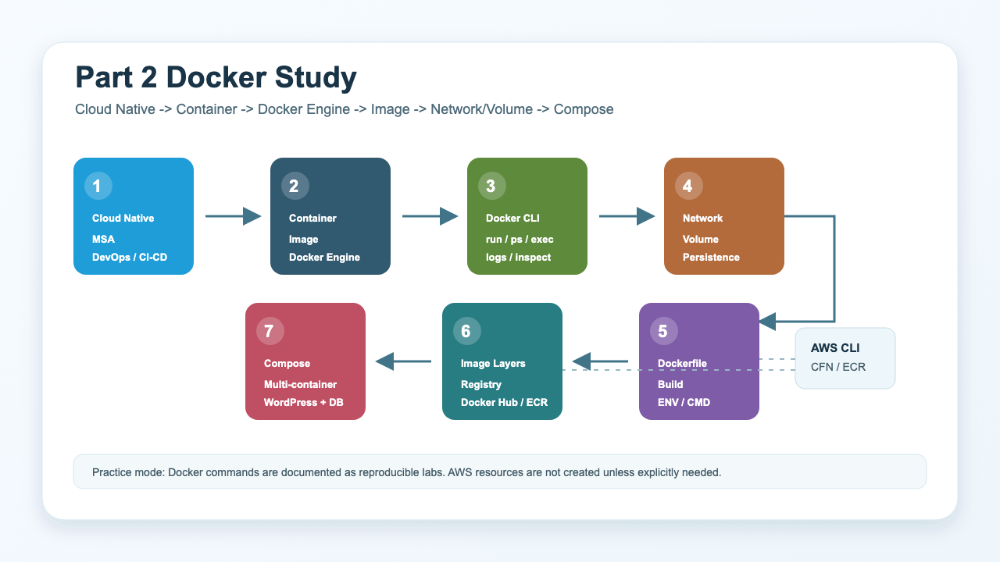

# Part 2 Docker

클라우드 네이티브와 Docker 개념, 그리고 Docker 실습 흐름을 정리한 기록입니다.



## 구성

| 순서 | 주제 | 핵심 내용 |
| --- | --- | --- |
| 1 | [Cloud Native](Docker01_cloud_native/README.md) | 클라우드 네이티브, MSA, DevOps, CI/CD |
| 2 | [Container and Docker](Docker02_container_docker/README.md) | 컨테이너, 이미지, Docker Engine, Registry |
| 3 | [Docker Basic Commands](Docker03_basic_commands/README.md) | 컨테이너 생명주기, 실행/중지/로그/접속 |
| 4 | [Docker Network and Volume](Docker04_network_volume/README.md) | bridge/host/none 네트워크, 볼륨, bind mount |
| 5 | [Dockerfile](Docker05_dockerfile/README.md) | 이미지 빌드, Dockerfile 지시어, CMD/ENTRYPOINT |
| 6 | [Docker Image Management](Docker06_image_management/README.md) | 이미지 레이어, 태그, 저장/불러오기, Docker Hub, ECR |
| 7 | [Docker Compose](Docker07_compose/README.md) | 여러 컨테이너를 하나의 애플리케이션으로 정의 |

## 실습 방식

이번 파트는 비용이 발생하는 AWS 리소스를 새로 만들지 않고 정리했습니다. Docker CLI와 Docker Compose 설치 여부는 확인했고, Docker 데몬이 실행 중이 아니어서 컨테이너 실행 실습은 재현 가능한 명령어 중심으로 기록했습니다.

| 항목 | 확인 결과 |
| --- | --- |
| Docker CLI | 설치 확인 |
| Docker Compose | 설치 확인 |
| Docker daemon | 현재 로컬에서 미실행 |
| AWS CLI 활용 | Docker host용 CloudFormation 템플릿 문법 검증 |
| 실제 AWS 리소스 생성 | 수행하지 않음 |

실제 실습을 진행하려면 Docker Desktop을 실행하거나, `examples/lab01_settings`의 CloudFormation 템플릿으로 EC2 Docker host를 만든 뒤 SSH로 접속해 명령을 실행하면 됩니다.

## Docker 흐름

1. Dockerfile에 애플리케이션 실행 환경을 코드로 작성합니다.
2. `docker build`로 Dockerfile을 이미지로 빌드합니다.
3. `docker run`으로 이미지를 컨테이너로 실행합니다.
4. 컨테이너는 격리된 프로세스로 실행되지만 호스트 커널을 공유합니다.
5. 컨테이너 내부 변경은 기본적으로 컨테이너 수명에 묶이므로, 영속 데이터는 volume이나 bind mount에 둡니다.
6. 여러 컨테이너가 함께 필요한 애플리케이션은 Docker Compose로 서비스, 네트워크, 볼륨을 선언합니다.
7. 배포가 필요하면 이미지를 Docker Hub나 Amazon ECR 같은 registry에 push합니다.

## AWS와 연결되는 부분

Docker 자체는 로컬에서도 실행할 수 있지만, 클라우드 환경에서는 다음 서비스와 자연스럽게 연결됩니다.

| Docker 개념 | AWS에서 이어지는 서비스 |
| --- | --- |
| 이미지 저장소 | Amazon ECR |
| 컨테이너 실행 호스트 | EC2 |
| 컨테이너 오케스트레이션 | ECS, EKS |
| 컨테이너 로그/지표 | CloudWatch |
| 인프라 자동화 | CloudFormation |
| 이미지 기반 CI/CD | CodeBuild, CodePipeline, GitHub Actions |

## 예제 파일

- [CloudFormation Docker host 템플릿](examples/lab01_settings)
- [Docker 기본 명령 실습 HTML](examples/lab02_basic_command/index.html)
- [Dockerfile 예제](examples/lab05_dockerfile)
- [Docker Compose WordPress 예제](examples/lab07_compose/docker-compose.yml)
- [전체 실습 명령 모음](commands.md)
- [검증 결과](verification.md)

## 정리 명령

실습 후에는 컨테이너, 이미지, 네트워크, 볼륨이 남아 있을 수 있습니다.

```bash
docker ps -a
docker stop $(docker ps -aq)
docker rm $(docker ps -aq)
docker network prune -f
docker volume prune -f
docker image prune -a -f
docker system prune -a --volumes -f
```

AWS에서 Docker host를 만든 경우에는 CloudFormation 스택도 반드시 삭제합니다.

```bash
aws cloudformation delete-stack --stack-name docker-host --region ap-northeast-2
aws cloudformation wait stack-delete-complete --stack-name docker-host --region ap-northeast-2
aws cloudformation delete-stack --stack-name docker-vpc --region ap-northeast-2
aws cloudformation wait stack-delete-complete --stack-name docker-vpc --region ap-northeast-2
```
