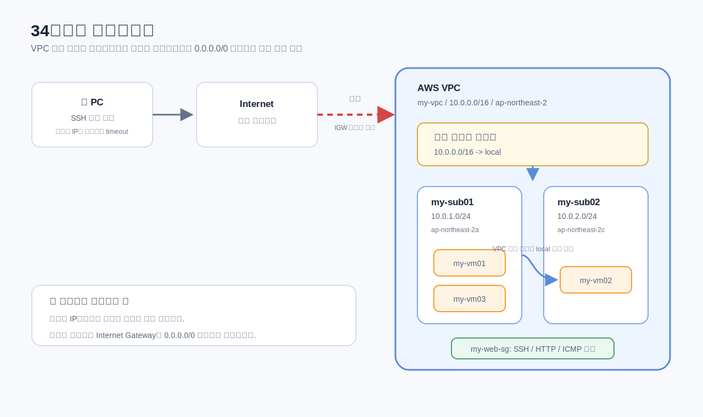
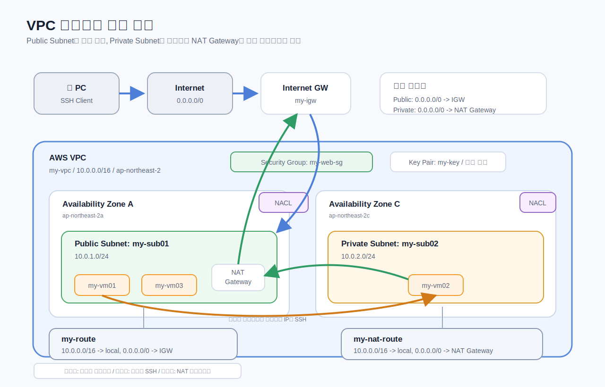

# VPC 네트워킹 실습

AWS VPC에서 퍼블릭 서브넷과 프라이빗 서브넷이 어떻게 나뉘는지 이해하기 위한 실습 기록입니다.

## 아키텍처

### 34페이지 체크포인트

이 시점에는 VPC, 서브넷, EC2는 있지만 인터넷으로 나가는 라우트가 아직 없습니다.



핵심은 다음과 같습니다.

- EC2에 퍼블릭 IP가 보여도 아직 인터넷에서 접속할 수 없습니다.
- 인터넷 게이트웨이가 아직 VPC에 연결되지 않았습니다.
- 라우팅 테이블에 `0.0.0.0/0 -> igw` 경로가 없습니다.
- 현재 라우팅은 `10.0.0.0/16 -> local`만 있으므로 VPC 내부 통신만 가능합니다.

### 최종 실습 구조

퍼블릭 서브넷, 프라이빗 서브넷, 배스천 호스트, NAT Gateway까지 구성하면 아래와 같은 구조가 됩니다.



## 실습 목표

VPC를 처음부터 만들고, EC2 인스턴스가 인터넷에서 접속되는 조건과 접속되지 않는 조건을 확인합니다.

이 실습에서 확인하는 내용은 다음과 같습니다.

- 사용자 지정 VPC 생성
- 서로 다른 가용 영역에 서브넷 생성
- 각 서브넷에 EC2 인스턴스 생성
- 라우팅 테이블의 역할 이해
- 하나의 서브넷을 퍼블릭 서브넷으로 구성
- 다른 서브넷을 프라이빗 서브넷으로 유지
- 배스천 호스트를 통해 프라이빗 EC2에 접속
- NAT Gateway를 통해 프라이빗 EC2의 아웃바운드 인터넷 통신 허용

## 핵심 개념

### VPC

VPC는 AWS 안에 만드는 논리적으로 격리된 가상 네트워크입니다.

이번 실습의 VPC CIDR은 다음과 같습니다.

```text
VPC CIDR: 10.0.0.0/16
```

VPC 안에 서브넷, 라우팅 테이블, 보안 그룹, 인터넷 게이트웨이, NAT Gateway, EC2 인스턴스가 배치됩니다.

### CIDR

CIDR는 네트워크의 IP 주소 범위를 표현하는 방식입니다.

예시:

```text
10.0.0.0/16  -> VPC의 큰 IP 범위
10.0.1.0/24  -> 서브넷 IP 범위
10.0.2.0/24  -> 서브넷 IP 범위
0.0.0.0/0    -> 모든 IPv4 주소
```

뒤의 숫자가 작을수록 더 넓은 IP 범위를 의미합니다. 예를 들어 `/16`은 `/24`보다 더 큰 범위입니다.

### 서브넷

서브넷은 VPC 안의 IP 범위를 더 작게 나눈 네트워크입니다. AWS에서 서브넷은 하나의 가용 영역에 속합니다.

실습 서브넷:

| 이름 | CIDR | 가용 영역 | 용도 |
| --- | --- | --- | --- |
| `my-sub01` | `10.0.1.0/24` | `ap-northeast-2a` | 이후 퍼블릭 서브넷으로 구성 |
| `my-sub02` | `10.0.2.0/24` | `ap-northeast-2c` | 이후 프라이빗 서브넷으로 구성 |

### 퍼블릭 서브넷

서브넷과 연결된 라우팅 테이블에 인터넷 게이트웨이로 향하는 기본 경로가 있으면 퍼블릭 서브넷입니다.

```text
0.0.0.0/0 -> igw-xxxxxxxx
```

EC2가 인터넷에서 접속되려면 퍼블릭 IP와 보안 그룹 인바운드 규칙도 필요합니다.

퍼블릭 EC2 접속 조건:

```text
퍼블릭 IP
+ 인터넷 게이트웨이
+ 라우팅 테이블: 0.0.0.0/0 -> IGW
+ 보안 그룹 인바운드 허용
```

### 프라이빗 서브넷

인터넷 게이트웨이로 직접 나가는 경로가 없으면 프라이빗 서브넷입니다.

예시:

```text
10.0.0.0/16 -> local
```

또는:

```text
10.0.0.0/16 -> local
0.0.0.0/0   -> nat-xxxxxxxx
```

두 번째 경우도 프라이빗 서브넷입니다. NAT Gateway는 프라이빗 인스턴스가 시작한 아웃바운드 통신만 허용하고, 인터넷에서 프라이빗 인스턴스로 직접 들어오는 인바운드 통신은 허용하지 않습니다.

### 라우팅 테이블

라우팅 테이블은 네트워크 트래픽을 어디로 보낼지 결정합니다.

34페이지 지점에서는 라우팅 테이블에 로컬 경로만 있습니다.

```text
10.0.0.0/16 -> local
```

이 상태에서는 VPC 내부 인스턴스끼리는 프라이빗 IP로 통신할 수 있지만, 인터넷과는 통신할 수 없습니다.

### 인터넷 게이트웨이

인터넷 게이트웨이는 VPC를 인터넷과 연결하는 출입구입니다.

인터넷 게이트웨이를 생성하는 것만으로는 부족합니다. 서브넷의 라우팅 테이블에 인터넷 방향 트래픽을 인터넷 게이트웨이로 보내는 경로가 있어야 합니다.

```text
0.0.0.0/0 -> 인터넷 게이트웨이
```

### NAT Gateway

NAT Gateway는 프라이빗 서브넷의 인스턴스가 인터넷으로 나가는 아웃바운드 통신을 시작할 수 있게 해줍니다.

인터넷 사용자가 프라이빗 인스턴스로 직접 들어오는 인바운드 연결은 허용하지 않습니다.

일반적인 구성:

```text
프라이빗 서브넷 라우팅 테이블:
10.0.0.0/16 -> local
0.0.0.0/0   -> NAT Gateway
```

NAT Gateway 자체는 퍼블릭 서브넷에 배치되어야 합니다.

### 보안 그룹

보안 그룹은 EC2 인스턴스 수준에서 동작하는 방화벽입니다.

보안 그룹은 스테이트풀입니다. 인바운드 요청이 허용되면 그에 대한 응답 트래픽은 자동으로 허용됩니다.

실습 보안 그룹:

| 유형 | 포트 | 소스 |
| --- | --- | --- |
| SSH | `22` | `0.0.0.0/0` |
| HTTP | `80` | `0.0.0.0/0` |
| ICMP | All | `0.0.0.0/0` |

실제 운영 환경에서는 SSH를 `0.0.0.0/0`로 열지 않고, 신뢰할 수 있는 IP 범위로 제한해야 합니다.

### 네트워크 ACL

네트워크 ACL은 서브넷 수준에서 동작하는 방화벽입니다.

보안 그룹과의 주요 차이:

| 보안 그룹 | 네트워크 ACL |
| --- | --- |
| 인스턴스 수준 | 서브넷 수준 |
| 허용 규칙만 설정 | 허용 및 거부 규칙 설정 |
| 스테이트풀 | 스테이트리스 |
| 모든 규칙을 평가 | 규칙 번호 순서대로 평가 |

### 배스천 호스트

배스천 호스트는 프라이빗 인스턴스에 접속하기 위해 사용하는 퍼블릭 EC2 점프 서버입니다.

접속 흐름:

```text
사용자 -> 퍼블릭 서브넷의 배스천 호스트 -> 프라이빗 IP로 Private EC2 접속
```

이 구조를 사용하면 프라이빗 인스턴스를 인터넷에 직접 노출하지 않아도 됩니다.

## 실습 체크포인트: 34페이지

이 시점의 상태:

- `my-vpc`가 생성되어 있습니다.
- `my-sub01`, `my-sub02`가 생성되어 있습니다.
- `my-web-sg`가 생성되어 있습니다.
- `my-vm01`, `my-vm02`, `my-vm03`가 생성되어 있습니다.
- EC2에 퍼블릭 IP가 보일 수 있습니다.
- 아직 인터넷 게이트웨이는 연결하지 않았습니다.
- 아직 `0.0.0.0/0 -> igw` 라우트가 없습니다.

예상 결과:

```text
로컬 컴퓨터에서 EC2 퍼블릭 IP로 SSH 접속하면 실패합니다.
```

이 단계에서 확인하는 핵심:

퍼블릭 IP만 있다고 EC2가 인터넷에서 접속 가능한 상태가 되는 것은 아닙니다.

## 퍼블릭/프라이빗 서브넷 확인 방법

서브넷이 퍼블릭인지 프라이빗인지는 서브넷 이름이 아니라 연결된 라우팅 테이블로 판단합니다.

퍼블릭 서브넷:

```text
0.0.0.0/0 -> igw-xxxxxxxx
```

아웃바운드 인터넷이 가능한 프라이빗 서브넷:

```text
0.0.0.0/0 -> nat-xxxxxxxx
```

VPC 내부 통신만 가능한 프라이빗 서브넷:

```text
10.0.0.0/16 -> local
```

## 명령어

실습 중 자주 쓰는 AWS CLI와 SSH 명령어는 [commands.md](commands.md)에 정리했습니다.

## 실습 후 정리

실습 후에는 다음 리소스를 삭제합니다.

- EC2 인스턴스
- NAT Gateway
- Elastic IP
- 로드 밸런서가 있다면 로드 밸런서
- 사용하지 않는 EBS 볼륨

NAT Gateway와 Elastic IP는 방치하면 과금될 수 있습니다.
